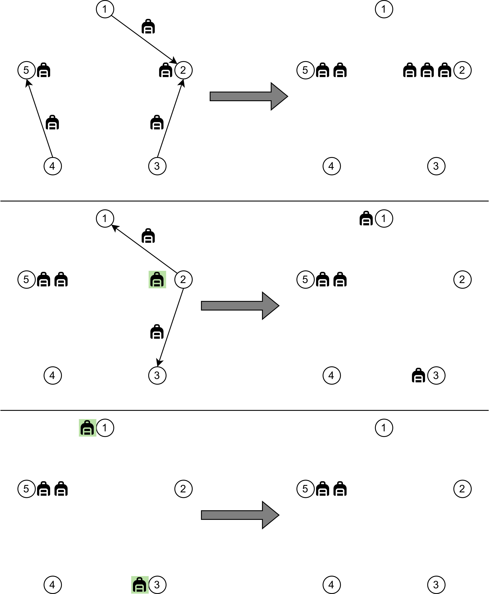

# F. Lost Luggage

**time limit per test:** 2 seconds

**memory limit per test:** 256 megabytes

**input:** standard input

**output:** standard output

As is known, the airline "Trouble" often loses luggage, and concerned journalists decided to calculate the maximum number of luggage pieces that may not return to travelers.

The airline "Trouble" operates flights between $n$ airports, numbered from $1$ to $n$. The journalists' experiment will last for $m$ days. It is known that at midnight before the first day of the experiment, there were $s_j$ lost pieces of luggage in the $j$-th airport. On the $i$-th day, the following occurs:

- In the morning, $2n$ flights take off simultaneously, including $n$ flights of the first type and $n$ flights of the second type.

 - The $j$-th flight of the first type flies from airport $j$ to airport $(((j-2) \bmod n )+ 1)$ (the previous airport, with the first airport being the last), and it can carry no more than $a_{i,j}$ lost pieces of luggage.
 - The $j$-th flight of the second type flies from airport $j$ to airport $((j \bmod n) + 1)$ (the next airport, with the last airport being the first), and it can carry no more than $c_{i,j}$ lost pieces of luggage.

- In the afternoon, a check of lost luggage is conducted at the airports. If after the flights have departed on that day, there are $x$ pieces of luggage remaining in the $j$-th airport and $x \ge b_{i, j}$, then at least $x - b_{i, j}$ pieces of luggage are found, and they cease to be lost.
- In the evening, all $2n$ flights conclude, and the lost luggage transported that day arrives at the corresponding airports.

For each $k$ from $1$ to $m$, the journalists want to know the maximum number of lost pieces of luggage that may be unfound during the checks over the first $k$ days. Note that for each $k$, these values are calculated independently.

#### Input

Each test contains multiple test cases. The first line contains the number of test cases $t$ ($1 \le t \le 100$). The description of the test cases follows.

The first line of each test case contains two integers $n$ and $m$ ($3 \le n \le 12$, $1 \le m \le 2000$) — the number of airports and the number of days of the experiment.

The second line of each test case contains $n$ integers $s_1, s_2, \ldots, s_n$ ($0 \le s_i \le 10^8$) — the initial number of lost pieces of luggage in each airport.

Next, the descriptions for each of the $m$ days follow in order.

The first line of the description of the $i$-th day contains $n$ integers $a_{i,1}, a_{i,2}, \ldots, a_{i,n}$ ($0 \le a_{i, j} \le 10^8$) — the maximum number of lost pieces of luggage that can be transported to the previous airport for each airport.

The second line of the description of the $i$-th day contains $n$ integers $b_{i,1}, \ldots, b_{i,n}$ ($0 \le b_{i, j} \le 10^8$) — the minimum number of lost pieces of luggage that will be found on the $i$-th day in each airport.

The third line of the description of the $i$-th day contains $n$ integers $c_{i,1}, \ldots, c_{i,n}$ ($0 \le c_{i, j} \le 10^8$) — the maximum number of lost pieces of luggage that can be transported to the next airport for each airport.

It is guaranteed that the sum of $m$ over all test cases does not exceed $2000$.

#### Output

For each test case, output $m$ integers — the maximum number of unfound pieces of luggage for each number of days from $1$ to $m$.

#### Example

#### Input
```
2
5 3
1 1 1 1 1
0 0 1 0 0
0 1 0 0 1
1 0 0 1 0
0 1 0 0 0
9 0 9 9 9
0 1 0 0 0
0 0 0 0 0
9 0 9 0 0
0 0 0 0 0
3 1
0 100000000 5
0 100000000 5
0 100000000 5
0 100000000 5
```

#### Output
```
5
4
2
100000005
```

#### Note

In the first test case:

- On the first day, all $5$ pieces of luggage may not be found, as the lost luggage can be sent on flights from each airport.
- In the morning of the second day, there may be no more than $3$ pieces of luggage in the $2$-nd airport, no more than $2$ pieces in the $5$-th airport, and no luggage in the other airports. All luggage from the $5$-th airport may remain there. In the $2$-nd airport, no more than $2$ pieces of luggage can be sent on flights to neighboring airports. Thus, at least $1$ piece of luggage will be found.
- By the end of the third day, lost luggage may only be in the $1$-st and $2$-nd airports. There can be no more than one piece in each, meaning that at most $2$ pieces of luggage will remain unfound in total.




 The found luggage is marked in green.
In the second test case, all pieces of luggage may remain in their original airports, and the inspection won't find any lost suitcases. Therefore, the answer is $10^9 + 5$.
