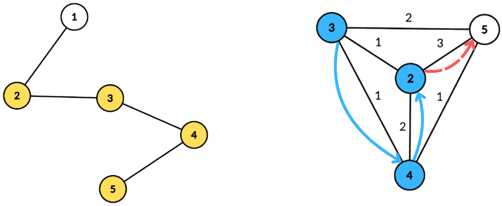

# E. Kia Bakes a Cake

**time limit per test:** 6 seconds

**memory limit per test:** 512 megabytes

**input:** standard input

**output:** standard output


You are given a binary string $s$ of length $n$ and a tree $T$ with $n$ vertices. Let $k$ be the number of 1s in $s$. We will construct a complete undirected weighted graph with $k$ vertices as follows:

- For each $1\le i\le n$ with $s_i = \mathtt{1}$, create a vertex labeled $i$.
- For any two vertices labeled $u$ and $v$ that are created in the above step, define the edge weight between them $w(u, v)$ as the distance$^{\text{∗}}$ between vertex $u$ and vertex $v$ in the tree $T$.

A simple path$^{\text{†}}$ that visits vertices labeled $v_1, v_2, \ldots, v_m$ in this order is nice if for all $1\le i\le m - 2$, the condition $2\cdot w(v_i, v_{i + 1})\le w(v_{i + 1}, v_{i + 2})$ holds. In other words, the weight of each edge in the path must be at least twice the weight of the previous edge. Note that $s_{v_i} = \mathtt{1}$ has to be satisfied for all $1\le i\le m$, as otherwise, there would be no vertex with the corresponding label.

For each vertex labeled $i$ ($1\le i\le n$ and $s_i = \mathtt{1}$) in the complete undirected weighted graph, determine the maximum number of vertices in any nice simple path starting from the vertex labeled $i$.

$^{\text{∗}}$The distance between two vertices $a$ and $b$ in a tree is equal to the number of edges on the unique simple path between vertex $a$ and vertex $b$.

$^{\text{†}}$A path is a sequence of vertices $v_1, v_2, \ldots, v_m$ such that there is an edge between $v_i$ and $v_{i + 1}$ for all $1\le i\le m - 1$. A simple path is a path with no repeated vertices, i.e., $v_i\neq v_j$ for all $1\le i \lt j\le m$.

#### Input

Each test contains multiple test cases. The first line contains the number of test cases $t$ ($1 \le t \le 10^4$). The description of the test cases follows.

The first line of each test case contains a single integer $n$ ($1\le n\le 7\cdot10^4$) — the length of the binary string $s$ and the number of vertices in the tree $T$.

The second line of each test case contains a binary string with $n$ characters $s_1s_2\ldots s_n$ ($s_i\in \{\mathtt{0}, \mathtt{1}\}$) — the string representing the vertices to be constructed in the complete undirected weighted graph.

Each of the next $n - 1$ lines contains two integers $u$ and $v$ ($1\le u, v\le n$) — the endpoints of the edges of the tree $T$.

It is guaranteed that the given edges form a tree.

It is guaranteed that the sum of $n$ over all test cases does not exceed $7\cdot10^4$.

#### Output

For each test case, output $n$ integers, the $i$-th integer representing the maximum number of vertices in any nice simple path starting from the vertex labeled $i$. If there is no vertex labeled $i$, i.e., $s_i = \mathtt{0}$, output $-1$ instead.

#### Example

#### Input
```
3
5
01111
1 2
2 3
3 4
4 5
17
01101011110101101
1 2
2 3
3 4
4 5
5 6
6 7
7 8
8 9
9 10
10 11
11 12
12 13
13 14
14 15
15 16
16 17
2
01
1 2
```

#### Output
```
-1 3 3 3 3 
-1 5 4 -1 4 -1 5 5 5 5 -1 4 -1 5 5 -1 3 
-1 1 
```

#### Note

In the first test case, the tree $T$ and the constructed graph are as follows:




 Left side is the tree $T$ with selected nodes colored yellow. The right side is the constructed complete graph.
The nice path shown in the diagram is $3\rightarrow 4\rightarrow 2$. The path is nice as $w(4, 2) = 2$ is at least twice of $w(3, 4) = 1$. Extending the path using $2\rightarrow 5$ is not possible as $w(2, 5) = 3$ is less than twice of $w(4, 2) = 2$.

In the second test case, the tree $T$ is a simple path of length $17$. An example of a nice path starting from the vertex labeled $2$ is $2\rightarrow 3\rightarrow 5\rightarrow 9\rightarrow 17$, which has edge weights of $1, 2, 4, 8$ doubling each time.
