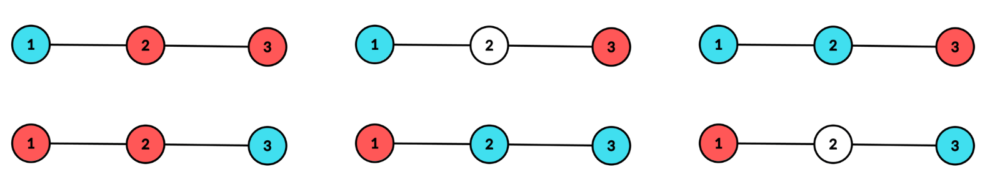
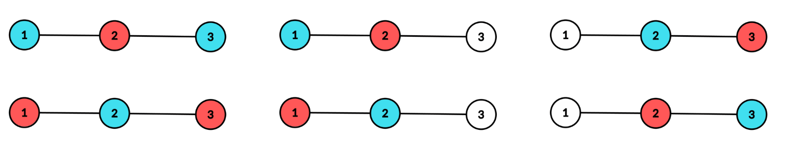
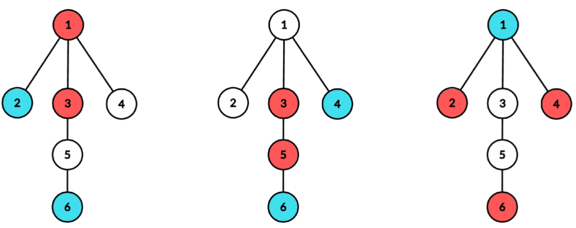

# F. Shoo Shatters the Sunshine

**time limit per test:** 7 seconds

**memory limit per test:** 256 megabytes

**input:** standard input

**output:** standard output


You are given a tree with $n$ vertices, where each vertex can be colored red, blue, or white. The coolness of a coloring is defined as the maximum distance$^{\text{∗}}$ between a red and a blue vertex.

Formally, if we denote the color of the $i$-th vertex as $c_i$, the coolness of a coloring is $\max d(u, v)$ over all pairs of vertices $1\le u, v\le n$ where $c_u$ is red and $c_v$ is blue. If there are no red or no blue vertices, the coolness is zero.

Your task is to calculate the sum of coolness over all $3^n$ possible colorings of the tree, modulo $998\,244\,353$.

$^{\text{∗}}$The distance between two vertices $a$ and $b$ in a tree is equal to the number of edges on the unique simple path between vertex $a$ and vertex $b$.

#### Input

Each test contains multiple test cases. The first line contains the number of test cases $t$ ($1 \le t \le 50$). The description of the test cases follows.

The first line of each test case contains a single integer $n$ ($2\le n\le 3000$) — the number of vertices in the tree.

Each of the next $n - 1$ lines contains two integers $u$ and $v$ ($1\le u, v\le n$) — the endpoints of the edges of the tree.

It is guaranteed that the given edges form a tree.

It is guaranteed that the sum of $n$ over all test cases does not exceed $3000$.

#### Output

For each test case, output the sum of coolness over all $3^n$ possible colorings of the tree, modulo $998\,244\,353$.

#### Example

#### Input
```
3
3
1 2
2 3
6
1 2
1 3
1 4
3 5
5 6
17
1 2
1 3
1 4
1 5
2 6
2 7
2 8
3 9
3 10
7 11
7 12
11 13
13 14
14 15
10 16
16 17
```

#### Output
```
18
1920
78555509
```

#### Note

In the first test case, there are $12$ colorings that have at least one blue and one red node. The following pictures show their coloring and their coolness:




 All these colorings have coolness $2$



 All these colorings have coolness $1$
Therefore, the sum of coolness over all possible colorings is $6\cdot 2 + 6\cdot 1 = 18$.

In the second test case, the following are some examples of colorings with a coolness of $3$:



