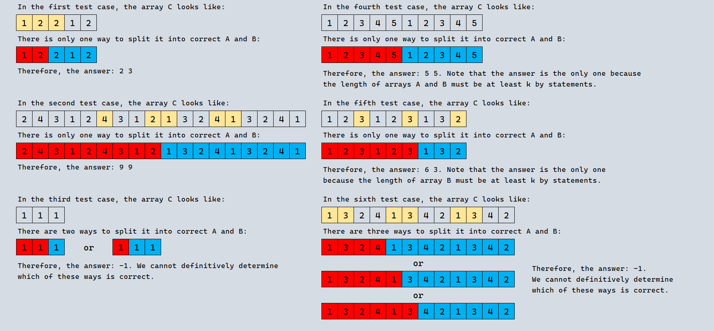

# D. Needle in a Numstack

**time limit per test:** 3 seconds

**memory limit per test:** 256 megabytes

**input:** standard input

**output:** standard output

This is an interactive problem.

You found the numbers $k$ and $n$ in the attic, but lost two arrays $A$ and $B$.

You remember that:

- $|A| + |B| = n$, the total length of the arrays is $n$.
- $|A| \geq k$ and $|B| \geq k$, the length of each array is at least $k$.
- The arrays consist only of numbers from $1$ to $k$.
- If you take any $k$ consecutive elements from array $A$, they will all be different. Also, if you take any $k$ consecutive elements from array $B$, they will all be different.

Fortunately, a kind spirit that settled in the attic found these arrays and concatenated them into an array $C$ of length $n$. That is, the elements of array $A$ were first written into array $C$, followed by the elements of array $B$.

You can ask the kind spirit up to $250$ questions. Each question contains an index $i$ ($1 \leq i \leq n$). In response, you will receive the $i$-th element of the concatenated array $C$.

You need to find the lengths of arrays $A$ and $B$, or report that it is impossible to determine them uniquely.

#### Input

Each test contains multiple test cases. The first line contains the number of test cases $t$ ($1 \le t \le 300$). The description of the test cases follows.

The only line of each test case contains two integers $n$ and $k$ ($1 \leq k \leq 50$, $2 k \leq n \leq 10^{6}$).

Note that the sum of $n$ across test cases is not limited.

#### Interaction

The interaction for each test case begins with reading the integer $n$.

Then you can make up to $250$ queries.

To make a query, output a string in the format "? x" (without quotes) ($1 \leq x \leq n$). After each query, read an integer — the answer to your query.

If you make too many queries, you will receive a verdict of Wrong answer.

To report your answer, output a string in the format "! a b" (without quotes), where $a$ and $b$ are the lengths of arrays $A$ and $B$ that you found, respectively. The answer is not counted when counting the number of queries.

If it is impossible to determine the lengths of the arrays uniquely, output "! -1" (without quotes). Note that if you answer $-1$ while there is a sequence of at most $250$ queries that uniquely determines the lengths of arrays, you will get a Wrong answer verdict.

It is guaranteed that there are arrays $A$ and $B$ that do not contradict the statement, for which the interactor output is correct.

The interactor is not adaptive, which means that the answer is known before the participant makes queries and does not depend on the queries made by the participant.

If your program makes more than $250$ queries, your program should immediately terminate to receive the verdict Wrong answer. Otherwise, you can get an arbitrary verdict because your solution will continue to read from a closed stream.

After outputting a query, do not forget to output a newline and flush the output buffer. Otherwise, you will receive a verdict of "IL" (Idleness limit exceeded). To flush the buffer, use:

- fflush(stdout) or cout.flush() in C++;
- System.out.flush() in Java;
- flush(output) in Pascal;
- stdout.flush() in Python;
- see the documentation for other languages.

Hacks

Hacks are disabled for this problem.

#### Example

#### Input
```
6
5 2

1

2

2

18 4

2

4

1

1

4

3 1

10 5

9 3

3

3

2

12 4

1

3

1

3

1

3
```

#### Output
```
? 1

? 2

? 3

! 2 3

? 9

? 13

? 10

? 14

? 6

! 9 9

! -1

! 5 5

? 3

? 6

? 9

! 6 3

? 1

? 2

? 5

? 6

? 9

? 10

! -1
```

#### Note

Consider the first example. We queried the first $3$ elements out of $5$. Now we know that the array $C$ looks like $[1, 2, 2, ?, ?]$. We know for sure that the third element is not from array $A$ — because according to the condition, any $k$ consecutive elements (in our case $k = 2$) in array $A$ are different. Thus, the third element is definitely located in array $B$. This means that the length of array $A$ is $2$, and the length of array $B$ is $3$.

The picture shows arrays from all test cases. The elements whose values were requested are marked in yellow.



