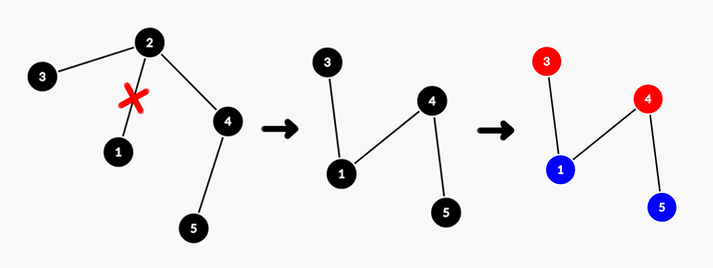

# E. Spruce Dispute

**time limit per test:** 2 seconds

**memory limit per test:** 256 megabytes

**input:** standard input

**output:** standard output


It's already a hot April outside, and Polycarp decided that this is the perfect time to finally take down the spruce tree he set up several years ago. As he spent several hours walking around it, gathering his strength, he noticed something curious: the spruce is actually a tree$^{\text{∗}}$ — and not just any tree, but one consisting of an odd number of vertices $n$. Moreover, on $n-1$ of the vertices hang Christmas ornaments, painted in exactly $\frac{n-1}{2}$ distinct colors, with exactly two ornaments painted in each color. The remaining vertex, as tradition dictates, holds the tree's topper.

At last, after several days of mental preparation, Polycarp began dismantling the spruce. First, he removed the topper and had already started taking apart some branches when suddenly a natural question struck him: how can he remove one of the tree's edges and rearrange the ornaments in such a way that the sum of the lengths of the simple paths between ornaments of the same color is as large as possible?

In this problem, removing an edge from the tree is defined as follows: choose a pair of adjacent vertices $a$ and $b$ ($a \lt b$), then remove vertex $b$ from the tree and reattach all of $b$'s adjacent vertices (except for $a$) directly to $a$.

Polycarp cannot continue dismantling his spruce until he gets an answer to this question. However, checking all possible options would take him several more years. Knowing your experience in competitive programming, he turned to you for help. But can you solve this dispute?

$^{\text{∗}}$A tree is a connected graph without cycles.

#### Input

Each test contains multiple test cases. The first line contains the number of test cases $t$ ($1 \le t \le 10^4$). The description of the test cases follows.

The first line of each test case contains an odd number $n$ ($3 \le n \lt 2 \cdot 10^5$) — the number of vertices in the tree.

The following $n-1$ lines describe the tree, given by pairs of adjacent vertices $u$, $v$ ($1 \le u, v \le n, u \neq v$).

It is guaranteed that the sum of $n$ over all test cases does not exceed $2 \cdot 10^5$.

#### Output

For each test case, you need to output two lines.

In the first line, output the pair of vertices $u$, $v$, the edge between which Polycarp is going to remove.

In the next line, output the array $c$ of $n$ numbers from $0$ to $\frac{n-1}{2}$, where $c[i]$ — the positive color number assigned to vertex $i$. Note that $c[\text{max}(u, v)]= 0$, since this vertex has been removed.

#### Example

#### Input
```
3
5
1 2
2 3
2 4
4 5
5
1 2
1 3
1 4
1 5
7
1 5
5 4
4 3
3 2
2 6
6 7
```

#### Output
```
1 2
2 0 1 1 2
1 5
1 1 2 2 0
4 3
1 3 3 0 2 2 1
```

#### Note

Consider the first test case.

Remove the edge connecting vertices $1$ and $2$. After this, vertex $2$ will be removed from the tree, and vertices $3$ and $4$ will be connected to vertex $1$.

Color vertices $3$ and $4$ with the first color, and vertices $1$ and $5$ with the second. The sum of the lengths of simple paths between ornaments of the same color is equal to $2 + 2 = 4$. It can be shown that this value is the largest possible.





In the second and third examples, the maximum sum of path lengths will be $3$ and $9$, respectively.
