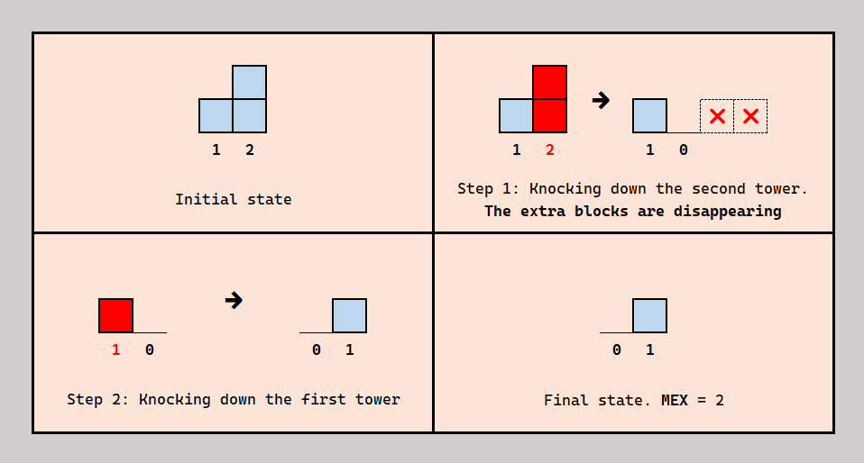
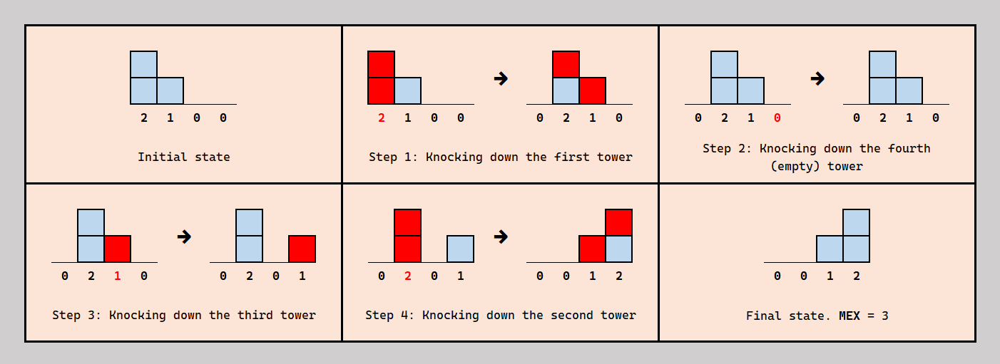

# F. Fallen Towers

**time limit per test:** 3 seconds

**memory limit per test:** 256 megabytes

**input:** standard input

**output:** standard output


Pizano built an array $a$ of $n$ towers, each consisting of $a_i \ge 0$ blocks.

Pizano can knock down a tower so that the next $a_i$ towers grow by $1$. In other words, he can take the element $a_i$, increase the next $a_i$ elements by one, and then set $a_i$ to $0$. The blocks that fall outside the array of towers disappear. If Pizano knocks down a tower with $0$ blocks, nothing happens.

Pizano wants to knock down all $n$ towers in any order, each exactly once. That is, for each $i$ from $1$ to $n$, he will knock down the tower at position $i$ exactly once.

Moreover, the resulting array of tower heights must be non-decreasing. This means that after he knocks down all $n$ towers, for any $i \lt j$, the tower at position $i$ must not be taller than the tower at position $j$.

You are required to output the maximum $\text{MEX}$ of the resulting array of tower heights.

The $\text{MEX}$ of an array is the smallest non-negative integer that is not present in the array.

#### Input

Each test contains multiple test cases. The first line contains the number of test cases $t$ ($1 \le t \le 10^4$). The description of the test cases follows.

The first line of each test case contains an integer $n$ ($1 \leq n \leq 10^5$) — the number of towers.

The second line of each test case contains $n$ integers — the initial heights of the towers $a_1, \ldots, a_n$ ($0 \leq a_i \leq 10^9$).

It is guaranteed that the sum of $n$ over all test cases does not exceed $10^5$.

#### Output

For each test case, output a single integer — the maximum $\text{MEX}$ of the final array.

#### Example

#### Input
```
8
2
1 2
4
2 1 0 0
10
5 9 3 7 1 5 1 5 4 3
10
1 1 1 1 1 1 1 1 1 1
10
3 2 1 0 3 2 1 0 3 2
5
5 2 0 5 5
1
1000000000
7
4 0 1 0 2 7 7
```

#### Output
```
2
3
7
4
5
4
1
3
```

#### Note

Explanation for the first test case.





Explanation for the second test case. Note that all towers were knocked down exactly once, and the final array of heights is non-decreasing.



