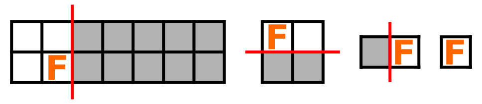

# B. Slice to Survive

**time limit per test:** 1 second

**memory limit per test:** 256 megabytes

**input:** standard input

**output:** standard output

Duelists Mouf and Fouad enter the arena, which is an $n \times m$ grid!

Fouad's monster starts at cell $(a, b)$, where rows are numbered $1$ to $n$ and columns $1$ to $m$.

Mouf and Fouad will keep duelling until the grid consists of only one cell.

In each turn:

- Mouf first cuts the grid along a row or column line into two parts, discarding the part without Fouad's monster. Note that the grid must have at least two cells; otherwise, the game has already ended.
- After that, in the same turn, Fouad moves his monster to any cell (possibly the same one it was in) within the remaining grid.




 Visualization of the phases of the fourth test case.
Mouf wants to minimize the number of turns, while Fouad wants to maximize them. How many turns will this epic duel last if both play optimally?

#### Input

Each test contains multiple test cases. The first line contains the number of test cases $t$ ($1 \le t \le 10^4$). The description of the test cases follows.

The first and only line of each test case contains four integers $n$, $m$, $a$, and $b$ ($2 \le n, m \le 10^9$, $1 \le a \le n$, $1 \le b \le m$) — denoting the number of rows, the number of columns, the starting row of the monster, and the starting column of the monster, respectively.

#### Output

For each test case, output a single integer — the number of turns this epic duel will last if both play optimally.

#### Example

#### Input
```
8
2 2 1 1
3 3 2 2
2 7 1 4
2 7 2 2
8 9 4 6
9 9 5 5
2 20 2 11
22 99 20 70
```

#### Output
```
2
4
4
3
6
8
6
10
```

#### Note

In the first test case, one possible duel sequence is as follows:

- Turn 1: Mouf cuts the grid horizontally along the line between the rows $1$ and $2$, removing the bottom half and leaving a $1 \times 2$ grid.
- Turn 1: Fouad's monster is at the cell $(1,1)$.
- Turn 2: Mouf cuts the $1 \times 2$ grid again, removes one column, and isolates the cell $(1,1)$.

The duel is completed in $2$ turns.

In the fourth case, one possible duel sequence is as follows:

- Turn 1: Mouf cuts the grid vertically along the line between the columns $2$ and $3$, splitting it into a $2 \times 2$ and a $2 \times 5$ field, then removes the $2 \times 5$ part.
- Turn 1: Fouad moves the monster to the cell $(1,1)$.
- From this point on, the duel plays out just like the first test case—two more turns trim down the grid from $2 \times 2$ to a single $1 \times 1$ cell.

In total, the duel is completed in $3$ turns.

You can refer to the pictures mentioned in the problem statement for illustrations of the fourth test case.
