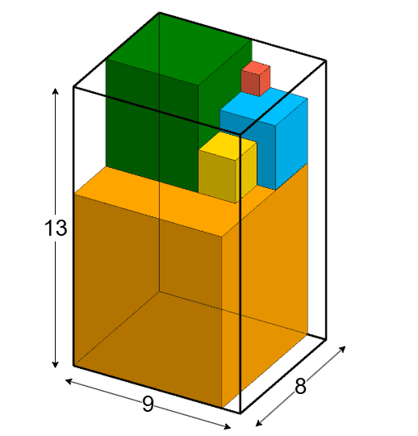

# B. Fibonacci Cubes

**time limit per test:** 2 seconds

**memory limit per test:** 512 megabytes

**input:** standard input

**output:** standard output

There are $n$ Fibonacci cubes, where the side of the $i$-th cube is equal to $f_{i}$, where $f_{i}$ is the $i$-th Fibonacci number.

In this problem, the Fibonacci numbers are defined as follows:

- $f_{1} = 1$
- $f_{2} = 2$
- $f_{i} = f_{i - 1} + f_{i - 2}$ for $i \gt 2$

There are also $m$ empty boxes, where the $i$-th box has a width of $w_{i}$, a length of $l_{i}$, and a height of $h_{i}$.

For each of the $m$ boxes, you need to determine whether all the cubes can fit inside that box. The cubes must be placed in the box following these rules:

- The cubes can only be stacked in the box such that the sides of the cubes are parallel to the sides of the box;
- Every cube must be placed either on the bottom of the box or on top of other cubes in such a way that all space below the cube is occupied;
- A larger cube cannot be placed on top of a smaller cube.

#### Input

Each test consists of several test cases. The first line contains a single integer $t$ ($1 \le t \le 10^{3}$) — the number of test cases. The description of the test cases follows.

In the first line of each test case, there are two integers $n$ and $m$ ($2 \le n \le 10, 1 \le m \le 2 \cdot 10^{5}$) — the number of cubes and the number of empty boxes.

The next $m$ lines of each test case contain $3$ integers $w_{i}$, $l_{i}$, and $h_{i}$ ($1 \le w_{i}, l_{i}, h_{i} \le 150$) — the dimensions of the $i$-th box.

Additional constraints on the input:

- The sum of $m$ across all test cases does not exceed $2 \cdot 10^{5}$.

#### Output

For each test case, output a string of length $m$, where the $i$-th character is equal to "1" if all $n$ cubes can fit into the $i$-th box; otherwise, the $i$-th character is equal to "0".

#### Example

#### Input
```
2
5 4
3 1 2
10 10 10
9 8 13
14 7 20
2 6
3 3 3
1 2 1
2 1 2
3 2 2
2 3 1
3 2 4
```

#### Output
```
0010
100101
```

#### Note

In the first test case, only one box is suitable. The cubes can be placed in it as follows:



