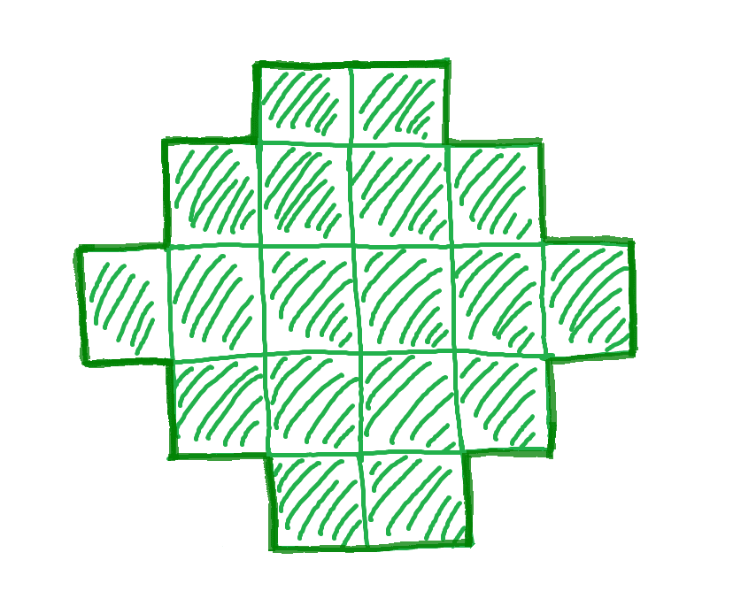
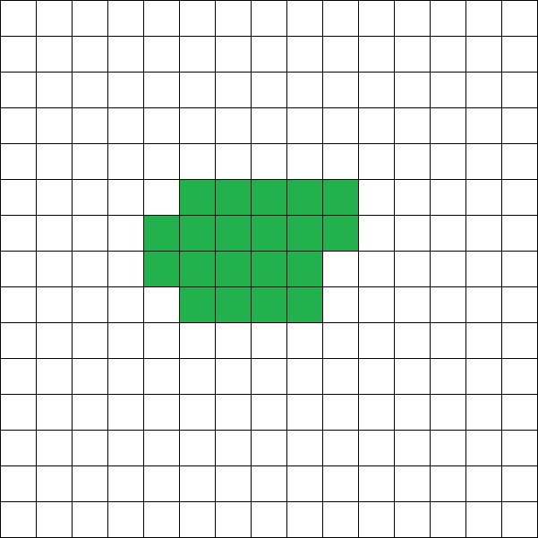
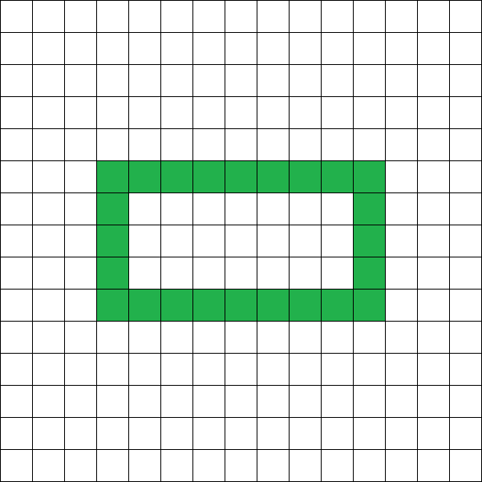
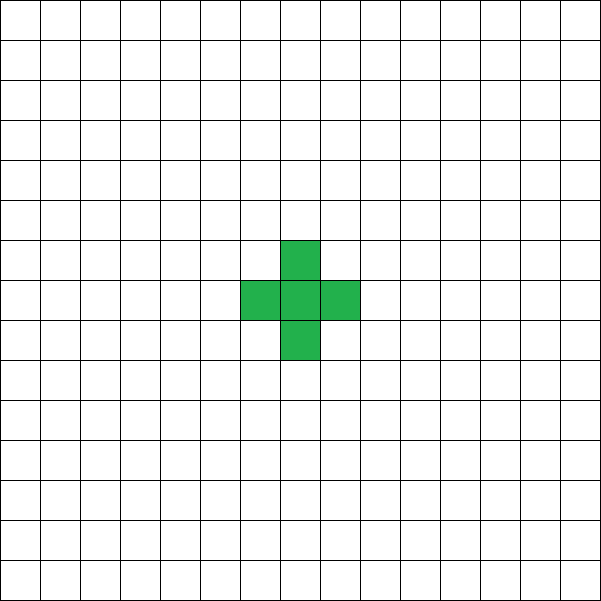

# F. Puzzle

**time limit per test:** 2 seconds

**memory limit per test:** 512 megabytes

**input:** standard input

**output:** standard output

You have been gifted a puzzle, where each piece of this puzzle is a square with a side length of one. You can glue any picture onto this puzzle, cut it, and obtain an almost ordinary jigsaw puzzle.

Your friend is an avid mathematician, so he suggested you consider the following problem. Is it possible to arrange the puzzle pieces in such a way that the following conditions are met:

- the pieces are aligned parallel to the coordinate axes;
- the pieces do not overlap each other;
- all pieces form a single connected component (i.e., there exists a path from each piece to every other piece along the pieces, where each two consecutive pieces share a side);
- the ratio of the perimeter of this component to the area of this component equals $\frac{p}{s}$;
- the number of pieces used does not exceed $50\,000$.

Can you handle it?




 For this figure, the ratio of the perimeter to the area is $\frac{11}{9}$

#### Input

Each test consists of several test cases. The first line contains a single integer $t$ ($1 \le t \le 10$) — the number of test cases. The description of the test cases follows.

The only line of each test case contains two integers $p$ and $s$ ($1 \le p, s \le 50$).

#### Output

For each test case:

- if it is impossible to arrange the pieces as described above, output a single integer $-1$;
- otherwise, in the first line output a single integer $k$ ($1 \le k \le 50\,000$), and then in $k$ lines output the coordinates of the pieces: each line should contain two integers $x_{i}$ and $y_{i}$ ($-10^{9} \le x_{i}, y_{i} \le 10^{9}$). If there are multiple suitable arrangements of the pieces, output any of them.

#### Examples

#### Input
```
2
1 1
31 4
```

#### Output
```
20
3 7
3 8
6 4
6 5
3 5
4 4
4 5
4 3
3 4
5 3
5 4
5 7
3 6
4 6
5 5
5 6
4 7
4 8
6 6
6 7
-1
```

#### Input
```
2
4 2
12 5
```

#### Output
```
24
-7 2
-3 -3
-7 -5
-7 1
-3 2
-7 -2
-3 -5
-7 -6
-5 -6
-3 -4
-3 -6
-7 0
-6 -6
-7 -3
-5 2
-7 -1
-3 1
-4 -6
-3 0
-7 -4
-6 2
-4 2
-3 -1
-3 -2
5
0 0
0 1
1 0
-1 0
0 -1
```

#### Note

In the first test case of the first test, the figure may look like this:





In the second test, the figures look like this:







Note that the internal perimeter is also taken into account!
