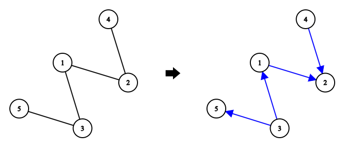
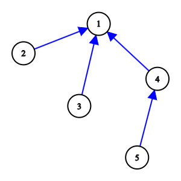

# D. Reachability and Tree

**time limit per test:** 2 seconds

**memory limit per test:** 256 megabytes

**input:** standard input

**output:** standard output

Let $u$ and $v$ be two distinct vertices in a directed graph. Let's call the ordered pair $(u, v)$ good if there exists a path from vertex $u$ to vertex $v$ along the edges of the graph.

You are given an undirected tree with $n$ vertices and $n - 1$ edges. Determine whether it is possible to assign a direction to each edge of this tree so that the number of good pairs in it is exactly $n$. If it is possible, print any way to direct the edges resulting in exactly $n$ good pairs.




 One possible directed version of the tree for the first test case.

#### Input

The first line contains one integer $t$ ($1 \le t \le 10^4$) — the number of test cases.

The first line of each test case contains one integer $n$ ($2 \le n \le 2 \cdot 10^5$) — the number of vertices in the tree.

The next $n - 1$ lines describe the edges. The $i$-th line contains two integers $u_i$ and $v_i$ ($1 \le u_i, v_i \le n$; $u_i \neq v_i$) — the vertices connected by the $i$-th edge.

It is guaranteed that the edges in each test case form an undirected tree and that the sum of $n$ over all test cases does not exceed $2 \cdot 10^5$.

#### Output

For each test case, print "NO" (case-insensitive) if it is impossible to direct all edges of the tree and obtain exactly $n$ good pairs of vertices.

Otherwise, print "YES" (case-insensitive) and then print $n - 1$ pairs of integers $u_i$ and $v_i$ separated by spaces — the edges directed from $u_i$ to $v_i$.

The edges can be printed in any order. If there are multiple answers, output any.

#### Example

#### Input
```
4
5
1 2
2 4
1 3
3 5
5
1 2
1 3
1 4
4 5
2
2 1
4
3 1
1 2
2 4
```

#### Output
```
YES
1 2
3 1
3 5
4 2
YES
2 1
3 1
4 1
5 4
NO
YES
1 3
2 1
2 4
```

#### Note

The tree from the first test case and its possible directed version are shown in the legend above. In this version, there are exactly $5$ good pairs of vertices: $(3, 5)$, $(3, 1)$, $(3, 2)$, $(1, 2)$, and $(4, 2)$.

One possible directed version of the tree from the second test case is shown below:





In the presented answer, there are exactly $5$ good pairs of vertices: $(2, 1)$, $(3, 1)$, $(4, 1)$, $(5, 4)$, and $(5, 1)$.

In the third test case, there are only two directed pairs of vertices, but for any direction of the edge, only one pair will be good.
