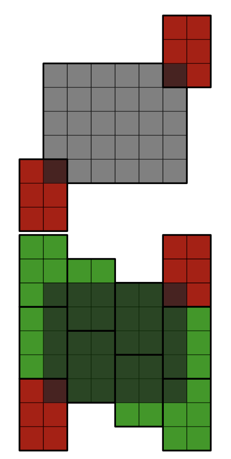
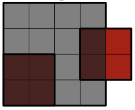

# B. Good Start

**time limit per test:** 1 second

**memory limit per test:** 256 megabytes

**input:** standard input

**output:** standard output

The roof is a rectangle of size $w \times h$ with the bottom left corner at the point $(0, 0)$ on the plane. Your team needs to completely cover this roof with identical roofing sheets of size $a \times b$, with the following conditions:

- The sheets cannot be rotated (not even by $90^\circ$).
- The sheets must not overlap (but they can touch at the edges).
- The sheets can extend beyond the boundaries of the rectangular roof.

A novice from your team has already placed two such sheets on the roof in such a way that the sheets do not overlap and each of them partially covers the roof.

Your task is to determine whether it is possible to completely tile the roof without removing either of the two already placed sheets.

#### Input

Each test contains multiple test cases. The first line contains the number of test cases $t$ ($1 \le t \le 10^4$). The description of the test cases follows.

The first line of each test case contains four integers $w$, $h$, $a$, and $b$ ($1 \le w, h, a, b \le 10^9$) — the dimensions of the roof and the dimensions of the roofing sheets, respectively.

The second line of each test case contains four integers $x_1$, $y_1$, $x_2$, and $y_2$ ($-a + 1 \le x_1, x_2 \le w - 1, -b + 1 \le y_1, y_2 \le h - 1$) — the coordinates of the bottom left corners of the already placed roofing sheets. It is guaranteed that these sheets do not overlap.

#### Output

For each test case, output "Yes" (without quotes) if it is possible to completely tile the roof without removing either of the two already placed tiles, and "No" (without quotes) otherwise.

You can output the answer in any case (upper or lower). For example, the strings "yEs", "yes", "Yes", and "YES" will be recognized as positive responses.

#### Example

#### Input
```
7
6 5 2 3
-1 -2 5 4
4 4 2 2
0 0 3 1
10 9 3 2
0 0 4 3
10 9 3 2
0 0 6 3
5 5 2 2
-1 -1 4 -1
5 5 2 2
-1 -1 2 3
7 8 2 4
0 0 0 5
```

#### Output
```
Yes
No
No
Yes
No
Yes
No
```

#### Note

In the first test case, it is possible to add $8$ roofing sheets as follows:





In the second test case, it is impossible to completely tile the roof:



