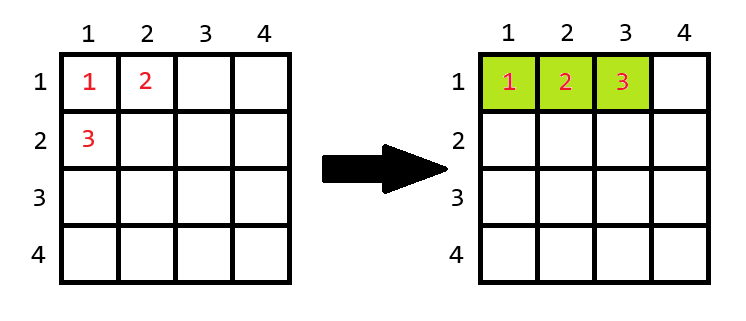
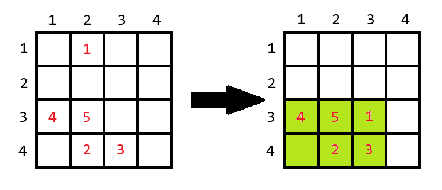

# D. Come a Little Closer

**time limit per test:** 2 seconds

**memory limit per test:** 256 megabytes

**input:** standard input

**output:** standard output

The game field is a matrix of size $10^9 \times 10^9$, with a cell at the intersection of the $a$-th row and the $b$-th column denoted as ($a, b$).

There are $n$ monsters on the game field, with the $i$-th monster located in the cell ($x_i, y_i$), while the other cells are empty. No more than one monster can occupy a single cell.

You can move one monster to any cell on the field that is not occupied by another monster at most once .

After that, you must select one rectangle on the field; all monsters within the selected rectangle will be destroyed. You must pay $1$ coin for each cell in the selected rectangle.

Your task is to find the minimum number of coins required to destroy all the monsters.

#### Input

The first line contains a single integer $t$ ($1 \le t \le 10^4$) — the number of test cases.

The first line of each test case contains a single integer $n$ ($1 \le n \le 2 \cdot 10^5$) — the number of monsters on the field.

The following $n$ lines contain two integers $x_i$ and $y_i$ ($1 \le x_i, y_i \le 10^9$) — the coordinates of the cell with the $i$-th monster. All pairs ($x_i, y_i$) are distinct.

It is guaranteed that the sum of $n$ across all test cases does not exceed $2 \cdot 10^5$.

#### Output

For each test case, output a single integer — the minimum cost to destroy all $n$ monsters.

#### Example

#### Input
```
7
3
1 1
1 2
2 1
5
1 1
2 6
6 4
3 3
8 2
4
1 1
1 1000000000
1000000000 1
1000000000 1000000000
1
1 1
5
1 2
4 2
4 3
3 1
3 2
3
1 1
2 5
2 2
4
4 3
3 1
4 4
1 2
```

#### Output
```
3
32
1000000000000000000
1
6
4
8
```

#### Note

Below are examples of optimal moves, with the cells of the rectangle to be selected highlighted in green.




 Required move for the first example.



 Required move for the fifth example.
