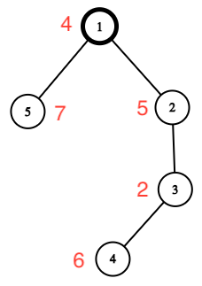

# E. Kirei Attacks the Estate

**time limit per test:** 2 seconds

**memory limit per test:** 256 megabytes

**input:** standard input

**output:** standard output

Once, Kirei stealthily infiltrated the trap-filled estate of the Ainzbern family but was discovered by Kiritugu's familiar. Assessing his strength, Kirei decided to retreat. The estate is represented as a tree with $n$ vertices, with the root at vertex $1$. Each vertex of the tree has a number $a_i$ recorded, which represents the danger of vertex $i$. Recall that a tree is a connected undirected graph without cycles.

For a successful retreat, Kirei must compute the threat value for each vertex. The threat of a vertex is equal to the maximum alternating sum along the vertical path starting from that vertex. The alternating sum along the vertical path starting from vertex $i$ is defined as $a_i - a_{p_i} + a_{p_{p_i}} - \ldots$, where $p_i$ is the parent of vertex $i$ on the path to the root (to vertex $1$).

For example, in the tree below, vertex $4$ has the following vertical paths:

- $[4]$ with an alternating sum of $a_4 = 6$;
- $[4, 3]$ with an alternating sum of $a_4 - a_3 = 6 - 2 = 4$;
- $[4, 3, 2]$ with an alternating sum of $a_4 - a_3 + a_2 = 6 - 2 + 5 = 9$;
- $[4, 3, 2, 1]$ with an alternating sum of $a_4 - a_3 + a_2 - a_1 = 6 - 2 + 5 - 4 = 5$.




 The dangers of the vertices are indicated in red.
Help Kirei compute the threat values for all vertices and escape the estate.

#### Input

The first line contains an integer $t$ ($1 \le t \le 10^4$) — the number of test cases.

The following describes the test cases.

The first line contains an integer $n$ ($2 \le n \le 2 \cdot 10^5$) — the number of vertices in the tree.

The second line contains $n$ integers $a_1, a_2, \ldots, a_n$ ($1 \le a_i \le 10^9$) — the dangers of the vertices.

The next $n - 1$ lines contain the numbers $v, u$ ($1 \le v, u \le n$, $v \neq u$) — the description of the edges of the tree.

It is guaranteed that the sum of $n$ across all test cases does not exceed $2 \cdot 10^5$. It is also guaranteed that the given set of edges forms a tree.

#### Output

For each test case, output $n$ integers — the threat of each vertex.

#### Example

#### Input
```
2
5
4 5 2 6 7
1 2
3 2
4 3
5 1
6
1000000000 500500500 900900900 9 404 800800800
3 4
5 1
2 5
1 6
6 4
```

#### Output
```
4 5 2 9 7 
1000000000 1500500096 1701701691 199199209 404 800800800 
```

#### Note

The tree from the first test case is depicted in the statement, and the maximum variable-sign sums are achieved as follows:

- $a_1 = 4$;
- $a_2 = 5$;
- $a_3 = 2$;
- $a_4 - a_3 + a_2 = 6 - 2 + 5 = 9$;
- $a_5 = 7$.
