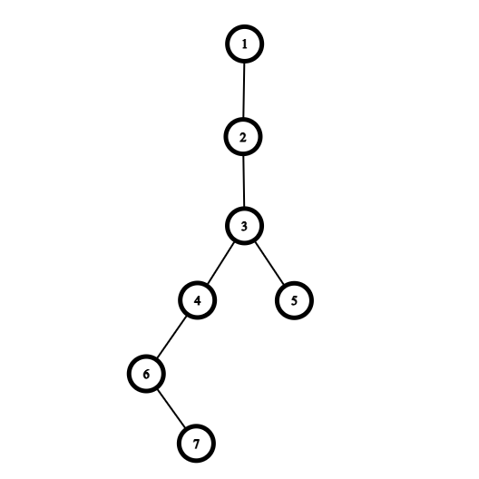

# F. Wildflower

**time limit per test:** 2 seconds

**memory limit per test:** 256 megabytes

**input:** standard input

**output:** standard output

Yousef has a rooted tree$^{\text{∗}}$ consisting of exactly $n$ vertices, which is rooted at vertex $1$. You would like to give Yousef an array $a$ of length $n$, where each $a_i$ $(1 \le i \le n)$ can either be $1$ or $2$.

Let $s_u$ denote the sum of $a_v$ where vertex $v$ is in the subtree$^{\text{†}}$ of vertex $u$. Yousef considers the tree special if all the values in $s$ are pairwise distinct (i.e., all subtree sums are unique).

Your task is to help Yousef count the number of different arrays $a$ that result in the tree being special. Two arrays $b$ and $c$ are different if there exists an index $i$ such that $b_i \neq c_i$.

As the result can be very large, you should print it modulo $10^9 + 7$.

$^{\text{∗}}$A tree is a connected undirected graph with $n - 1$ edges.

$^{\text{†}}$The subtree of a vertex $v$ is the set of all vertices that pass through $v$ on a simple path to the root. Note that vertex $v$ is also included in the set.

#### Input

The first line contains an integer $t$ $(1 \le t \le 10^4)$ — the number of test cases.

Each test case consists of several lines. The first line of the test case contains an integer $n$ $(2 \le n \le 2 \cdot 10^5)$ — the number of vertices in the tree.

Then $n−1$ lines follow, each of them contains two integers $u$ and $v$ $(1 \le u,v \le n, u \ne v)$ which describe a pair of vertices connected by an edge. It is guaranteed that the given graph is a tree and has no loops or multiple edges.

It is guaranteed that the sum of $n$ over all test cases doesn't exceed $2 \cdot 10^5$.

#### Output

For each test case, print one integer $x$ — the number of different arrays $a$ that result in the tree being special, modulo $10^9 + 7$.

#### Example

#### Input
```
7
2
1 2
8
1 2
2 3
3 8
2 4
4 5
5 6
6 7
10
1 2
2 3
3 4
4 5
5 6
4 7
7 8
4 9
9 10
7
1 4
4 2
3 2
3 5
2 6
6 7
7
1 2
2 3
3 4
3 5
4 6
6 7
7
5 7
4 6
1 6
1 3
2 6
6 7
5
3 4
1 2
1 3
2 5
```

#### Output
```
4
24
0
16
48
0
4
```

#### Note

The tree given in the fifth test case:



