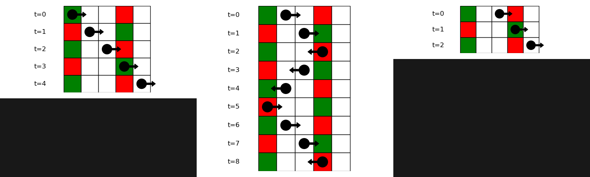
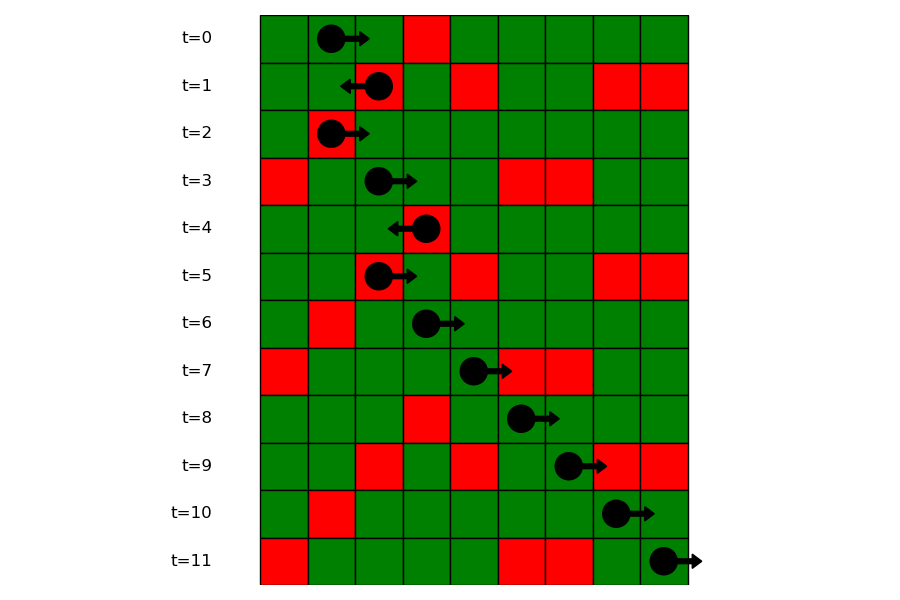

# D1. Red Light, Green Light (Easy version)

**time limit per test:** 4 seconds

**memory limit per test:** 512 megabytes

**input:** standard input

**output:** standard output

This is the easy version of the problem. The only difference is the constraint on $k$ and the total sum of $n$ and $q$ across all test cases. You can make hacks only if both versions of the problem are solved.

You are given a strip of length $10^{15}$ and a constant $k$. There are exactly $n$ cells that contain a traffic light; each has a position $p_i$ and an initial delay $d_i$ for which $d_i \lt k$. The $i$-th traffic light works the following way:

- it shows red at the $l \cdot k + d_i$-th second, where $l$ is an integer,
- it shows green otherwise.

At second $0$, you are initially positioned at some cell on the strip, facing the positive direction. At each second, you perform the following actions in order:

- If the current cell contains a red traffic light, you turn around.
- Move one cell in the direction you are currently facing.

You are given $q$ different starting positions. For each one, determine whether you will eventually leave the strip within $10^{100}$ seconds.

#### Input

Each test contains multiple test cases. The first line contains the number of test cases $t$ ($1 \le t \le 500$). The description of the test cases follows.

The first line of each test case contains two integers $n$, $k$ ($\mathbf{1 \le n \le 500}$ and $\mathbf{1 \le k \le 500}$) — the number of traffic lights and the length of the period.

The second line of each test case contains $n$ integers $p_1, p_2, \ldots p_n$ ($1 \le p_1 \lt p_2 \lt \cdots \lt p_n \le 10^{15}$) — the positions of the traffic lights.

The third line of each test case contains $n$ integers $d_1, d_2, \ldots d_n$ ($0 \le d_i \lt k$) — the delays of the traffic lights.

The fourth line of each test case contains one integer $q$ ($\mathbf{1 \le q \le 500}$) — the number of queries.

The fifth line of each test case contains $q$ integers $a_1, a_2, \ldots, a_q$ ($1 \leq a_i \leq 10^{15}$) — the starting positions.

It is guaranteed that the sum of $n$ and $q$ over all test cases does not exceed $\mathbf{500}$.

#### Output

For each test case, output $q$ lines. Each line should contain "YES" if you will eventually leave the strip and "NO" otherwise. You can output the answer in any case (upper or lower). For example, the strings "yEs", "yes", "Yes", and "YES" will be recognized as positive responses.

#### Example

#### Input
```
4
2 2
1 4
1 0
3
1 2 3
9 4
1 2 3 4 5 6 7 8 9
3 2 1 0 1 3 3 1 1
5
2 5 6 7 8
4 2
1 2 3 4
0 0 0 0
4
1 2 3 4
3 4
1 2 3
3 1 1
3
1 2 3
```

#### Output
```
YES
NO
YES
YES
YES
YES
NO
NO
YES
YES
NO
NO
YES
NO
YES
```

#### Note

In the first test case, the following happens at starting positions $1$, $2$, and $3$:





And the following in the second test case at starting position $2$:



