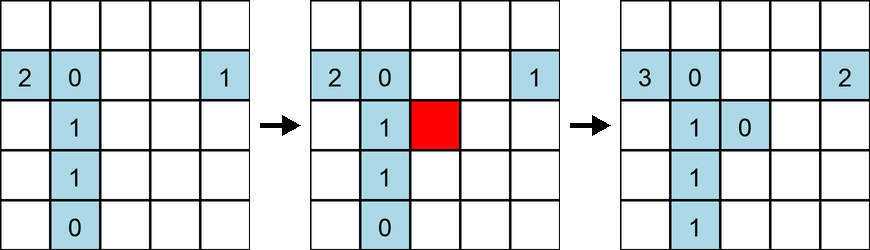
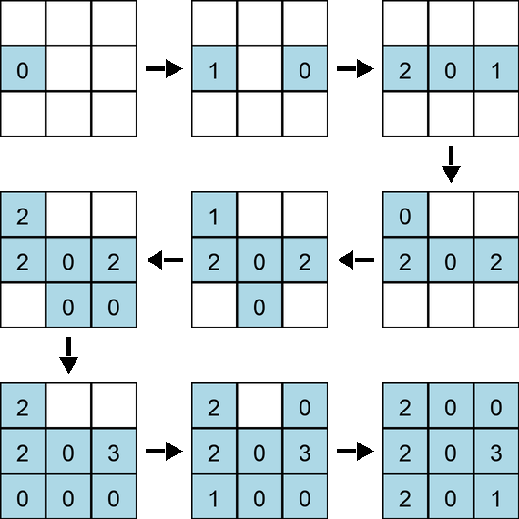

# E. Grid Coloring

**time limit per test:** 2 seconds

**memory limit per test:** 256 megabytes

**input:** standard input

**output:** standard output

There is a $n\times m$ grid with each cell initially white. You have to color all the cells one-by-one. After you color a cell, all the colored cells furthest from it receive a penalty. Find a coloring order, where no cell has more than $3$ penalties.

Note that $n$ and $m$ are both odd.

The distance metric used is the [chessboard distance](<https://en.wikipedia.org/wiki/Chebyshev_distance>) while we decide ties between cells with [Manhattan distance](<https://en.wikipedia.org/wiki/Taxicab_geometry#Formal_definition>). Formally, a cell $(x_2, y_2)$ is further away than $(x_3, y_3)$ from a cell $(x_1, y_1)$ if one of the following holds:

- $\max\big(\lvert x_1 - x_2 \rvert, \lvert y_1 - y_2 \rvert\big) \gt \max\big(\lvert x_1 - x_3 \rvert, \lvert y_1 - y_3 \rvert\big)$
- $\max\big(\lvert x_1 - x_2 \rvert, \lvert y_1 - y_2 \rvert\big)=\max\big(\lvert x_1 - x_3 \rvert, \lvert y_1 - y_3 \rvert\big)$ and $\lvert x_1 - x_2 \rvert + \lvert y_1 - y_2 \rvert \gt \lvert x_1 - x_3 \rvert + \lvert y_1 - y_3 \rvert$

It can be proven that at least one solution always exists.




 Example showing penalty changes after coloring the center of a $5 \times 5$ grid. The numbers indicate the penalty of the cells.

#### Input

Each test contains multiple test cases. The first line contains the number of test cases $t$ ($1 \le t \le 100$). The description of the test cases follows.

The first line of each test case contains two odd integers $n$ and $m$ ($1 \le n, m \le 4999$) — the number of rows and columns.

It is guaranteed that the sum of $n \cdot m$ over all test cases does not exceed $5000$.

#### Output

For each test case, output $n \cdot m$ lines where the $i$-th line should contain the coordinates of the $i$-th cell in your coloring order. If there are multiple solutions, print any of them.

The empty lines in the example output are just for increased readability. You're not required to print them.

#### Example

#### Input
```
3
3 3
1 1
1 5
```

#### Output
```
2 1
2 3
2 2
1 1
3 2
3 3
3 1
1 3
1 2

1 1

1 2
1 4
1 5
1 1
1 3
```

#### Note

In the first test case, the grid can be colored as follows:




 The numbers indicate the penalty of the cells.
