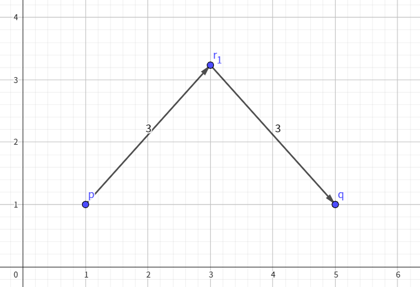
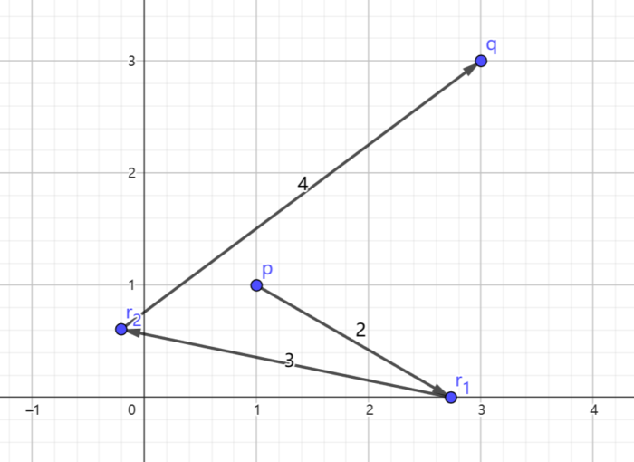
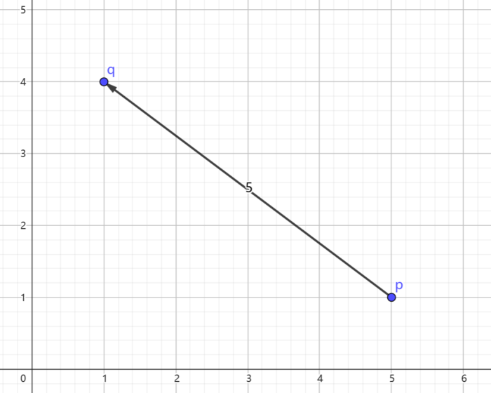

# B. Line Segments

**time limit per test:** 1.5 seconds

**memory limit per test:** 256 megabytes

**input:** standard input

**output:** standard output

[PIKASONIC - Lost My Mind (feat.nakotanmaru)](<https://www.youtube.com/watch?v=iprl3wJnWoo>)


You are given two points $(p_x,p_y)$ and $(q_x,q_y)$ on a Euclidean plane.

You start at the starting point $(p_x,p_y)$ and will perform $n$ operations. In the $i$-th operation, you must choose any point such that the Euclidean distance$^{\text{∗}}$ between your current position and the point is exactly $a_i$, and then move to that point.

Determine whether it is possible to reach the terminal point $(q_x,q_y)$ after performing all operations.

$^{\text{∗}}$The Euclidean distance between $(x_1, y_1)$ and $(x_2, y_2)$ is $\sqrt{(x_1 - x_2)^2 + (y_1 - y_2)^2}$

#### Input

Each test contains multiple test cases. The first line contains the number of test cases $t$ ($1 \le t \le 10^4$). The description of the test cases follows.

The first line of each test case contains a single integer $n$ ($1\leq n \leq 10^3$) — the length of the sequence $a$.

The second line of each test case contains four integers $p_x,p_y,q_x,q_y$ ($1\leq p_x,p_y,q_x,q_y\leq 10^7$) — the coordinates of the starting point and terminal point.

The third line of each test case contains $n$ integers $a_1,a_2,\ldots,a_n$ ($1 \le a_i \le 10^4$) — the distance to move in each operation.

It is guaranteed that the sum of $n$ over all test cases does not exceed $2\cdot 10^5$.

#### Output

For each test case, output "Yes" if it is possible to reach the terminal point $(q_x,q_y)$ after all operations; otherwise, output "No".

You can output the answer in any case (upper or lower). For example, the strings "yEs", "yes", "Yes", and "YES" will be recognized as positive responses.

#### Example

#### Input
```
5
2
1 1 5 1
3 3
3
1 1 3 3
2 3 4
2
100 100 100 100
4 5
1
5 1 1 4
5
2
10000000 10000000 10000000 10000000
10000 10000
```

#### Output
```
Yes
Yes
No
Yes
Yes
```

#### Note

Here is a picture that shows a possible movement of the first test case. The coordinates of point $r_1$ are $(3,1+\sqrt{5})$.




 The first test case.
Here is a picture that shows a possible movement of the second test case. The coordinates of point $r_1$ are $(1+\sqrt{3},0)$, and the coordinates of point $r_2$ are $\left(-\frac{(\sqrt{3}+4)(3\sqrt{3(149-24\sqrt{3})}-7\sqrt{3}-38)}{104},-\frac{\sqrt{3(1331-764\sqrt{3})}+12\sqrt{3}-27}{104}\right)$.




 The second test case.
For the third test case, it can be shown that there is no set of moves that satisfies all requirements.

Here is a picture that shows a possible movement of the fourth test case.




 The fourth test case.
