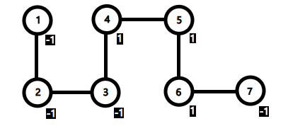

# F. Volcanic Eruptions

**time limit per test:** 3 seconds

**memory limit per test:** 256 megabytes

**input:** standard input

**output:** standard output

There is an undirected tree with root $1$ where each vertex has a weight $w_i\in\{1,-1\}$.

A volcano at the root erupts at time $0$. At time $t$, lava floods all vertices whose distance from the root is at most $t$, where the distance is the number of edges in the shortest path between the two vertices.

At time $0$, you are at vertex $st$ with life value $S$, initially $S=1$. Starting at time $0$ (including time $0$), the following events happen in order at each time stamp:

- Let $u$ be the vertex you are currently at. Your life value increases by $w_u$, i.e., $S\gets S+w_u$.
- If $S=0$ or if vertex $u$ is flooded with lava at this time, you die immediately.
- You must move to an adjacent vertex (includes father and sons; staying in place is not allowed). You arrive at the chosen vertex at the next time stamp.

Find the maximum number of moves you can make before you die.

#### Input

Each test contains multiple test cases. The first line contains the number of test cases $T$ ($1 \le T \le 10^4$). The description of the test cases follows.

For each test case, the first line contains two integers $n,st$ ($2 \le st \le n \le 5\cdot 10^5$), denoting the number of vertices and the vertex you start at at time stamp $0$.

The second line contains $n$ integers $w_1, w_2, \ldots, w_n$ ($w_i\in\{1,-1\}$,$w_{st}=1$), where $w_i$ represents the weight of the vertex $i$.

The next $n-1$ lines each contain two integers $u,v$ ($1\le u,v \le n$), which describe a pair of vertices connected by an edge.

It is guaranteed that the given graph is a tree and the sum of $n$ over all test cases does not exceed $10^6$.

#### Output

For each test case, output a line with an integer indicating the maximum number of moves you can make.

#### Example

#### Input
```
6
7 4
-1 -1 -1 1 1 1 -1
2 1
3 2
4 3
5 4
6 5
7 6
8 2
-1 1 1 1 1 -1 1 1
2 1
6 2
8 6
3 8
7 3
5 7
4 5
8 2
-1 1 -1 -1 -1 1 -1 -1
2 1
8 2
4 1
5 4
3 4
7 2
6 8
8 4
1 1 1 1 1 -1 1 -1
8 1
3 1
4 3
5 4
6 4
7 6
2 5
8 4
1 1 1 1 -1 -1 1 1
2 1
5 1
4 5
8 5
3 8
7 2
6 2
18 10
-1 -1 -1 -1 -1 -1 -1 -1 -1 1 -1 1 1 -1 1 1 1 1
1 2
2 3
3 4
4 5
5 6
6 7
7 8
8 9
9 10
10 11
11 12
12 13
9 14
14 15
15 16
16 17
17 18
```

#### Output
```
6
7
3
3
1
13
```

#### Note

Here is a picture that shows the tree in the first test case.




 The first test case.
One of the optimal sequence of moves is $4\to3\to4\to5\to6\to7\to6$, which makes $6$ moves in total. The changes in $S$ is $2\to1\to2\to3\to4\to3\to4$. More precisely:

- At time $0$, the life value $S$ becomes $2$ and we move from vertex $4$ to vertex $3$.
- At time $1$, the life value $S$ becomes $1$ and we move from vertex $3$ to vertex $4$.
- At time $2$, the life value $S$ becomes $2$ and we move from vertex $4$ to vertex $5$.
- At time $3$, the life value $S$ becomes $3$ and we move from vertex $5$ to vertex $6$.
- At time $4$, the life value $S$ becomes $4$ and we move from vertex $6$ to vertex $7$.
- At time $5$, the life value $S$ becomes $3$. The distance from vertex $7$ to the root is $6$, which means vertex $7$ is not flooded by lava yet. We move from vertex $7$ to vertex $6$.
- At time $6$, the life value $S$ becomes $4$, but the distance from vertex $6$ to the root is $5$, which means vertex $6$ is flooded with lava.
