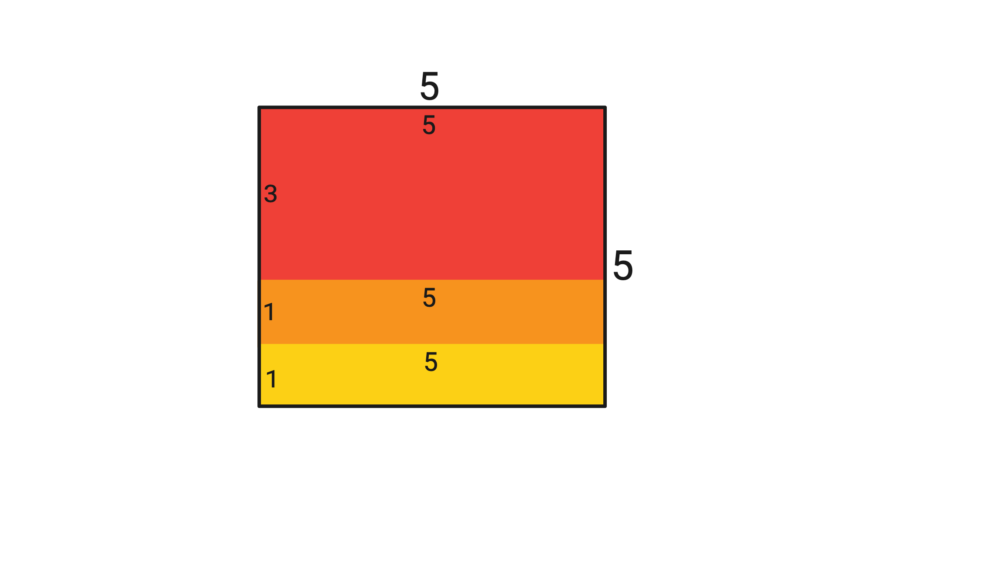

# A. Square of Rectangles

**time limit per test:** 1 second

**memory limit per test:** 256 megabytes

**input:** standard input

**output:** standard output

Aryan is an ardent lover of squares but a hater of rectangles (Yes, he knows all squares are rectangles). But Harshith likes to mess with Aryan. Harshith gives Aryan three rectangles of sizes $l_1\times b_1$, $l_2\times b_2$, and $l_3\times b_3$ such that $l_3\leq l_2\leq l_1$ and $b_3\leq b_2\leq b_1$. Aryan, in order to defeat Harshith, decides to arrange these three rectangles to form a square such that no two rectangles overlap and the rectangles are aligned along edges. Rotating rectangles is not allowed. Help Aryan determine if he can defeat Harshith.

#### Input

Each test contains multiple test cases. The first line contains the number of test cases $t$ ($1 \le t \le 100$). The description of the test cases follows.

Each test case contains a single line with $6$ space-separated integers $l_1, b_1, l_2, b_2, l_3$, and $b_3$ ($1 \leq l_3\le l_2\le l_1\le 100$, $1\le b_3\le b_2\le b_1 \leq 100$) — the dimensions of the three rectangles.

#### Output

For each testcase, print "YES" if the rectangles can be arranged to form a square; otherwise, "NO".

You can output the answer in any case (upper or lower). For example, the strings "yEs", "yes", "Yes", and "YES" will be recognized as positive responses.

#### Example

#### Input
```
5
100 100 10 10 1 1
5 3 5 1 5 1
2 3 1 2 1 1
8 5 3 5 3 3
3 3 3 3 2 1
```

#### Output
```
NO
YES
YES
NO
NO
```

#### Note

In the second test case, the three rectangles $5\times 3$, $5\times 1$, and $5\times 1$ can be arranged as follows to form a square.





In the fourth test case, it can be proven that the rectangles can't be arranged to form a square with the given constraints.
