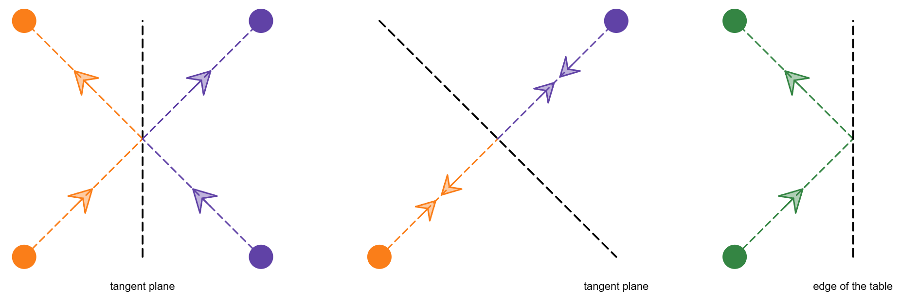
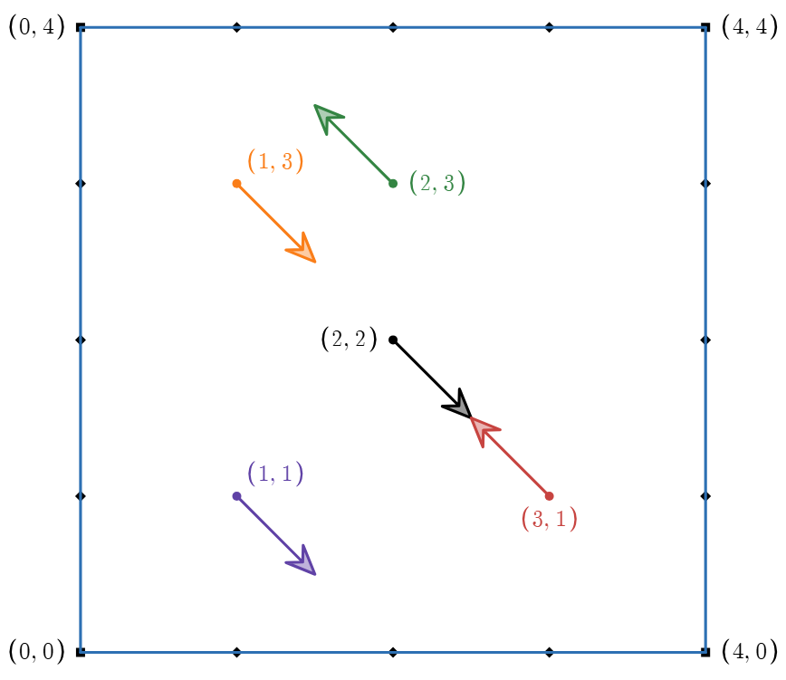
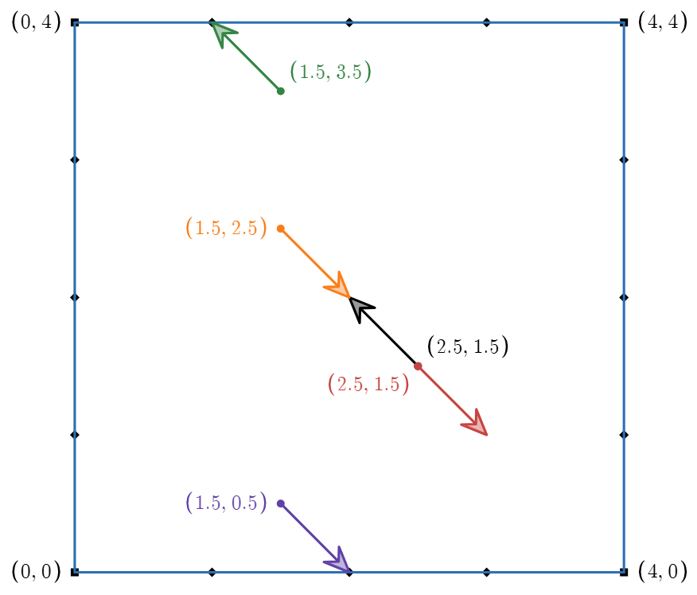
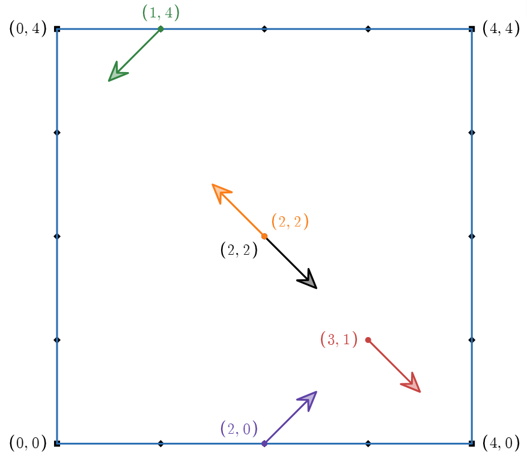
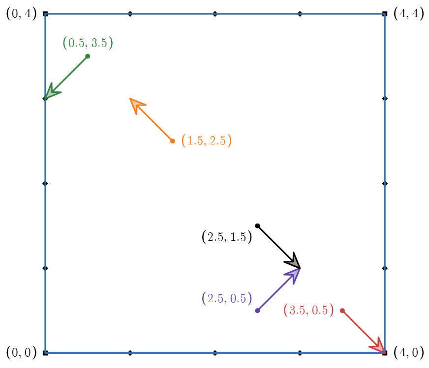
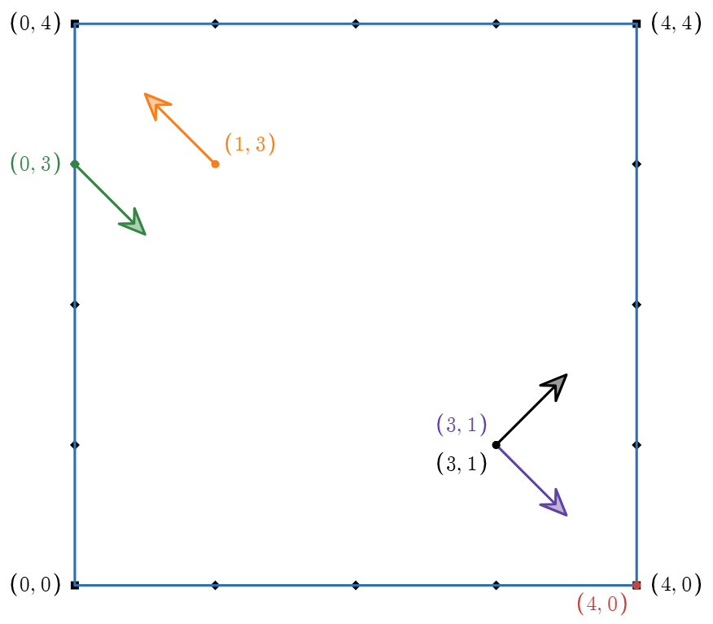
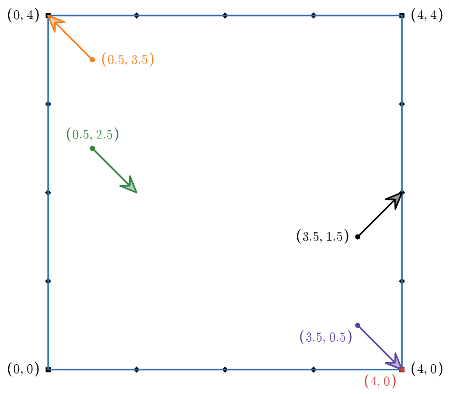
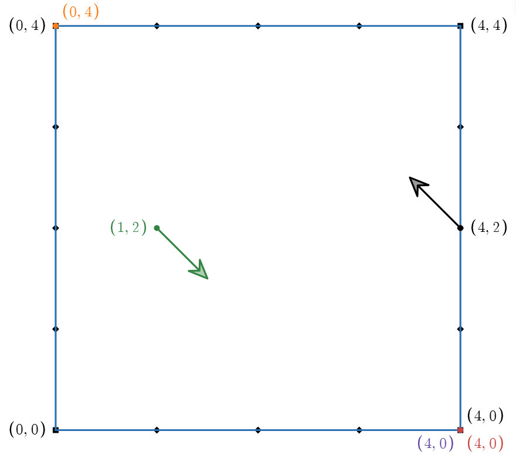
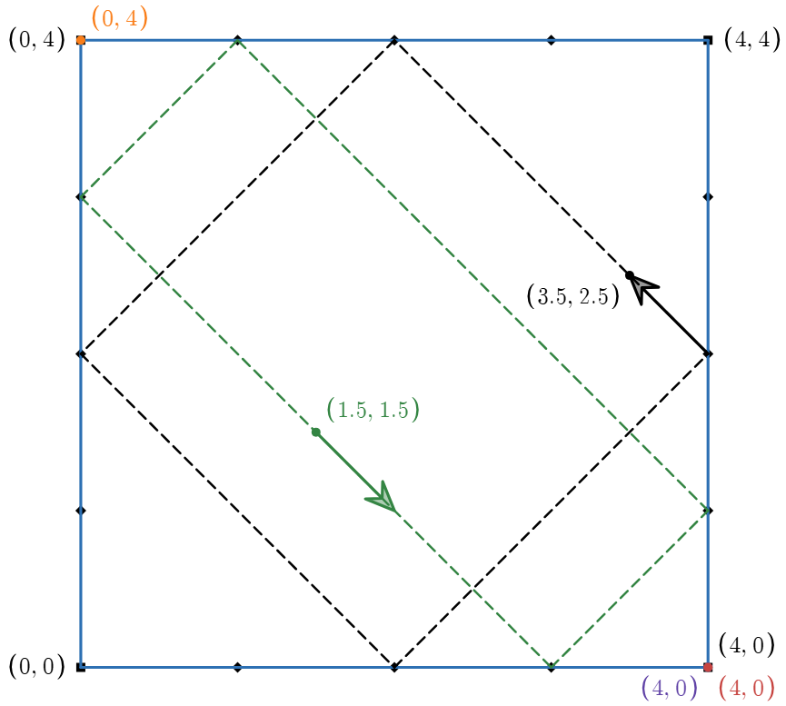

# B. Square Pool

**time limit per test:** 1 second

**memory limit per test:** 256 megabytes

**input:** standard input

**output:** standard output

Aryan and Harshith are playing pool in universe AX120 on a fixed square pool table of side $s$ with pockets at its $4$ corners. The corners are situated at $(0,0)$, $(0,s)$, $(s,0)$, and $(s,s)$. In this game variation, $n$ identical balls are placed on the table with integral coordinates such that no ball lies on the edge or corner of the table. Then, they are all simultaneously shot at $10^{100}$ units/sec speed (only at $45$ degrees with the axes).

In universe AX120, balls and pockets are almost point-sized, and the collisions are elastic, i.e., the ball, on hitting any surface, bounces off at the same angle and with the same speed.





Harshith shot the balls, and he provided Aryan with the balls' positions and the angles at which he shot them. Help Aryan determine the number of balls potted into the pockets by Harshith.

It is guaranteed that multiple collisions do not occur at the same moment and position.

#### Input

Each test contains multiple test cases. The first line contains the number of test cases $t$ ($1 \le t \le 1000$). The description of the test cases follows.

The first line of each test case contains two integers $n$ and $s$ ($1 \le n \le 10^3$, $2 \le s\le 10^9$) — the number of balls placed on the table and the side length of the square pool table.

The $i$-th of the next $n$ lines contains four integers $d_x$, $d_y$, $x_i$, and $y_i$ ($d_x,d_y \in \{-1, 1\}$, $0 \lt x_i, y_i \lt s$) — the direction vectors of the launch on the $X$-axis and $Y$-axis respectively, and the coordinates of the location where the $i$-th ball was placed. It is guaranteed that no two balls coincide at the initial moment.

It is also guaranteed that the sum of $n$ over all test cases does not exceed $10^3$.

#### Output

For each test case, print a single integer — the number of balls potted in that game.

#### Example

#### Input
```
2
1 2
1 1 1 1
5 4
1 -1 1 1
1 -1 2 2
-1 1 2 3
1 -1 1 3
-1 1 3 1
```

#### Output
```
1
3
```

#### Note

In the first test case, there is a single ball and it's shot directly towards the pocket at $(2, 2)$, thus potted.

In the second test case, the state progresses as




$\rightarrow$






$\rightarrow$






$\rightarrow$






$\rightarrow$


