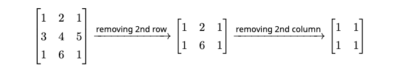

# D. Matrix game

**time limit per test:** 2 seconds

**memory limit per test:** 256 megabytes

**input:** standard input

**output:** standard output

Aryan and Harshith play a game. They both start with three integers $a$, $b$, and $k$. Aryan then gives Harshith two integers $n$ and $m$. Harshith then gives Aryan a matrix $X$ with $n$ rows and $m$ columns, such that each of the elements of $X$ is between $1$ and $k$(inclusive). After that, Aryan wins if he can find a submatrix$^{\text{∗}}$ $Y$ of $X$ with $a$ rows and $b$ columns such that all elements of $Y$ are equal.

For example, when $a=2, b=2, k=6, n=3$ and $m=3$, if Harshith gives Aryan the matrix below, it is a win for Aryan as it has a submatrix of size $2\times 2$ with all elements equal to $1$ as shown below.




 Example of a matrix where Aryan wins
Aryan gives you the values of $a$, $b$, and $k$. He asks you to find the lexicographically minimum tuple $(n,m)$ that he should give to Harshith such that Aryan always wins. Help Aryan win the game. Assume that Harshith plays optimally. The values of $n$ and $m$ can be large, so output them modulo $10^9+7$. A tuple $(n_1, m_1)$ is said to be lexicographically smaller than $(n_2, m_2)$ if either $n_1 \lt n_2$ or $n_1=n_2$ and $m_1 \lt m_2$.

$^{\text{∗}}$A submatrix of a matrix is obtained by removing some rows and/or columns from the original matrix.

#### Input

Each test contains multiple test cases. The first line contains the number of test cases $t$ ($1 \le t \le 10^4$). The description of the test cases follows.

Each test case contains a single line with three space-separated integers $a, b$ and $k$ ($1\leq a,b,k\leq 10^5$).

It is guaranteed that the sum of $\max(a, b, k)$ over all test cases does not exceed $10^5$.

#### Output

For each test case, output a single line containing two space-separated integers $n$ and $m$, denoting the answer to the problem. The values of $n$ and $m$ can be large, so output them modulo $10^9+7$.

#### Example

#### Input
```
3
1 1 5
2 2 2
90000 80000 70000
```

#### Output
```
1 1
3 7
299929959 603196135
```

#### Note

For the first test case, every $n\times m$ matrix contains a $1\times 1$ submatrix with all elements equal. $(1,1)$ is the lexicographically minimum tuple among all of them.

For the second test case, it can be verified that whatever $3\times 7$ matrix Harshith gives to Aryan, Aryan can always win by finding a $2\times 2$ submatrix with all elements equal. $(3,7)$ is also the lexicographically minimum tuple among all possible tuples where Aryan always wins.
