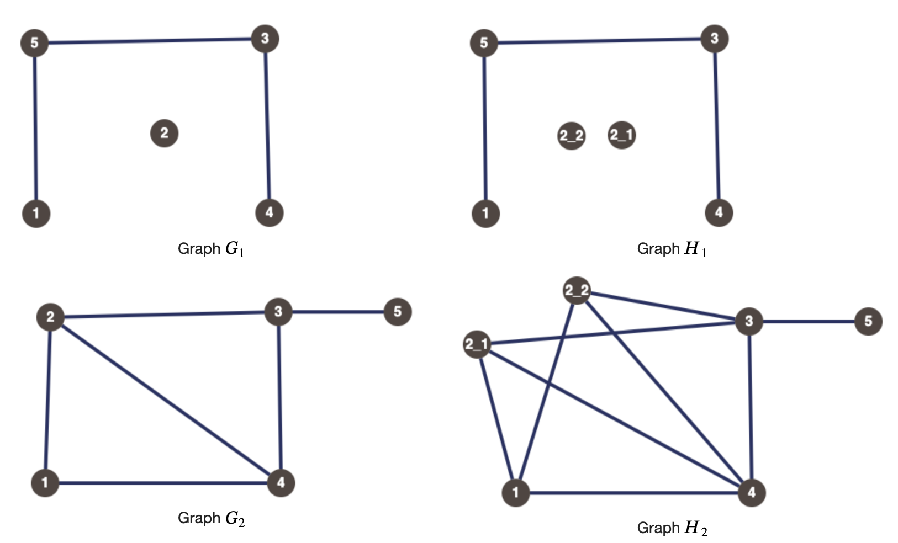

# F. Superb Graphs

**time limit per test:** 2 seconds

**memory limit per test:** 256 megabytes

**input:** standard input

**output:** standard output


As we all know, Aryan is a funny guy. He decides to create fun graphs. For a graph $G$, he defines fun graph $G'$ of $G$ as follows:

- Every vertex $v'$ of $G'$ maps to a non-empty independent set$^{\text{∗}}$ or clique$^{\text{†}}$ in $G$.
- The sets of vertices of $G$ that the vertices of $G'$ map to are pairwise disjoint and combined cover all the vertices of $G$, i.e., the sets of vertices of $G$ mapped by vertices of $G'$ form a partition of the vertex set of $G$.
- If an edge connects two vertices $v_1'$ and $v_2'$ in $G'$, then there is an edge between every vertex of $G$ in the set mapped to $v_1'$ and every vertex of $G$ in the set mapped to $v_2'$.
- If an edge does not connect two vertices $v_1'$ and $v_2'$ in $G'$, then there is not an edge between any vertex of $G$ in the set mapped to $v_1'$ and any vertex of $G$ in the set mapped to $v_2'$.

As we all know again, Harshith is a superb guy. He decides to use fun graphs to create his own superb graphs. For a graph $G$, a fun graph $G' '$ is called a superb graph of $G$ if $G' '$ has the minimum number of vertices among all possible fun graphs of $G$.

Aryan gives Harshith $k$ simple undirected graphs$^{\text{‡}}$ $G_1, G_2,\ldots,G_k$, all on the same vertex set $V$. Harshith then wonders if there exist $k$ other graphs $H_1, H_2,\ldots,H_k$, all on some other vertex set $V'$ such that:

- $G_i$ is a superb graph of $H_i$ for all $i\in \{1,2,\ldots,k\}$.
- If a vertex $v\in V$ maps to an independent set of size greater than $1$ in one $G_i, H_i$ ($1\leq i\leq k$) pair, then there exists no pair $G_j, H_j$ ($1\leq j\leq k, j\neq i$) where $v$ maps to a clique of size greater than $1$.

Help Harshith solve his wonder.

$^{\text{∗}}$For a graph $G$, a subset $S$ of vertices is called an independent set if no two vertices of $S$ are connected with an edge.

$^{\text{†}}$For a graph $G$, a subset $S$ of vertices is called a clique if every vertex of $S$ is connected to every other vertex of $S$ with an edge.

$^{\text{‡}}$A graph is a simple undirected graph if its edges are undirected and there are no self-loops or multiple edges between the same pair of vertices.

#### Input

Each test contains multiple test cases. The first line contains the number of test cases $t$ ($1 \le t \le 100$). The description of the test cases follows.

The first line of each test case contains two integers $n$ and $k$ ($1\leq n\leq 300, 1\leq k\leq 10$).

Then, there are $k$ graphs described. The first line of each graph description contains a single integer $m$ ($0\leq m\leq \frac{n\cdot(n-1)}{2} $).

Next $m$ lines each contain two space-separated integers $u$ and $v$ ($1\leq u, v\leq n, u\neq v$), denoting that an edge connects vertices $u$ and $v$.

It is guaranteed that the sum of $m$ over all graphs over all test cases does not exceed $2\cdot 10^5$, and the sum of $n$ over all test cases does not exceed $300$.

#### Output

For each testcase, print "Yes" if there exists $k$ graphs satisfying the conditions; otherwise, "No".

You can output the answer in any case (upper or lower). For example, the strings "yEs", "yes", "Yes", and "YES" will be recognized as positive responses.

#### Example

#### Input
```
3
5 2
3
3 4
5 3
5 1
6
3 5
3 4
1 4
1 2
2 3
4 2
4 3
0
3
3 1
1 4
1 2
4
4 2
4 3
1 2
2 3
3 2
0
3
3 1
3 2
1 2
```

#### Output
```
Yes
Yes
No
```

#### Note

For the first test case, the following are the graphs of $G_1, H_1$ and $G_2, H_2$ such that $G_1$ is superb graph of $H_1$ and $G_2$ is superb graph of $H_2$.





In each graph, vertex $2$ of $G_i$ corresonds to independent set $\{2\_1, 2\_2\}$ of corresponding $H_i$ and remaining vertices $v\in\{1,3,4,5\}$ of $G_i$ correspond to independent set/clique $\{v\}$ in corresponding $H_i$(a single vertex set can be considered both an independent set and a clique).

In the third test case, it can be proven that the answer is "No".
