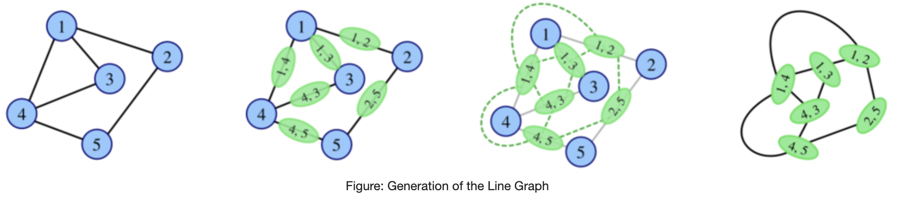
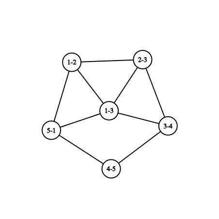

# G. Eulerian Line Graph

**time limit per test:** 2 seconds

**memory limit per test:** 256 megabytes

**input:** standard input

**output:** standard output


Aryan loves graph theory more than anything. Well, no, he likes to flex his research paper on line graphs to everyone more. To start a conversation with you, he decides to give you a problem on line graphs. In the mathematical discipline of graph theory, the line graph of a simple undirected graph $G$ is another simple undirected graph $L(G)$ that represents the adjacency between every two edges in $G$.

Precisely speaking, for an undirected graph $G$ without self-loops or multiple edges, its line graph $L(G)$ is a graph such that

- Each vertex of $L(G)$ represents an edge of $G$.
- Two vertices of $L(G)$ are adjacent if and only if their corresponding edges share a common endpoint in $G$.





Also, $L^0(G)=G$ and $L^k(G)=L(L^{k-1}(G))$ for $k\geq 1$.

An Euler trail is a sequence of edges that visits every edge of the graph exactly once. This trail can be either a path (starting and ending at different vertices) or a cycle (starting and ending at the same vertex). Vertices may be revisited during the trail, but each edge must be used exactly once.

Aryan gives you a simple connected graph $G$ with $n$ vertices and $m$ edges and an integer $k$, and it is guaranteed that $G$ has an Euler trail and it is not a path graph$^{\text{∗}}$. He asks you to determine if $L^k(G)$ has an Euler trail.

$^{\text{∗}}$A path graph is a tree where every vertex is connected to atmost two other vertices.

#### Input

Each test contains multiple test cases. The first line contains the number of test cases $t$ ($1 \le t \le 10^4$). The description of the test cases follows.

The first line of each test case contains three space-separated integers $n$, $m$, and $k$ ($5 \le n \le 2 \cdot 10^5$, $n-1 \le m \le \min(\frac{n\cdot(n-1)}{2} ,2 \cdot 10^5)$, $1 \le k \le 2 \cdot 10^5$).

The next $m$ lines of each test case contain two space-separated integers $u$ and $v$ ($1 \le u,v \le n$, $u \neq v$), denoting that an edge connects vertices $u$ and $v$.

It is guaranteed that the sum of $n$ and $m$ over all test cases does not exceed $2\cdot 10^5$.

#### Output

For each testcase, print "YES" if $L^k(G)$ has an Euler trail; otherwise, "NO".

You can output the answer in any case (upper or lower). For example, the strings "yEs", "yes", "Yes", and "YES" will be recognized as positive responses.

#### Example

#### Input
```
4
5 5 2
1 2
2 3
3 4
4 5
5 1
5 6 1
1 2
2 3
3 4
4 5
5 1
1 3
10 11 3
1 2
2 3
3 4
4 5
4 6
4 7
5 7
6 7
7 8
8 9
9 10
7 8 2
1 3
2 3
1 4
4 5
2 5
1 6
6 7
2 7
```

#### Output
```
YES
NO
YES
NO
```

#### Note

For the first test case, $L^2(G)$ is isomorphic to $G$ itself. So, since $G$ has an Euler trail, $L^2(G)$ also has an Euler trail.

For the second test case, $L(G)$ looks as follows(Vertex $i-j$ of $L(G)$ in figure corresponds to edge between vertices $i$ and $j$ of $G$). It can be proven that this doesn't have an Euler trail.



