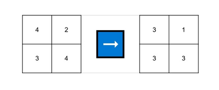
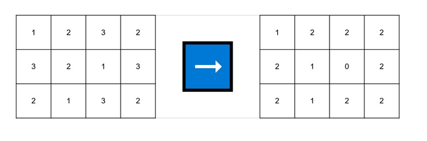

# C. Those Who Are With Us

**time limit per test:** 1 second

**memory limit per test:** 256 megabytes

**input:** standard input

**output:** standard output

You are given a matrix of integers with $n$ rows and $m$ columns. The cell at the intersection of the $i$-th row and the $j$-th column contains the number $a_{ij}$.

You can perform the following operation exactly once:

- Choose two numbers $1 \leq r \leq n$ and $1 \leq c \leq m$.
- For all cells $(i, j)$ in the matrix such that $i = r$ or $j = c$, decrease $a_{ij}$ by one.

You need to find the minimal possible maximum value in the matrix $a$ after performing exactly one such operation.

#### Input

Each test consists of multiple test cases. The first line contains a single integer $t$ ($1 \leq t \leq 10^4$) — the number of test cases. The description of the test cases follows.

The first line of each test case contains two integers $n$ and $m$ ($1 \leq n \cdot m \leq 10^5$) — the number of rows and columns in the matrix.

The next $n$ lines of each test case describe the matrix $a$. The $i$-th line contains $m$ integers $a_{i1}, a_{i2}, \ldots, a_{im}$ ($1 \leq a_{ij} \leq 100$) — the elements in the $i$-th row of the matrix.

It is guaranteed that the sum of $n \cdot m$ across all test cases does not exceed $2 \cdot 10^5$.

#### Output

For each test case, output the minimum maximum value in the matrix $a$ after performing exactly one operation.

#### Example

#### Input
```
10
1 1
1
1 2
1 2
2 1
2
1
2 2
4 2
3 4
3 4
1 2 3 2
3 2 1 3
2 1 3 2
4 3
1 5 1
3 1 3
5 5 5
3 5 1
4 4
1 3 3 2
2 3 2 2
1 2 2 1
3 3 2 3
2 2
2 2
1 2
3 2
1 2
2 1
1 2
3 3
2 1 1
1 2 1
1 1 2
```

#### Output
```
0
1
1
3
2
4
3
1
1
2
```

#### Note

In the first three test cases, you can choose $r = 1$ and $c = 1$.

In the fourth test case, you can choose $r = 1$ and $c = 2$.





In the fifth test case, you can choose $r = 2$ and $c = 3$.





In the sixth test case, you can choose $r = 3$ and $c = 2$.
