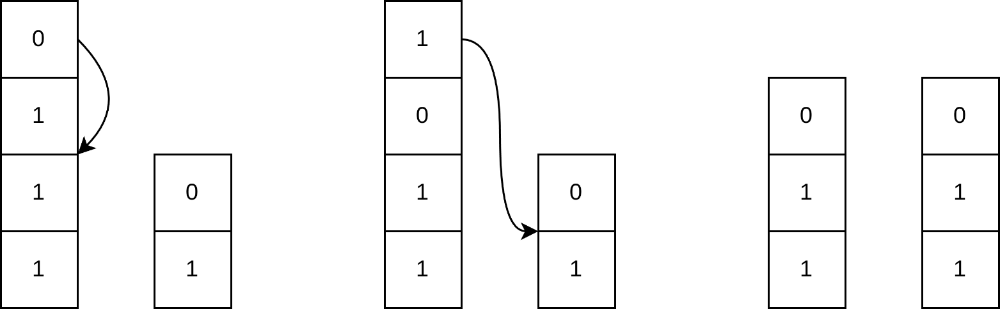
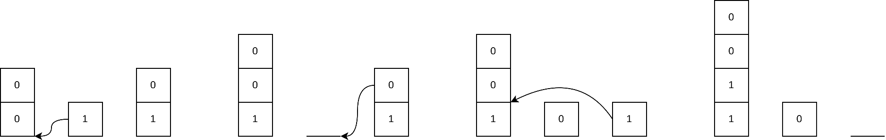

# B. Pile Shuffling

**time limit per test:** 1 second

**memory limit per test:** 256 megabytes

**input:** standard input

**output:** standard output


You are given $n$ binary piles, the $i$-th of which consists of $a_i$ zeros on the top and $b_i$ ones on the bottom.

In one operation, you can take the top element of any pile and move it to any position in any pile, including the pile it was taken from.




 Solution of the first example test case. Calculate the minimum number of operations required to make it so that the $i$-th pile consists of $c_i$ zeros on the top and $d_i$ ones on the bottom.

#### Input

Each test contains multiple test cases. The first line contains the number of test cases $t$ ($1 \le t \le 10^4$). The description of the test cases follows.

The first line of each test case contains a single integer $n$ ($1 \leq n \leq 2 \cdot 10^5$) — the number of piles.

Then $n$ lines follow, the $i$-th containing four integers $a_i$, $b_i$, $c_i$, $d_i$ ($0 \leq a_i, b_i, c_i, d_i \leq 10^9$) — the original and target state of the $i$-th pile.

It is guaranteed that there exists a sequence of operations that transforms the piles into the target state.

It is guaranteed that the sum of $n$ over all test cases does not exceed $2 \cdot 10^5$.

#### Output

For each test case, output one integer — the minimum number of operations required to achieve the target state.

#### Example

#### Input
```
3
2
1 3 1 2
1 1 1 2
3
2 0 2 2
0 1 1 0
1 1 0 0
3
1 2 1 2
3 4 3 4
0 0 0 0
```

#### Output
```
2
3
0
```

#### Note

The solution of the first test case is shown in the statement.

In the second test case, an optimal solution is to do the following:





In the third test case, all piles are already in their target state.
