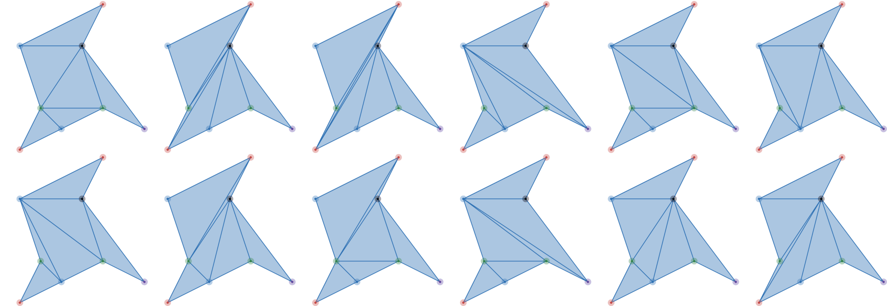
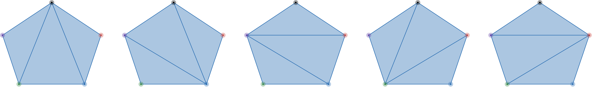

# F. Colorful Polygon

**time limit per test:** 2 seconds

**memory limit per test:** 256 megabytes

**input:** standard input

**output:** standard output

You are given an array $a_1, a_2, \ldots, a_n$, where $n \leq 8$ and $a_1 + a_2 + \cdots + a_n \leq 100$.

Construct a simple polygon$^{\text{∗}}$ with at most $333$ vertices that has exactly $$\frac{(a_1 + a_2 + \cdots + a_n)!}{a_1! a_2! \cdots a_n!}$$ different triangulations$^{\text{†}}$. It can be proven that such a polygon always exists.

$^{\text{∗}}$A [simple polygon](<https://en.wikipedia.org/wiki/Simple_polygon>) is a polygon that does not intersect itself and has no holes. In other words, no two non-consecutive edges can have common points, and consecutive edges must have exactly one common point — the vertex between them. Consecutive edges may be collinear.

$^{\text{†}}$A [triangulation](<https://en.wikipedia.org/wiki/Polygon_triangulation>) of a polygon with $m$ vertices is a set of $m-3$ diagonals that intersect only at vertices. A diagonal is a segment between two vertices which lies inside the polygon and has exactly two common points with the polygon sides — the vertices it connects.

#### Input

The first line of each test contains a single integer $n$ ($2 \leq n \leq 8$) — the number of elements in the array.

The second line contains $n$ integers $a_1, a_2, \ldots, a_n$ ($1 \leq a_i \leq 100$) — the elements of the array.

It is guaranteed that $a_1 + a_2 + \cdots + a_n$ does not exceed $100$.

#### Output

In the first line, output a single integer $m$ ($3 \leq m \leq 333$) — the number of vertices in the polygon.

In the $i$-th of the following $m$ lines, output two integers $x_i$, $y_i$ ($-10^6 \leq x_i, y_i \leq 10^6$) — the coordinates of the $i$-th vertex of the polygon.

The polygon must be simple. The vertices may be given in either clockwise or counterclockwise order.

#### Examples

#### Input
```
3
1 1 2
```

#### Output
```
8
0 0
2 1
4 2
6 1
3 5
4 7
0 5
1 2
```

#### Input
```
2
4 1
```

#### Output
```
5
-2 -2
-3 1
0 3
3 1
2 -2
```

#### Note

In the first test, the required polygon has to have $\tfrac{4!}{1! 1! 2!} = 12$ triangulations. The following are all the triangulations of the example polygon.





 In the second test, the required polygon has to have $\tfrac{5!}{4! 1!} = 5$ triangulations.



