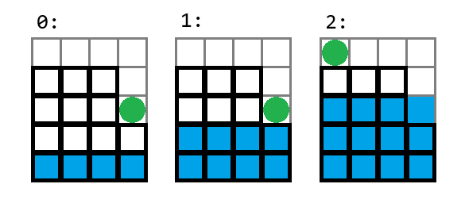

# C. I Will Definitely Make It

**time limit per test:** 1 second

**memory limit per test:** 256 megabytes

**input:** standard input

**output:** standard output

You are given $n$ towers, numbered from $1$ to $n$. Tower $i$ has a height of $h_i$. At time $0$, you are on the tower with index $k$, and the current water level is $1$.

Every second, the water level rises by $1$ unit. At any moment, if the water level becomes strictly greater than the height of the tower you are on, you perish.

You have a magical ability: at moment $x$, you can start teleporting from tower $i$ to tower $j$, which will take $\lvert h_i - h_j \rvert$ seconds. That is, until moment $x + \lvert h_i - h_j \rvert$, you will be on tower $i$, and at moment $x + \lvert h_i - h_j \rvert$, you will move to tower $j$. You can start a new teleportation at the same moment you just arrived at tower $j$.

For example, if $n=k=4$, $h=[4, 4, 4, 2]$, then if you start teleporting from tower $4$ to tower $1$ at moment $0$, the movement will look as follows:





Note that if the height of tower $1$ were $5$, you would not be able to teleport to it immediately, as you would be submerged at moment $2$.

Your goal is to reach any tower with the maximum height before the water covers you.

Determine if this is possible.

#### Input

Each test consists of several test cases. The first line contains a single integer $t$ ($1 \le t \le 10^4$) — the number of test cases. The description of the test cases follows.

The first line of each test case contains two integers $n$ and $k$ ($1 \le k \le n \le 10^5$) — the number of towers and the index of the tower you are initially on.

The second line contains $n$ integers $h_1, h_2, \dots, h_n$ ($1 \le h_i \le 10^9$) — the heights of the towers.

It is guaranteed that the sum of all $n$ across all test cases does not exceed $10^5$.

#### Output

For each test case, output one line: "YES", if you can reach the tower with the maximum height before the water covers you, or "NO" otherwise.

You may output each letter in any case (lowercase or uppercase). For example, the strings "yEs", "yes", "Yes", and "YES" will be accepted as a positive answer.

#### Example

#### Input
```
5
5 3
3 2 1 4 5
3 1
1 3 4
4 4
4 4 4 2
6 2
2 3 6 9 1 2
4 2
1 2 5 6
```

#### Output
```
YES
NO
YES
YES
NO
```

#### Note

In the first test case, the only possible path is: $3 \rightarrow 2 \rightarrow 1 \rightarrow 4 \rightarrow 5$.

In the second test case, regardless of the order, it will not be possible to reach the tallest tower.

In the third test case, one of the possible paths is: $4 \rightarrow 1$.
