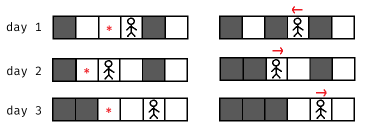
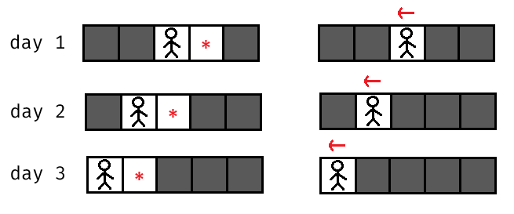

# B. Hamiiid, Haaamid... Hamid?

**time limit per test:** 1 second

**memory limit per test:** 256 megabytes

**input:** standard input

**output:** standard output


Mani has locked Hamid in a $1 \times n$ grid. Initially, some cells of the grid contain walls and the rest are empty, and Hamid is in an empty cell.

In each day, the following events happen in order:
- Mani selects an empty cell and builds a wall in that cell. Note that he can not build a wall in the cell which Hamid currently is at;
- Hamid selects a direction (left or right), then
 - If there are no walls in that direction, he will escape the grid;
 - Otherwise, he will move to the nearest wall in that direction and destroy that wall. Hamid is at the position of the destroyed wall after this day.

Here is an example of a possible sequence of actions when $n=6$:





Hamid is always aware of where the walls are. He wants to minimize the number of days that he needs to escape the grid, while Mani wants to maximize it.

You have to determine the number of days Hamid needs to escape the grid if they both act optimally.

#### Input

Each test contains multiple test cases. The first line contains the number of test cases $t$ ($1 \le t \le 10^4$). The description of the test cases follows.

The first line of each test case contains two integers $n$ and $x$ ($2 \leq n \leq 2 \cdot 10^5$, $1 \leq x \leq n$) — the size of the grid and the initial position of Hamid. He is at the $x$-th cell from left to right initially.

The second line contains a string $s$ of length $n$ ($s_i=\texttt{"#"}$ or $\texttt{"."}$) — the initial state of the grid. The $i$-th cell of the grid contains a wall if $s_i= \texttt{"#"}$, and it is empty if $s_i=\texttt{"."}$.

It is guaranteed that the $x$-th cell is empty, and there are at least two empty cells in the grid.

It is guaranteed that the sum of $n$ over all test cases does not exceed $2 \cdot 10^5$.

#### Output

For each test case, output a single integer — the number of days Hamid needs to escape the grid if they both act optimally.

#### Example

#### Input
```
4
3 1
..#
4 2
....
5 3
##..#
6 4
#...#.
```

#### Output
```
1
1
3
3
```

#### Note

In the first test case, Mani must build a wall in cell $2$, so Hamid can escape from the left side of the grid on the first day.

In the second test case, if Mani places the wall to the left of Hamid, Hamid can escape from the right. And if the wall is to Hamid's right, he can escape from the left. Thus, the answer is $1$.

In the third test case:





It can be shown that both players acted optimally in the above illustration.

In the fourth test case, we have shown an example of actions in the statements. Note that the players did not act optimally in this example.
