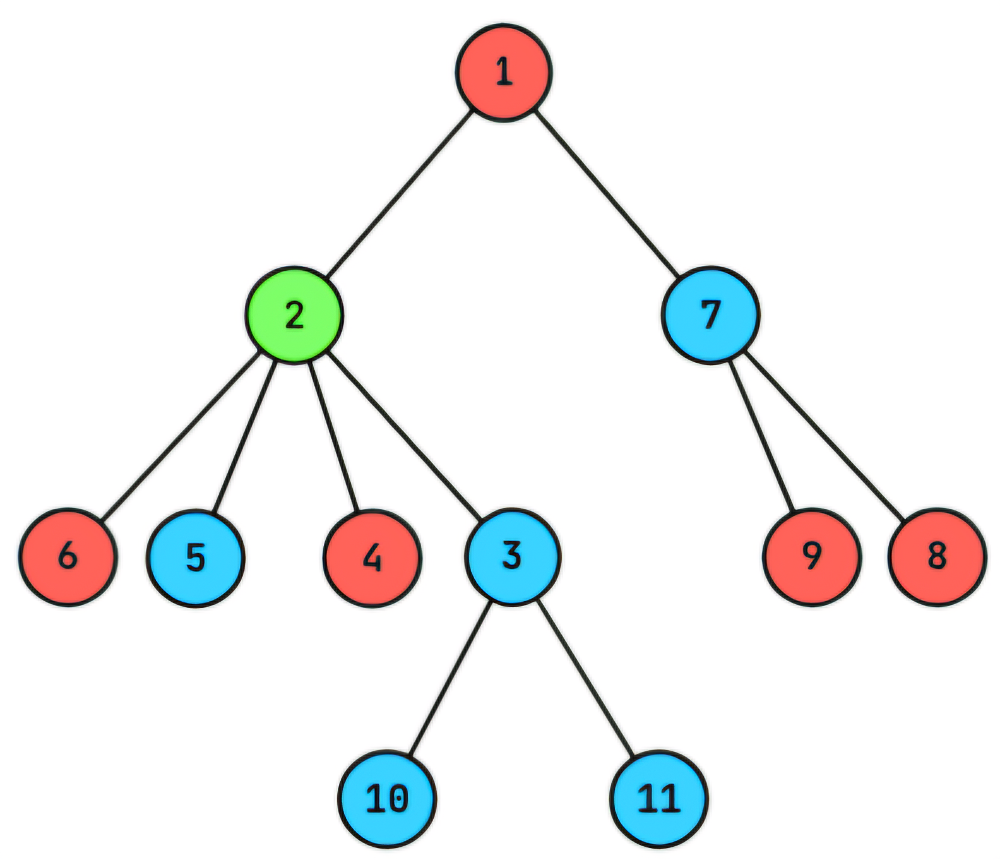

# E. Ancient Tree

**time limit per test:** 4 seconds

**memory limit per test:** 256 megabytes

**input:** standard input

**output:** standard output


Bahamin came from the past to visit Ali — who came from the future. He also brought an ancient tree as a gift for Ali. He noticed some of its vertices have lost their color. Bahamin needs to repaint these vertices, but he is very busy with fixing his time machine. Fortunately (or unfortunately), dinosaurs now handle such tasks — for a fee, of course. He needs your help to find the coloring with minimum cost. So he gives you the problem as follows.

You are given a rooted tree$^{\text{∗}}$ of $n$ vertices, where vertex $1$ is the root. Each vertex has an integer weight $w_i$ and a color $c_i$, where the colors are integers between $1$ and $k$. However, some vertices have lost their colors, represented by $c_i = 0$.

We call vertex $v$ cutie if there exists two vertices $x$ and $y$, such that

- $\operatorname{lca}(x, y)$$^{\text{†}}$ $= v$,
- $c_x = c_y$, and
- $c_x \neq c_v$.

The cost of the tree is the sum of weights of all cutie vertices.

You have to assign colors between $1$ and $k$ to all the vertices which have lost their colors. Find the minimum possible cost among all valid colorings and provide a coloring with the minimum possible cost.

$^{\text{∗}}$A tree is a connected graph without cycles. A rooted tree is a tree where one vertex is special and called the root.

$^{\text{†}}$$\operatorname{lca}(x, y)$ denotes the [lowest common ancestor (LCA)](<https://en.wikipedia.org/wiki/Lowest_common_ancestor>) of $x$ and $y$.

#### Input

Each test contains multiple test cases. The first line contains the number of test cases $t$ ($1 \le t \le 10^4$). The description of the test cases follows.

The first line of each test case contains two integers $n$ and $k$ ($3 \leq n \leq 2 \cdot 10^5$, $2 \leq k \leq n$) — the number of vertices and the number of colors.

The second line contains $n$ integers $w_1,w_2,\ldots,w_n$ ($1 \leq w_i \leq 10^9$) — the weight of vertices.

The third line contains $n$ integers $c_1,c_2,\ldots,c_n$ ($0 \leq c_i \leq k$) — the color of vertices. $c_i=0$ means that vertex $i$ has lost its color.

Then $n−1$ lines follow, the $i$-th line containing two integers $u$ and $v$ ($1 \leq u, v \leq n$) — the two vertices that the $i$-th edge connects.

It is guaranteed that the given edges form a tree.

It is guaranteed that the sum of $n$ over all test cases does not exceed $2 \cdot 10^5$.

#### Output

For each test case, in the first line output a single integer — the minimum possible cost among all valid colorings.

In the second line output $n$ integers $c'_1, c'_2, \ldots, c'_n$ — a coloring with the minimum possible cost. You need to guarantee that:

- $c'_i = c_i$ if $c_i \neq 0$;
- $1 \leq c'_i \leq k$ if $c_i = 0$.

If there are multiple colorings with the minimum possible cost, you can output any of them.

#### Example

#### Input
```
4
4 4
5 5 5 5
1 0 2 3
1 2
1 3
1 4
5 2
3 1 4 1 5
1 2 1 2 2
1 4
2 1
3 4
4 5
11 3
3 1 4 3 1 4 3 1 4 5 6
0 0 0 2 1 2 1 2 2 1 1
1 2
2 3
2 4
2 5
2 6
1 7
7 8
7 9
10 3
3 11
4 3
2 3 2 3
2 1 0 0
3 1
1 2
2 4
```

#### Output
```
0
1 4 2 3
3
1 2 1 2 2
7
2 3 1 2 1 2 1 2 2 1 1
0
2 1 3 1
```

#### Note

In the first test case, there are four choices for the missing color:

- $c_2 = 1$ makes no vertex cutie, so the cost is $0$;
- $c_2 = 2$ makes vertex $1$ cutie, since $c_2 = c_3 = 2$, $\operatorname{lca}(2, 3) = 1$ and $c_1 \neq 2$. Thus, the cost is $w_1 = 5$;
- $c_2 = 3$ makes vertex $1$ cutie, since $c_2 = c_4 = 3$, $\operatorname{lca}(2, 4) = 1$ and $c_1 \neq 3$. Thus, the cost is $w_1 = 5$;
- $c_2 = 4$ makes no vertex cutie, so the cost is $0$.

Thus, the minimum possible cost among different colorings is $0$.

In the second test case, every vertex has a color. So current cost is not changeable. And since we have $c_5 = c_2 = 2$, $\operatorname{lca}(2, 5) = 1$ and $c_1 \neq 2$, vertex $1$ is cutie and current cost is equal to $w_1 = 3$.

In the third test case, a possible coloring with the minimum cost is shown below:





Some other valid colorings are:

- $c = [3, 1, 2, 2, 1, 2, 1, 2, 2, 1, 1]$ which makes vertices $1, 2, 3, 7$ cutie:

 - $\operatorname{lca}(4, 8) = 1$;
 - $\operatorname{lca}(3, 4) = 2$;
 - $\operatorname{lca}(10, 11) = 3$;
 - $\operatorname{lca}(8, 9) = 7$.
 All pairs of vertices mentioned have a different color from their LCA. So the cost will be $w_1 + w_2 + w_3 + w_7 = 11$.
- $c = [3, 2, 1, 2, 1, 2, 1, 2, 2, 1, 1]$ which makes vertices $1, 2, 7$ cutie:

 - $\operatorname{lca}(5, 7) = 1$;
 - $\operatorname{lca}(5, 11) = 2$;
 - $\operatorname{lca}(8, 9) = 7$.
 All pairs of vertices mentioned have a different color from their LCA. So the cost will be $w_1 + w_2 + w_7 = 7$.

It can be shown that no coloring with cost smaller than $7$ exists.
