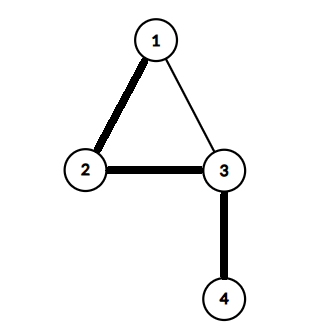
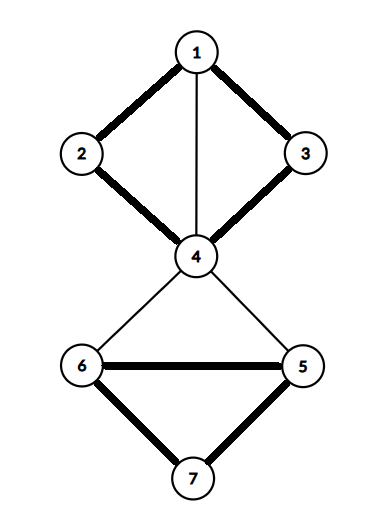
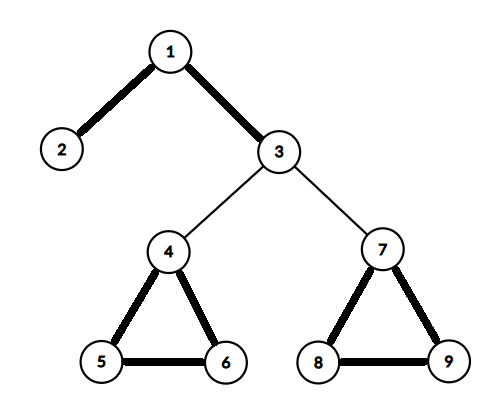

# H. 23 Rises Again

**time limit per test:** 5 seconds

**memory limit per test:** 1024 megabytes

**input:** standard input

**output:** standard output


Kiarash is picking strawberries to take home...

A graph is called candy if and only if the degree of every vertex in it is at most $2$.

You are given a simple, undirected, and connected graph $G$ of $n\le 30$ vertices, with a special property: each vertex belongs to at most $5$ simple cycles$^{\text{∗}}$.

What is the maximum number of edges among all subgraphs$^{\text{†}}$ of $G$ that are candy?

$^{\text{∗}}$A simple cycle is a connected subgraph such that each vertex has a degree of exactly $2$

$^{\text{†}}$A subgraph of $G$ is a graph whose vertices and edges are subsets of $G$.

#### Input

Each test contains multiple test cases. The first line contains the number of test cases $t$ ($1 \le t \le 50$). The description of the test cases follows.

The first line of each test case contains two integers $n$ and $m$ ($3 \leq n \leq 30$, $n-1 \leq m \leq \frac{n(n-1)}{2}$) — the number of vertices and the number of edges.

Then $m$ lines follow, the $i$-th line containing two integers $u$ and $v$ ($1 \leq u, v \leq n$) — the two vertices that the $i$-th edge connects.

It is guaranteed that the given graph is simple and connected, and each vertex belongs to at most $5$ simple cycles.

It is guaranteed that the sum of $n^2$ over all test cases does not exceed $900$.

#### Output

For each test case, output a single integer — the maximum number of edges among all subgraphs that are candy graphs.

#### Example

#### Input
```
3
4 4
1 2
1 3
2 3
3 4
7 10
1 2
1 3
1 4
2 4
3 4
4 5
4 6
5 6
5 7
6 7
9 10
1 2
1 3
3 4
3 7
4 5
4 6
5 6
7 8
7 9
8 9
```

#### Output
```
3
7
8
```

#### Note

In the first test case, you can select the edges marked in the image below. On the other hand, you can't select all the edges because the degree of vertex $3$ would exceed $2$. So the maximum number of edges among all subgraphs that are candy is $3$.





In the second test case, you can select the edges marked in the image below. It can be proven that any subgraph that is candy has at most $7$ edges.





In the third test case, the image below shows one of the subgraphs with the maximum possible number of edges that is candy.



