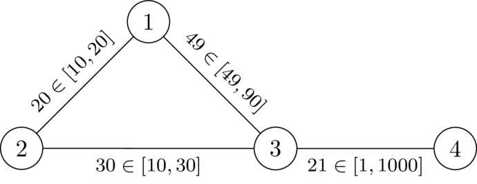
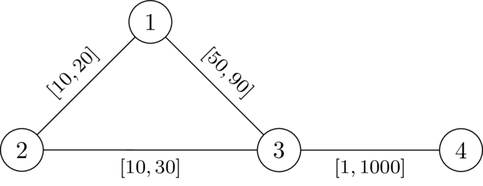

# F. Strict Triangle

**time limit per test:** 4 seconds

**memory limit per test:** 512 megabytes

**input:** standard input

**output:** standard output

You are given an undirected connected graph with $n$ nodes and $m$ edges. The weight $w_i$ of the $i$-th edge is not yet decided and must be a real number between $l_i$ and $r_i$.

You are given a node $k$. Determine if there exists a valid assignment of weights $(w_1, \ldots, w_m)$ such that:

- $l_i \leq w_i \leq r_i$ for all $i$, and
- $\mathrm{dist}_w(1, n) \neq \mathrm{dist}_w(1, k) + \mathrm{dist}_w(k, n)$$^{\text{∗}}$.

$^{\text{∗}}$Given an assignment of weights $w$, $\mathrm{dist}_w(u, v)$ is the minimum value of $w_{e_1} + w_{e_2} + \ldots + w_{e_p}$ over all sequences of $p$ edges $(e_1, e_2, \ldots, e_p)$ that form a path from $u$ to $v$.

#### Input

Each test contains multiple test cases. The first line contains the number of test cases $t$ ($1 \le t \le 10\,000$). The description of the test cases follows.

The first line of each test case contains three integers $n$, $m$, and $k$ ($4 \le n \le 200\,000$, $n-1 \le m \le 200\,000$, $2 \le k \le n - 1$) — the number of nodes, the number of edges, and the node $k$.

The $i$-th of the following $m$ lines contains four integers $u_i$, $v_i$, $l_i$, and $r_i$ ($1 \le u_i, v_i \le n$, $u_i \ne v_i$, $1 \le l_i \le r_i \le 10^9$), representing an edge between $u_i$ and $v_i$ whose weight must be between $l_i$ and $r_i$ inclusive. No edge appears in the input more than once.

It is guaranteed that:

- the sum of $n$ over all test cases doesn't exceed $200\,000$
- the sum of $m$ over all test cases doesn't exceed $200\,000$

#### Output

Print YES if there exists a valid assignment of weights and NO otherwise.

You can output the answer in any case (upper or lower). For example, the strings "yEs", "yes", "Yes", and "YES" will be recognized as positive responses.

#### Example

#### Input
```
7
4 4 2
1 2 10 20
2 3 10 30
1 3 49 90
4 3 1 1000
4 4 2
1 2 10 20
2 3 10 30
1 3 50 90
4 3 1 1000
5 7 3
1 2 1 100000
1 4 10 100
2 3 1 100000
3 4 1 100000
2 5 2 100000
3 5 1 1
4 5 1 31
5 7 3
1 2 1 100000
1 4 100000 100000
2 3 1 1
3 4 1 100000
2 5 2 100000
3 5 1 1
4 5 1 31
5 5 3
1 2 1 42
2 4 1 42
4 5 1 42
1 3 1 1
3 5 1 42
5 5 3
1 2 1 42
2 4 1 42
4 5 1 42
1 3 1 1
3 5 1 1
5 5 3
1 2 1 42
2 4 1 42
4 5 1 42
1 3 1 1
3 5 2 2
```

#### Output
```
YES
NO
YES
YES
YES
NO
NO
```

#### Note

In the first test case, $w = (20, 30, 49, 21)$ is a valid assignment of weights, since $\mathrm{dist}_w(1, 4) = 70 \neq 71 = \mathrm{dist}_w(1, 2) + \mathrm{dist}_w(2, 4)$.





In the second test case, there is no valid assignment of weights.



