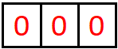
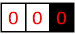
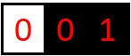
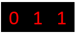

# D. Permutation Blackhole

**time limit per test:** 3 seconds

**memory limit per test:** 512 megabytes

**input:** standard input

**output:** standard output

For a permutation $p_1, p_2, \ldots, p_n$ of length $n$, the corresponding coloring sequence $s$ can be obtained by the following coloring process:

- Initially, there are $n$ white cells indexed from $1$ to $n$ from left to right. At second $0$, the score of each cell is $0$.
- At second $i$ ($1 \le i \le n$),

 - If $i \gt 1$, find the nearest black cell to the cell $p_i$, and increase the score of that cell by $1$. In case there are multiple nearest black cells, choose the cell with the lowest index. Cell $y$ is called the nearest black cell to cell $x$ only if cell $y$ is black and there is no black cell $z$ satisfying $|x-z| \lt |x-y|$.
 - Color the cell $p_i$ black.


After all cells are colored black, denoting $s_i$ as the score of cell $i$ ($1 \le i \le n$), we get the coloring sequence $s$.

You might want to read the notes for a better understanding.

You are given an incomplete coloring sequence $s$, where some $s_i$ are already fixed, while others are not yet determined. Count how many different permutations $p$ can produce this coloring sequence. Since the answer may be large, you need to output it modulo $998\,244\,353$.

#### Input

Each test contains multiple test cases. The first line contains the number of test cases $t$ ($1 \le t \le 10^3$). The description of the test cases follows.

For each test case, the first line contains an integer $n$ ($2 \leq n \leq 100$).

The second line contains $n$ integers $s_1, s_2, \ldots, s_n$ ($-1 \leq s_i \leq n-1$). Here, $s_i=-1$ means $s_i$ has not been determined. And $s_i \neq -1$ means $s_i$ has already been fixed.

It is guaranteed that the sum of $n^2$ over all test cases does not exceed $10^4$.

#### Output

For each test case, output the total of different permutations $p_1, p_2, \ldots, p_n$ that can produce the coloring sequence, modulo $998\,244\,353$.

#### Example

#### Input
```
9
3
-1 -1 1
3
-1 -1 -1
4
-1 2 -1 0
4
-1 0 1 -1
5
-1 3 -1 0 -1
5
4 4 4 4 4
5
1 0 1 2 0
6
-1 1 -1 -1 3 0
13
-1 -1 -1 -1 -1 -1 2 -1 -1 -1 -1 -1 -1
```

#### Output
```
2
6
4
3
8
0
4
10
867303072
```

#### Note

In the first test case, $p=[3,1,2]$ and $p=[3,2,1]$ can produce the coloring sequence $s=[-1,-1,1]$.

For $p=[3,1,2]$, the coloring process is shown as the following picture.





 The grid at seconds $0$, $1$, $2$, and $3$ respectively when $p=[3,1,2]$.
For $p=[3,2,1]$, the coloring process is shown as the following picture.








 The grid at seconds $0$, $1$, $2$, and $3$ respectively when $p=[3,2,1]$.
