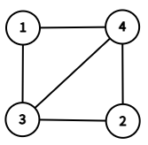
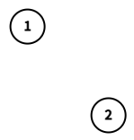
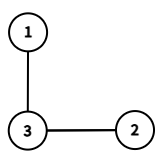
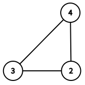

# E. Induced Subgraph Queries

**time limit per test:** 5 seconds

**memory limit per test:** 512 megabytes

**input:** standard input

**output:** standard output

You are given an unweighted, undirected graph $G$ with $n$ nodes and $m$ edges. The graph $G$ contains no self-loops or multiple edges.

We denote the node set of $G$ as $V$. For any node subset $V' \subseteq V$, the corresponding induced subgraph, denoted by $G[V']$, is defined as follows:

- $G[V']$ is the graph whose node set is $V'$, and whose edge set consists of all edges in $G$ with both endpoints in $V'$.

Your task is to answer $q$ queries. Each query provides three integers $l$, $r$, and $k$. Denoting $V'=\{l,l+1,\ldots,r\}$, you need to find the $k$-th smallest value among $f(l,G[V'])$, $f(l+1,G[V'])$, $\ldots$ , $f(r,G[V'])$ (i.e., the $k$-th value in increasing order; repeated values are counted multiple times).

Here, $f(u,G[V'])=\bigoplus_{(u,v)\in G[V']}v$. In other words, it is the [bitwise XOR](<https://en.wikipedia.org/wiki/Bitwise_operation#XOR>) value of the labels of all adjacent nodes of node $u$ in graph $G[V']$.

You might want to read the notes for a better understanding.

#### Input

Each test contains multiple test cases. The first line contains the number of test cases $t$ ($1 \le t \le 1.5 \cdot 10^4$). The description of the test cases follows.

Each test case begins with two integers $n$ and $m$ ($2 \leq n \leq 1.5 \cdot 10^5$, $1 \leq m \leq 1.5 \cdot 10^5$) — the number of nodes and edges, respectively.

The next $m$ lines each contain two integers $u_i$ and $v_i$ ($1 \leq u_i, v_i \leq n$, $u_i \neq v_i$), representing an undirected edge between nodes $u_i$ and $v_i$.

The next line contains a single integer $q$ ($1 \leq q \leq 1.5 \cdot 10^5$) — the number of queries.

Each of the next $q$ lines contains three integers $l$, $r$, and $k$ ($1 \leq l \leq r \leq n$, $1 \le k \le r-l+1$), defining a query about the induced subgraph $G[\{l,\ldots,r\}]$.

It is guaranteed that the graph contains no self-loops or multiple edges.

It is guaranteed that the sum of $n$,$m$, and $q$ over all test cases does not exceed $1.5 \cdot 10^5$, respectively.

#### Output

For each test case, output $q$ integers, representing the answer for each query.

#### Example

#### Input
```
2
4 5
1 3
1 4
2 3
2 4
3 4
3
1 2 2
1 3 1
2 4 3
2 1
2 1
3
1 1 1
2 2 1
1 2 2
```

#### Output
```
0
3
7
0
0
2
```

#### Note

In the first test case, the input graph $G$ is the one in the following picture.




 The given graph $G$.
In the first query, the induced subgraph $G[\{1,2\}]$ is the one in the following picture. We can see that nodes $1$ and $2$ have no adjacent nodes. Thus, $f(1,G[\{1,2\}])=f(2,G[\{1,2\}])=0$. The $2$-nd smallest value is $0$.




 $G[\{1,2\}]$.
In the second query, the induced subgraph $G[\{1,2,3\}]$ is the one in the following picture. We can see that $f(1,G[\{1,2,3\}])=3$, $f(2,G[\{1,2,3\}])=3$, and $f(3,G[\{1,2,3\}])=1 \oplus 2=3$. The $1$-st smallest value is $3$.




 $G[\{1,2,3\}]$.
In the third query, the induced subgraph $G[\{2,3,4\}]$ is the one in the following picture. We can see that $f(2,G[\{2,3,4\}])=3 \oplus 4=7$, $f(3,G[\{2,3,4\}])=2 \oplus 4=6$, and $f(4,G[\{2,3,4\}])=2 \oplus 3=1$. The $3$-rd smallest value is $7$.




 $G[\{2,3,4\}]$.
