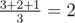
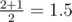

# D. Cutting a Fence

**time limit per test:** 5 seconds

**memory limit per test:** 256 megabytes

**input:** stdin

**output:** stdout

Vasya the carpenter has an estate that is separated from the wood by a fence. The fence consists of *n* planks put in a line. The fence is not closed in a circle. The planks are numbered from left to right from 1 to *n*, the *i*-th plank is of height *a*~*i*~. All planks have the same width, the lower edge of each plank is located at the ground level.

Recently a local newspaper "Malevich and Life" wrote that the most fashionable way to decorate a fence in the summer is to draw a fuchsia-colored rectangle on it, the lower side of the rectangle must be located at the lower edge of the fence.

Vasya is delighted with this idea! He immediately bought some fuchsia-colored paint and began to decide what kind of the rectangle he should paint. Vasya is sure that the rectangle should cover *k* consecutive planks. In other words, he will paint planks number *x*, *x* + 1, ..., *x* + *k* - 1 for some *x* (1 ≤ *x* ≤ *n* - *k* + 1). He wants to paint the rectangle of maximal area, so the rectangle height equals *min* *a*~*i*~ for *x* ≤ *i* ≤ *x* + *k* - 1, *x* is the number of the first colored plank.

Vasya has already made up his mind that the rectangle width can be equal to one of numbers of the sequence *k*~1~, *k*~2~, ..., *k*~*m*~. For each *k*~*i*~ he wants to know the expected height of the painted rectangle, provided that he selects *x* for such fence uniformly among all *n* - *k*~*i*~ + 1 possible values. Help him to find the expected heights.

#### Input

The first line contains a single integer *n* (1 ≤ *n* ≤ 10^6^) — the number of planks in the fence. The second line contains a sequence of integers *a*~1~, *a*~2~, ..., *a*~*n*~ (1 ≤ *a*~*i*~ ≤ 10^9^) where *a*~*i*~ is the height of the *i*-th plank of the fence.

The third line contains an integer *m* (1 ≤ *m* ≤ 10^6^) and the next line contains *m* space-separated integers *k*~1~, *k*~2~, ..., *k*~*m*~ (1 ≤ *k*~*i*~ ≤ *n*) where *k*~*i*~ is the width of the desired fuchsia-colored rectangle in planks.

#### Output

Print *m* whitespace-separated real numbers, the *i*-th number equals the expected value of the rectangle height, if its width in planks equals *k*~*i*~. The value will be considered correct if its absolute or relative error doesn't exceed 10^ - 9^.

#### Examples

#### Input
```
3
3 2 1
3
1 2 3
```

#### Output
```
2.000000000000000
1.500000000000000
1.000000000000000
```

#### Input
```
2
1 1
3
1 2 1
```

#### Output
```
1.000000000000000
1.000000000000000
1.000000000000000
```

#### Note

Let's consider the first sample test.

- There are three possible positions of the fence for *k*~1~ = 1. For the first position (*x* = 1) the height is 3, for the second one (*x* = 2) the height is 2, for the third one (*x* = 3) the height is 1. As the fence position is chosen uniformly, the expected height of the fence equals



;
- There are two possible positions of the fence for *k*~2~ = 2. For the first position (*x* = 1) the height is 2, for the second one (*x* = 2) the height is 1. The expected height of the fence equals



;
- There is the only possible position of the fence for *k*~3~ = 3. The expected height of the fence equals 1.
