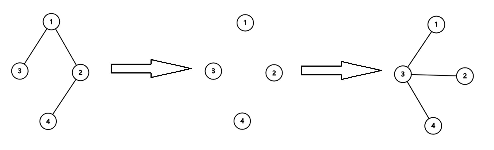

# D. Arboris Contractio

**time limit per test:** 2 seconds

**memory limit per test:** 256 megabytes

**input:** standard input

**output:** standard output


Kagari is preparing to archive a tree, and she knows the cost of doing so will depend on its diameter$^{\text{∗}}$. To keep the expense down, her goal is to shrink the diameter as much as possible first. She can perform the following operation on the tree:

- Choose two vertices $s$ and $t$. Let the sequence of vertices on the simple path$^{\text{†}}$ from $s$ to $t$ be $v_0, v_1, \dots, v_k$, where $v_0 = s$ and $v_k = t$.
- Remove all edges along the path. In other words, remove edges $(v_0, v_1), (v_1, v_2), \dots, (v_{k-1}, v_k)$.
- Connect vertices $v_1, v_2, \dots, v_k$ directly to $v_0$. In other words, add edges $(v_0, v_1), (v_0, v_2), \dots, (v_0, v_k)$.

It can be shown that the graph is still a tree after the operation.

Help her determine the minimum number of operations required to achieve the minimal diameter.

$^{\text{∗}}$The diameter of a tree is the longest possible distance between any pair of vertices. The distance itself is measured by the number of edges on the unique simple path connecting them.

$^{\text{†}}$A simple path is a path between two vertices in a tree that does not visit any vertex more than once. It can be shown that the simple path between any two vertices is always unique.

#### Input

Each test contains multiple test cases. The first line contains the number of test cases $t$ ($1 \le t \le 10^4$). The description of the test cases follows.

The first line of each test case contains one integer $n$ ($2 \le n \le 2 \cdot 10^5$) — the number of the vertices in the tree.

The following $n-1$ lines of each test case describe the tree. Each of the lines contains two integers $u$ and $v$ ($1 \le u, v \le n$, $u \neq v$) that indicate an edge between vertex $u$ and $v$. It is guaranteed that these edges form a tree.

It is guaranteed that the sum of $n$ over all test cases does not exceed $2 \cdot 10^5$.

#### Output

For each test case, output one integer — the minimum number of operations to minimize the diameter.

#### Example

#### Input
```
4
4
1 2
1 3
2 4
2
2 1
4
1 2
2 3
2 4
11
1 2
1 3
2 4
3 5
3 8
5 6
5 7
7 9
7 10
5 11
```

#### Output
```
1
0
0
4
```

#### Note

In the first test case, the diameter of the original tree is $3$. Kagari can perform an operation on $s = 3$ and $t = 4$. As the figure depicts, the operations includes the following steps:

- Remove edges $(3, 1)$, $(1, 2)$ and $(2, 4)$.
- Add edges $(3, 1)$, $(3, 2)$ and $(3, 4)$.





After the operation, the diameter reduces to $2$. It can be shown that $2$ is the minimum diameter.

In the second test case, the diameter of the tree is $1$. It can be shown that $1$ is already the minimum, so Kagari can perform no operation.
