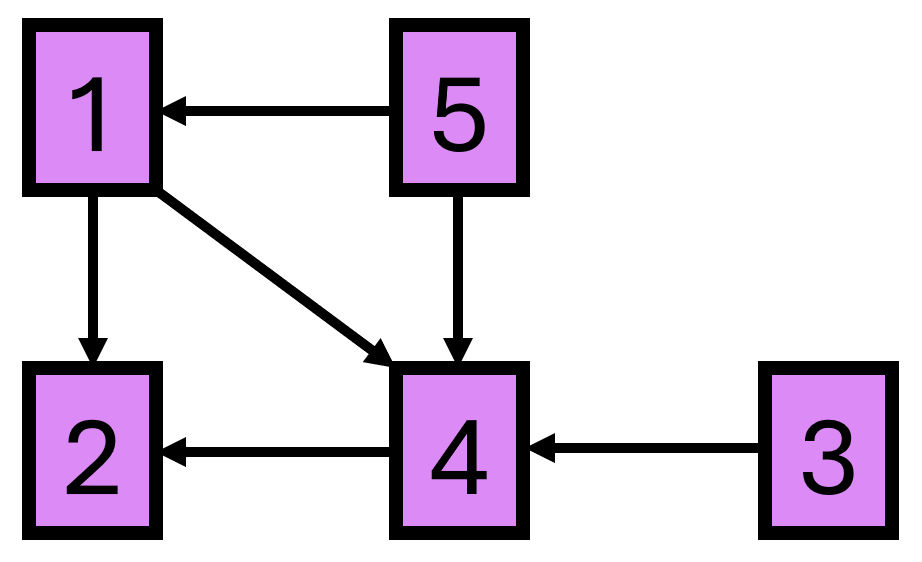
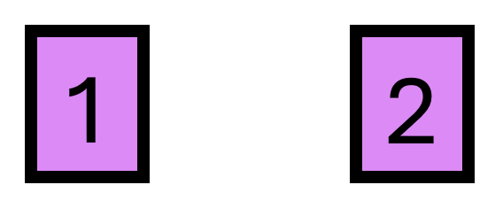

# C. The Nether

**time limit per test:** 3 seconds

**memory limit per test:** 256 megabytes

**input:** standard input

**output:** standard output


This is an interactive problem.

Having recently discovered The Nether, Steve has built a network of $n$ nether portals, each at a different location in his world.

Each portal is connected in one direction to some number (possibly zero) of other portals. To avoid getting lost, Steve has carefully built the network of portals so that there is no sequence of jumps through portals that will bring you from a location back to itself; formally, the network forms a directed acyclic graph.

Steve refuses to tell you which portals are connected to which, but he will allow you to ask queries. In each query, you give Steve a set of locations $S = \{s_1, s_2, \ldots, s_k\}$ and a starting location $x \in S$. Steve will figure out the longest path starting at $x$ that only passes through locations in $S$ and tell you the number of locations in it. (If it is impossible to reach any other location in $S$ from $x$, Steve will reply with $1$.)

As you are looking to obtain the achievement "Hot Tourist Destinations", you want to find any path that visits as many locations as possible. Steve is feeling particularly generous and will give you $2 \cdot n$ queries to find it.

#### Input

Each test contains multiple test cases. The first line contains the number of test cases $t$ ($1 \le t \le 1000$). The description of the test cases follows.

The only line of each test case contains a single integer $n$ ($2 \le n \le 500$) — the number of locations.

It is guaranteed that the sum of $n^3$ over all test cases does not exceed $500^3$.

#### Interaction

The interaction for each test case begins with reading the integer $n$. Then you can make up to $2 \cdot n$ queries.

To make a query, output a line in the following format:

- $\texttt{?}\,\,x\,\,k\,\,s_1\,s_2\,\ldots\,s_k$

The jury will return the answer to the query.

When you find a path with maximum length, output a single line in the following format:

- $\texttt{!}\,\,k\,\,v_1\,v_2\,\ldots\,v_k$

This denotes starting at portal $v_1$, then jumping to $v_2$, then to $v_3$ and so on, ending at $v_k$.

Note that outputting the answer does not count towards the limit of $2 \cdot n$ queries.

After printing each query do not forget to output the end of line and flush$^{\text{∗}}$ the output. Otherwise, you will get Idleness limit exceeded verdict.

If, at any interaction step, you read $-1$ instead of valid data, your solution must exit immediately. This means that your solution will receive Wrong answer because of an invalid query or any other mistake. Failing to exit can result in an arbitrary verdict because your solution will continue to read from a closed stream.

The interactor is not adaptive. The connections between portals do not change during the interaction.

Hacks

To perform a hack, use the following format:

Each test contains multiple test cases. The first line contains the number of test cases $t$ ($1 \le t \le 1000$). The description of the test cases follows.

The first line of each test case contains a single integer $n$ ($2 \leq n \leq 500$) — the number of locations.

Then, output $n$ lines. The $i$-th line should be of the form $k_i\,v_1\,v_2\,\ldots\,v_{k_i}$ ($0 \le k_i \le n - 1$, $1 \le v_j \le n$, $v_j \ne i$), denoting that the portal at location $i$ is connected in one direction (leads to) locations $v_1, v_2, \ldots, v_{k_i}$. The given network must form a directed acyclic graph.

The sum of $n^3$ over all test cases must not exceed $500^3$.

$^{\text{∗}}$To flush, use:

- fflush(stdout) or cout.flush() in C++;
- sys.stdout.flush() in Python;
- see the documentation for other languages.

#### Example

#### Input
```
2
5

3

3

2

1

2

1

1
```

#### Output
```
? 1 4 1 2 3 4

? 3 3 4 3 2

? 5 2 1 5

? 2 2 2 4

! 4 5 1 4 2

? 1 2 1 2

? 2 2 1 2

! 1 1
```

#### Note

In the first test case, the network of portals is as follows:





- The longest path starting at location $1$ passing only through $\{1, 2, 3, 4\}$ is the path $1 \rightarrow 4 \rightarrow 2$, which has $3$ distinct locations.
- The longest path starting at location $3$ passing only through $\{2, 3, 4\}$ is the path $3 \rightarrow 4 \rightarrow 2$, which has $3$ distinct locations.
- The longest path starting at location $5$ passing only through $\{1, 5\}$ is the path $5 \rightarrow 1$, which has $2$ distinct locations.
- It is impossible to get to any other location in $\{2, 4\}$ starting from $2$, so Steve answers $1$ for that query.
 Using the information from these queries, it is possible to determine that a longest path is $5 \rightarrow 1 \rightarrow 4 \rightarrow 2$.
In the second test case, the network of portals is as follows:





Neither of the portals is connected to the other, so the longest path is a single location. Note that ! 1 2 would also be a valid answer.
