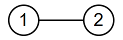
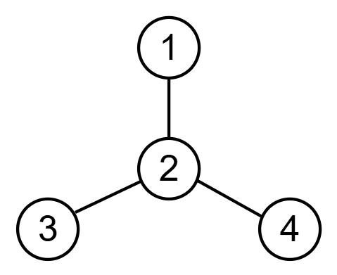

# E. I Yearned For The Mines

**time limit per test:** 2 seconds

**memory limit per test:** 256 megabytes

**input:** standard input

**output:** standard output


As a child, Steve yearned for the mines! His mine can be represented as a tree$^{\text{∗}}$ of $n$ nodes.

Unfortunately, Steve's mine has been infiltrated by his greatest nemesis, Herobrine! At any time, Herobrine is hiding in exactly one node; initially, he may be in any of them. Steve can perform the following operations:

- $1\,\,x$ — Check if Herobrine is currently in node $x$. If he is, Steve catches him. Otherwise, Herobrine may or may not move to any adjacent node (except the one you just checked).
- $2\,\,x$ — Destroy all edges connected to node $x$; Herobrine will no longer be able to use them. Afterwards, Herobrine may or may not move to any adjacent node.

Find a sequence of at most $\left\lfloor \frac{5}{4} \cdot n \right\rfloor$ operations that will guarantee Steve catches Herobrine, regardless of Herobrine's initial location and moves. We have a proof that, under the given constraints, this is always possible.

$^{\text{∗}}$A tree is a connected graph without cycles.

#### Input

Each test contains multiple test cases. The first line contains the number of test cases $t$ ($1 \le t \le 10^4$). The description of the test cases follows.

The first line of each test case contains a single integer $n$ ($2 \le n \le 2 \cdot 10^5$) — the number of nodes.

Each of the next $n − 1$ lines contains two integers $u$ and $v$ ($1 \le u, v \le n$), describing an edge between nodes $u$ and $v$.

It is guaranteed that the given edges form a tree.

It is guaranteed that the sum of $n$ over all test cases does not exceed $2 \cdot 10^5$.

#### Output

For each test case, first output a single integer $k$ ($1 \le k \le \left\lfloor \frac{5}{4} \cdot n \right\rfloor$) — the number of operations you wish to perform.

Then output $k$ lines. Line $i$ ($1 \le i \le k$) should contain two integers $t_i$ and $x_i$ ($1 \le t_i \le 2$, $1 \le x_i \le n$), indicating that the $i$-th operation you wish to perform is operation $t_i$ on node $x_i$.

#### Example

#### Input
```
2
2
1 2
4
1 2
2 3
4 2
```

#### Output
```
2
1 1
1 2
5
1 2
2 2
1 1
1 3
1 4
```

#### Note

In the first test case, the tree is as follows:





Initially, Herobrine may be in either of the nodes. After the first operation, which checks node $1$, if Herobrine was in node $1$, he would be caught, so the only possible node he could be in after the operation is node $2$ (he cannot move to node $1$ since it was just checked). Therefore, after the second operation, which checks node $2$, he must have been caught.

In the second test case, the tree is as follows:





Initially, Herobrine may be in any of the nodes $[1, 2, 3, 4]$. After the first operation, Herobrine can only be in nodes $[1, 3, 4]$. The second operation destroys all edges adjacent to node $2$. Since all the edges connected to nodes $1$, $3$, and $4$ are now destroyed, Herobrine is unable to move any more no matter where he is located. So after checking those three nodes in operations $3$, $4$, and $5$, he is guaranteed to have been caught.
