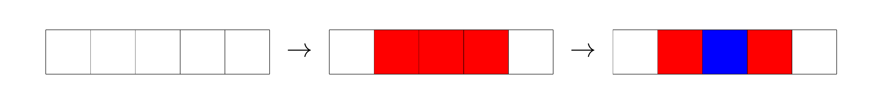
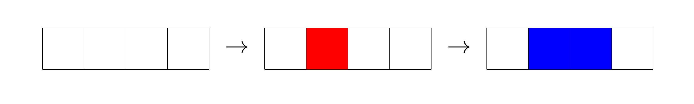

# A. Painting With Two Colors

**time limit per test:** 1 second

**memory limit per test:** 256 megabytes

**input:** standard input

**output:** standard output

You are given three positive integers $n$, $a$, and $b$ ($1\leq a,b \leq n$).

Consider a row of $n$ cells, initially all white and indexed from $1$ to $n$. You will perform the following two steps in order:

- Choose an integer $x$ such that $1 \le x \le n - a + 1$, and paint the $a$ consecutive cells $x, x+1, \ldots, x+a-1$ red.
- Choose an integer $y$ such that $1 \le y \le n - b + 1$, and paint the $b$ consecutive cells $y, y+1, \ldots, y+b-1$ blue.

If a cell is painted both red and blue, its final color is blue.

A coloring of the grid is considered symmetric if, for every integer $i$ from $1$ to $n$ (inclusive), the color of cell $i$ is the same as the color of cell $(n+1-i)$. Your task is to determine whether there exist integers $x$ and $y$ such that the final coloring of the grid is symmetric.

#### Input

Each test contains multiple test cases. The first line contains the number of test cases $t$ ($1 \le t \le 500$). The description of the test cases follows.

The first and the only line of each test case contains three integers $n$, $a$, and $b$ ($1 \le n \le 10^9$, $1 \le a,b \le n$) — the number of cells of the grid and the number of cells to be painted in each step.

#### Output

For each testcase, output "YES" if it is possible that the final coloring of the grid is symmetric; otherwise, output "NO".

You can output the answer in any case (upper or lower). For example, the strings "yEs", "yes", "Yes", and "YES" will be recognized as positive responses.

#### Example

#### Input
```
7
5 3 1
4 1 2
7 7 4
8 3 7
1 1 1
1000000000 1000000000 1000000000
3 2 1
```

#### Output
```
YES
YES
NO
NO
YES
YES
NO
```

#### Note

In the first test case, the grid becomes symmetric when choosing $x = 2$ and $y = 3$, so the answer is "YES". The following figure illustrates each step of the coloring process:





In the second test case, the grid becomes symmetric when choosing $x = 2$ and $y = 2$, so the answer is "YES". The following figure illustrates each step of the coloring process:





In the third and fourth test cases, it can be proved that no choice of $x$ and $y$ results in a symmetric grid, so the answer is "NO".
