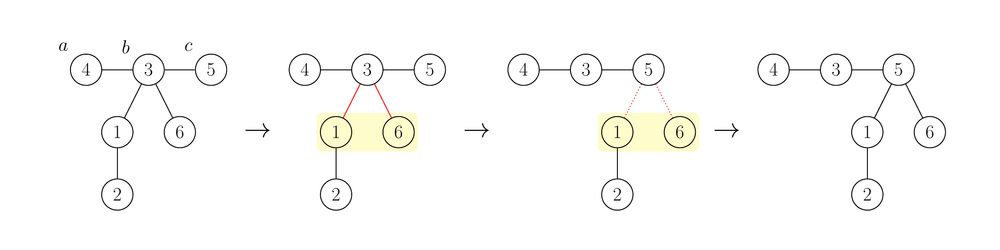
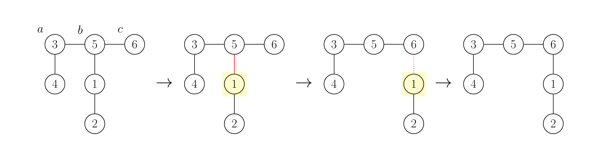

# D. Sliding Tree

**time limit per test:** 2 seconds

**memory limit per test:** 256 megabytes

**input:** standard input

**output:** standard output


You are given a tree$^{\text{∗}}$ with $n$ vertices numbered from $1$ to $n$. You can modify its structure using the following multi-step operation, called a sliding operation:

- Choose three distinct vertices $a$, $b$, and $c$ such that $b$ is directly connected to both $a$ and $c$.
- Then, for every neighbor $d$ of $b$ (excluding $a$ and $c$), remove the edge between $b$ and $d$, and instead connect $d$ directly to $c$.

For example, the figure below illustrates this operation with $a = 4$, $b = 3$, and $c = 5$ in the leftmost tree.





It can be proved that after a sliding operation, the resulting graph is still a tree.

Your task is to find a sequence of sliding operations that transforms the tree into a path graph$^{\text{†}}$, while minimizing the total number of operations. You only need to output the first sliding operation in an optimal sequence if at least one operation is required. It can be proved that it is possible to transform the tree into a path graph using a finite number of operations.

$^{\text{∗}}$A tree is a connected graph without cycles.

$^{\text{†}}$A path graph is a tree where every vertex has a degree of at most $2$. Note that a graph with only $1$ vertex and no edges is also a path graph.

#### Input

Each test contains multiple test cases. The first line contains the number of test cases $t$ ($1 \le t \le 10^4$). The description of the test cases follows.

The first line of each test case contains a single integer $n$ ($1 \le n \le 2 \cdot 10^5$) — the number of vertices in the tree.

The $i$-th of the following $n-1$ lines contains two integers $u_i$ and $v_i$ ($1 \le u_i,v_i \le n$, $u_i \neq v_i$) — the ends of the $i$-th edge.

It is guaranteed that the given edges form a tree.

It is guaranteed that the sum of $n$ over all test cases does not exceed $2 \cdot 10^5$.

#### Output

For each test case:

- If no operations are required (that is, the input tree is already a path graph), output $-1$.
- Otherwise, output three distinct integers $a$, $b$, and $c$ ($1 \le a,b,c \le n$) — the chosen vertices for the first sliding operation in an optimal sequence.

If there are multiple valid choices for the first operation, you can output any of them.

#### Example

#### Input
```
4
6
4 3
3 5
3 1
1 2
3 6
1
2
1 2
5
5 4
2 3
4 2
1 4
```

#### Output
```
4 3 5
-1
-1
2 4 1
```

#### Note

The first test case matches the example provided in the problem statement. It can be proved that we cannot transform the given tree into a path graph using less than $2$ operations.

However, we can transform the given tree into a path graph using $2$ operations: Initially, we perform an operation with $a=4$, $b=3$, and $c=5$, as shown in the example. Next, we apply an operation with $a=3$, $b=5$, and $c=6$. After this, the tree becomes a path graph. The second operation is illustrated in the figure below.





Thus, we obtain a sequence of sliding operations with the total number of operations minimized. Note, however, that only the first operation must be in the output; the number of operations and the second operation should not appear in the output.

In the second and third test cases, the tree is already a path graph, so no operations are required.
