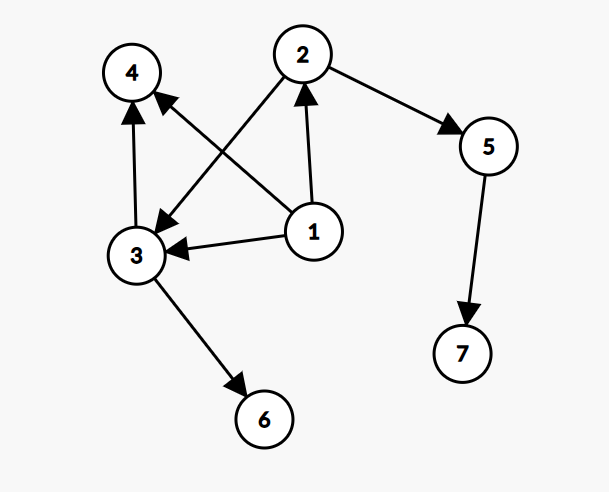

# G. Cry Me a River

**time limit per test:** 2 seconds

**memory limit per test:** 256 megabytes

**input:** standard input

**output:** standard output

There is a directed acyclic graph with $n$ nodes and $m$ edges. Each node is initially colored blue.

Let's define the fun graph game as follows:

- Initially, a token is placed on node $s$.
- Cry and River take turns moving the token to a node such that there exists a directed edge from its current position to that node, with Cry going first.
- Cry wins if the token ever reaches a node with no outgoing edges, after either player's turn.
- River wins if the token reaches a red node after either player's turn.
- If the players reach a node that is both red and does not have outgoing edges, River wins.

Since the graph is acyclic, it can be shown that the game always ends in a finite number of turns.

Note that Cry and River can win the game immediately if the starting node $s$ doesn't have outgoing edges, or is red respectively.

You must handle $q$ queries of the following kind:

- 1 u: update the color of node $u$ to red. It is guaranteed that node $u$ was blue before this update.
- 2 u: If a fun graph game is played with the token initially at node $u$, and both players play optimally, does Cry win?

#### Input

Each test contains multiple test cases. The first line contains the number of test cases $t$ ($1 \le t \le 10^4$). The description of the test cases follows.

The first line of each test case contains three integers $n$, $m$, $q$ ($2 \leq n \leq 2\cdot 10^5$ ,$1 \leq m,q \leq 2\cdot 10^5$).

The following $m$ lines each contain two integers $u$ and $v$ ($1 \leq u,v \leq n$), meaning that there is an edge from $u$ to $v$.

The following $q$ lines each contain two integers $x$ and $u$ ($1 \leq x \leq 2, 1 \leq u \leq n$) – denoting the type of query and the node that the query is done on.

It is guaranteed that the given graph is a directed acyclic graph. Additionally, no edge is given more than once.

It is guaranteed that the sum of $n$, the sum of $m$, and the sum of $q$ each do not exceed $2\cdot 10^5$ over all test cases.

#### Output

For each query of the second type, output YES if Cry wins. Otherwise, output NO. Each letter may be outputted in uppercase or lowercase.

#### Example

#### Input
```
1
7 8 10
1 2
1 3
1 4
2 5
3 6
5 7
2 3
3 4
2 1
1 3
1 4
2 1
2 2
2 3
2 4
2 5
2 6
2 7
```

#### Output
```
YES
NO
YES
NO
NO
YES
YES
YES
```

#### Note

Below shows the graph in the sample.





Initially, all nodes are blue. Thus, Cry cannot lose, and eventually the token will be moved to a node without outgoing edges.

After nodes $3$ and $4$ are painted red, the nodes $1,3,4$ now start off as a win for River when playing optimally. If the game starts at nodes $3$ and $4$, River wins immediately. If the game starts at node $1$, one way the game can go is as follows:

- Cry moves the token to node $2$.
- River moves the token to node $3$, which is red, so River wins.
.
It can be shown that Cry still wins with optimal play for all other nodes.
