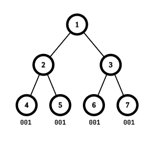
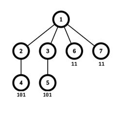

# C1. Maple and Tree Beauty (Easy Version)

**time limit per test:** 3 seconds

**memory limit per test:** 1024 megabytes

**input:** standard input

**output:** standard output


This is the easy version of the problem. The difference between the versions is that in this version, the constraints on $t$ and $n$ are smaller. You can hack only if you solved all versions of this problem.

Maple is given a rooted tree consisting of $n$ vertices numbered from $1$ to $n$, where the root has index $1$. Each vertex of the tree is labeled either zero or one. Unfortunately, Maple forgot how the vertices are labeled and only remembers that there are exactly $k$ zeros and $n - k$ ones.

For each vertex, we define the name of the vertex as the binary string formed by concatenating the labels of the vertices from the root to the vertex. More formally, $\text{name}_1 = \text{label}_1$ and $\text{name}_u = \text{name}_{p_u} + \text{label}_u$ for all $2\le u\le n$, where $p_u$ is the parent of vertex $u$ and $+$ represents string concatenation.

The beauty of the tree is equal to the length of the longest common subsequence$^{\text{∗}}$ of the names of all the leaves$^{\text{†}}$. Your task is to determine the maximum beauty among all labelings of the tree with exactly $k$ zeros and $n - k$ ones.

$^{\text{∗}}$A sequence $a$ is a subsequence of a sequence $b$ if $a$ can be obtained from $b$ by the deletion of several (possibly, zero or all) element from arbitrary positions. The longest common subsequence of strings $s_1, s_2, \ldots s_m$ is the longest string that is a subsequence of all of $s_1, s_2, \ldots, s_m$.

$^{\text{†}}$A leaf is any vertex without children.

#### Input

Each test contains multiple test cases. The first line contains the number of test cases $t$ ($1 \le t \le 50$). The description of the test cases follows.

The first line of each test case contains two integers $n$ and $k$ ($2 \leq n \leq 1000$, $0 \leq k \leq n$) — the number of vertices and the number of vertices labeled with zero, respectively.

The second line contains $n - 1$ integers $p_2, p_3, \ldots, p_{n}$ ($1 \leq p_i \le i - 1$) — the parent of vertex $i$.

Note that there are no constraints on the sum of $n$ over all test cases.

#### Output

For each test case, output a single integer representing the maximum beauty among all labelings of the tree with exactly $k$ zeros and $n - k$ ones.

#### Examples

#### Input
```
5
7 3
1 1 2 2 3 3
7 2
1 1 2 3 1 1
5 0
1 2 3 4
5 2
1 1 1 1
5 4
1 1 1 1
```

#### Output
```
3
2
5
1
2
```

#### Input
```
5
2 0
1
2 1
1
3 0
1 1
3 1
1 2
3 1
1 1
```

#### Output
```
2
2
2
3
2
```

#### Note




 In the first test case, the maximum beauty is $3$, when the vertices are labeled with $[0, 0, 0, 1, 1, 1, 1]$, and the longest common subsequence is 001.



 In the second test case, the maximum beauty is $2$, when the vertices are labeled with $[1, 0, 0, 1, 1, 1, 1]$, and the longest common subsequence is 11.
