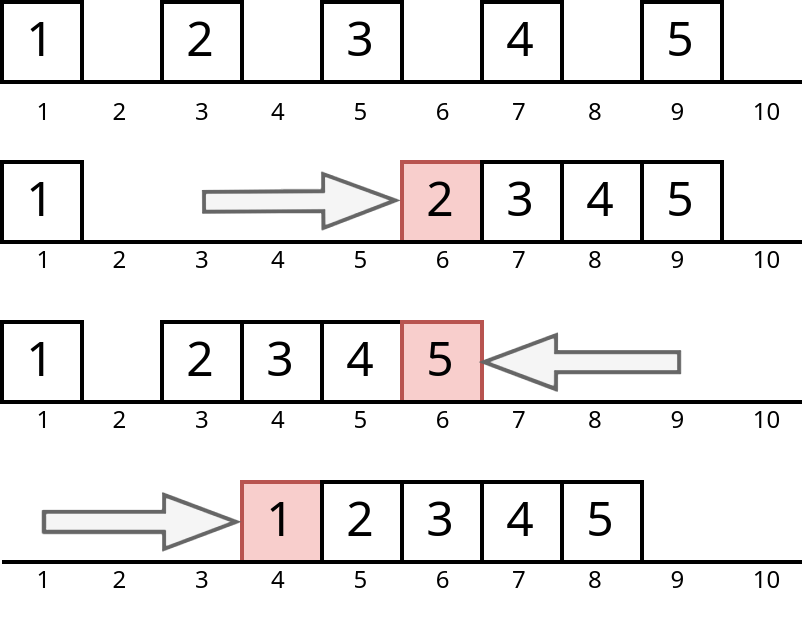

# D. Antiamuny and Slider Movement

**time limit per test:** 5 seconds

**memory limit per test:** 512 megabytes

**input:** standard input

**output:** standard output


Antiamuny is managing $n$ sliders on a one-dimensional track of length $m$. Each slider occupies exactly one unit of space and starts at a distinct position. The sliders are numbered from $1$ to $n$ and are arranged from left to right, so that the $i$-th slider is initially at position $a_i$.

Antiamuny is given $q$ operations. Each operation is described by two integers $i$ and $x$ ($1\le i\le n$, $i \leq x \leq m - n + i$). The operation moves the $i$-th slider to position $x$. However, if this move causes a collision with another slider (i.e., if there is any other slider between the $i$-th slider's current position and the destination $x$), that obstructing slider is pushed in the same direction by one unit until it no longer causes a collision with the $i$-th slider. This can trigger a chain reaction, where one slider pushes another, and so on, until all sliders occupy distinct positions again.

Importantly, note that the operations do not change the relative ordering of the sliders: the $i$-th slider from the left will remain as the $i$-th slider from the left. Furthermore, the constraints on $x$ ensure that all sliders always remain on the track, with positions between $1$ and $m$.

For example, suppose the initial slider positions are $[1, 3, 5, 7, 9]$. If the fifth slider (at position $9$) is moved to position $6$, it will push the fourth slider from $7$ to $5$, which in turn pushes the third slider from $5$ to $4$. The resulting positions become $[1, 3, \textbf{4}, \textbf{5}, \textbf{6}]$.

Unfortunately, Antiamuny has forgotten the order in which the $q$ operations were applied. To recover the results, he decides to independently simulate each of the $q!$ possible permutations of the operations. For each permutation $p$ of length $q$$^{\text{∗}}$, define $f_i(p)$ as the final position of the $i$-th slider after applying the operations in the order specified by $p$.

In other words, starting from the initial positions of $a_1, a_2, \ldots, a_n$, Antiamuny first applies the $p_1$-th operation, then the $p_2$-th operation, and so on, until the $p_q$-th operation. The value of $f_i(p)$ is the position of the $i$-th slider at the end of this sequence of operations.

Your task is to compute, for each slider $i$ ($1\le i\le n$), the sum of $f_i(p)$ over all $q!$ permutations $p$ of the operations. Since the result can be large, output each sum modulo $10^9 + 7$.

$^{\text{∗}}$A permutation of length $q$ is an array consisting of $q$ distinct integers from $1$ to $q$ in arbitrary order. For example, $[2,3,1,5,4]$ is a permutation, but $[1,2,2]$ is not a permutation ($2$ appears twice in the array), and $[1,3,4]$ is also not a permutation ($q=3$ but there is $4$ in the array).

#### Input

Each test contains multiple test cases. The first line contains the number of test cases $t$ ($1 \le t \le 10^3$). The description of the test cases follows.

The first line of each test case contains three integers $n$, $m$, and $q$ ($1 \leq n,q \leq 5 \cdot 10^3$, $n \leq m \leq 10^9$) — the number of sliders, the length of the track, and the number of operations, respectively.

The second line of each test case contains $n$ integers $a_1, a_2, \ldots, a_n$ ($1 \leq a_1 \lt a_2 \lt \ldots \lt a_n \leq m$) — the initial positions of each slider.

Each of the next $q$ lines contains two integers $i$ and $x$ ($1 \le i \le n$, $i \leq x \leq m - n + i$) — the index of the slider to move, and the position to move the slider to, respectively.

It is guaranteed that the sum of $n$ and the sum of $q$ over all test cases does not exceed $5\cdot 10^3$.

#### Output

For each test case, output $n$ integers, where the $i$-th of which represents the sum of $f_i(p)$ over all $q!$ permutations $p$ of the operations, modulo $10^9 + 7$.

#### Example

#### Input
```
3
5 10 3
1 3 5 7 9
5 6
2 6
1 4
5 10 5
2 3 5 7 9
1 6
4 7
3 3
5 7
4 9
3 1000000000 3
1 10 253746392
3 100000000
3 1000000000
3 500000000
```

#### Output
```
18 29 35 41 47 
340 460 580 930 1090 
6 60 199999979 
```

#### Note

In the first test case:

- If the operations are done in order $[2,1,3]$, we first apply the second operation which moves the $2$-nd slider to position $6$; then apply the first operation, which moves the $5$-th slider to position $6$; and finally apply the third operation, which moves the $1$-st slider to position $4$. The positions of the sliders after each operation are shown in the figure below. The final positions of the sliders will be $[4,5,6,7,8]$.




- If the operations are done in order $[1,2,3]$, the final positions of the sliders will be $[4,6,7,8,9]$.
- If the operations are done in order $[1,3,2]$, the final positions of the sliders will be $[4,6,7,8,9]$.
- If the operations are done in order $[2,3,1]$, the final positions of the sliders will be $[2,3,4,5,6]$.
- If the operations are done in order $[3,1,2]$, the final positions of the sliders will be $[2,6,7,8,9]$.
- If the operations are done in order $[3,2,1]$, the final positions of the sliders will be $[2,3,4,5,6]$.

For slider $1$, the sum of positions of the $6$ different scenarios is $4+4+4+2+2+2=18$.

For slider $2$, the sum of positions of the $6$ different scenarios is $5+6+6+3+6+3=29$.

For slider $3$, the sum of positions of the $6$ different scenarios is $6+7+7+4+7+4=35$.

For slider $4$, the sum of positions of the $6$ different scenarios is $7+8+8+5+8+5=41$.

For slider $5$, the sum of positions of the $6$ different scenarios is $8+9+9+6+9+6=47$.
