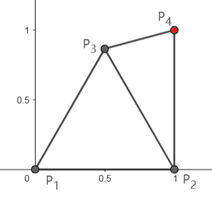
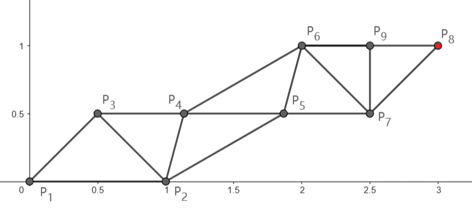

# F. Ode to the Bridge Builder

**time limit per test:** 3 seconds

**memory limit per test:** 512 megabytes

**input:** standard input

**output:** standard output


You are given a 2D plane. Initially, two points $P_1$ and $P_2$ are located at $(0,0)$ and $(1,0)$, respectively, with a line segment connecting them. You can draw triangles using the following operation:

- Choose two points $A$ and $B$ that are directly connected by a line segment (i.e., $A$ and $B$ must be the endpoints of an existing segment).
- Choose two real numbers $x$ and $y$ such that $-2\cdot 10^4\le x, y\le 2\cdot 10^4$. Draw a new point $C$ at coordinates $(x,y)$. Then, draw line segments $AC$ and $BC$, forming triangle $\triangle ABC$.
- The length $l$ of every side of the new triangle $\triangle ABC$ must satisfy $0.5\le l\le 1$.

Note that each operation draws one new point and two new line segments.

Your task is to draw a point at coordinates $(p, q)$ using at most $m = \left\lceil 2\sqrt{p^2 + q^2}\right\rceil$ operations, where $\lceil x\rceil$ is the smallest integer greater than or equal to $x$. It is guaranteed that $p$ and $q$ are positive integers.

Due to potential rounding errors:

- The constructed vertex only needs to be within $10^{-4}$ of $(p,q)$.
- For triangle side lengths, an absolute error of $10^{-8}$ is allowed (i.e., $0.5 - 10^{-8} \le l \le 1 + 10^{-8}$).

Note that the target point may be created before the last operation (see the second test case).

#### Input

Each test contains multiple test cases. The first line contains the number of test cases $t$ ($1 \le t \le 1000$). The description of the test cases follows.

The first line of each test case contains three integers $p$, $q$, and $m$ ($1\le p, q\le 10^4$, $m = \left\lceil 2\sqrt{p^2 + q^2}\right\rceil$) — the $x$ and $y$ coordinates of the target, and the maximum number of operations you are allowed to perform, respectively.

It is guaranteed that the sum of $m$ over all test cases does not exceed $10^5$.

#### Output

For each test case, output a single integer $n$ ($0\le n\le m$) representing the number of operations used.

Then, output $n$ lines describing the operations. The $i$-th of the next $n$ lines should contain four values: two integers $u$ and $v$ ($1\le u,v\le i+1,u\neq v$), the identifiers of the two chosen points, followed by two real numbers $x$ and $y$ ($-2\cdot 10^4\le x,y\le 2\cdot 10^4$), the coordinates of the new point.

The identifiers are assigned as follows:

- The identifiers of point $P_1(0,0)$ and $P_2(1,0)$ are $1$ and $2$, respectively.
- The identifier of the point drawn during the $j$-th operation is $j+2$.

If there are multiple valid solutions that use at most $m$ operations, you may output any of them.

#### Example

#### Input
```
2
1 1 3
3 1 7
```

#### Output
```
2
1 2 0.5 0.8660254037844386
2 3 1 1
7
1 2 0.5 0.5
2 3 1.1339745962156 0.5
4 2 1.8660254037844 0.5
4 5 2 1
5 6 2.5 0.5
6 7 3 1
6 7 2.5 1
```

#### Note

In the first case, you can perform at most $\lceil 2\sqrt{2}\rceil=3$ operations. The following solution uses only two operations:

- Choose points $A = P_1$ and $B = P_2$. Draw a new point $P_3$ at coordinates $\left(\frac{1}{2},\frac{\sqrt{3}}{2}\right)$. The lengths of all sides of triangle $\triangle P_1P_2P_3$ are all $1$.
- Choose points $A = P_2$ and $B = P_3$. Draw a new point $P_4$ at coordinates $(1, 1)$. The lengths of the sides of triangle $\triangle P_2P_3P_4$ are $|P_2P_3|=|P_2P_4|=1$, $|P_3P_4|=2\sin(15^\circ)\approx0.5176\ge 0.5$.





In the second case, you can perform at most $\left\lceil 2\sqrt{10}\right\rceil=7$ operations.

In the solution shown below, the points $P_4$ and $P_5$ are at coordinates $\left(2-\frac{\sqrt{3}}{2},\frac{1}{2}\right)$ and $\left(1+\frac{\sqrt{3}}{2},\frac{1}{2}\right)$ respectively, and $|P_4P_6|=|P_2P_5|=1$. It can be verified that the length of every line segment lies within $[0.5,1]$.

Note that the last operation is unnecessary, and the solution is still correct without the last operation.



