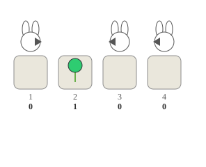
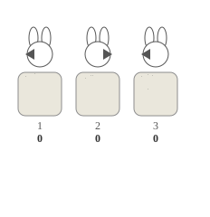

# C. Rabbits

**time limit per test:** 2 seconds

**memory limit per test:** 256 megabytes

**input:** standard input

**output:** standard output


You have $n$ flower pots arranged in a line numbered from $1$ to $n$ left to right. Some of the pots contain flowers, while others are empty. You are given a binary string $s$ describing which pots contain flowers ($s_i = 1$) and which are empty ($s_i = 0$). You also have some rabbits, and you want to take a nice picture of rabbits and flowers. You want to put rabbits in every empty pot ($s_i = 0$), and for each rabbit, you can put it looking either to the left or to the right. Unfortunately, the rabbits are quite naughty, and they will try to jump, which will ruin the picture.

Each rabbit will prepare to jump into the next pot in the direction they are looking, but they won't jump if there is a rabbit in that pot already or if there is another rabbit that prepares to jump into the same pot from the opposite side. Rabbits won't jump out of the borders (a rabbit at pot $1$ looking to the left won't jump, same for a rabbit looking to the right at pot $n$).

Your goal is to choose the directions of the rabbits so that they never jump, allowing you to take your time to take the picture. You need to determine if there is a valid arrangement of rabbits such that no rabbit ever jumps.

#### Input

Each test contains multiple test cases. The first line contains the number of test cases $t$ ($1 \le t \le 10^4$). The description of the test cases follows.

The first line of each test case contains an integer $n$ ($1 \le n \le 2 \cdot 10^5$).

The second line contains a binary string $s$ of size $n$, denoting the occupied and empty pots.

It is guaranteed that the sum of $n$ over all test cases does not exceed $2 \cdot 10^5$.

#### Output

For each test case, print "YES" if there exists a configuration of rabbits that satisfies the condition, and "NO" otherwise.

You can output the answer in any case (upper or lower). For example, the strings "yEs", "yes", "Yes", and "YES" will be recognized as positive responses.

#### Example

#### Input
```
12
4
0100
3
000
8
11011011
5
00100
1
1
5
01011
2
01
7
0101011
7
1101010
5
11001
4
1101
9
001101100
```

#### Output
```
YES
YES
NO
YES
YES
YES
YES
YES
YES
YES
NO
NO
```

#### Note

[Visualizer link](<https://codeforces.com/assets/contests/2147/C_2iM9A1dE03B4IrDfFG54.html>)

In the first test case, one of the valid configurations is to put a rabbit looking to the right at position $1$, a rabbit looking to the left at position $3$, and a rabbit looking to the left at position $4$. No rabbit will move since:

- The rabbit at pot $1$ won't move to pot $2$ since the rabbit at pot $3$ is looking to the left.
- The rabbit at pot $3$ won't move to pot $2$ since the rabbit at pot $1$ is looking to the right.
- The rabbit at pot $4$ won't move to pot $3$ since there is a rabbit in there.





In the second test case, one of the valid configurations is to put a rabbit looking to the left at position $1$, a rabbit looking to the right at position $2$, and a rabbit looking to the left at position $3$. No rabbit will move since:

- The rabbit at pot $1$ won't move since it is looking at the left border.
- The rabbit at pot $2$ won't move to pot $3$ since there is a rabbit in there.
- The rabbit at pot $3$ won't move to pot $2$ since there is a rabbit in there.





It can be proven that there is no valid arrangement of rabbits in the third test case.
