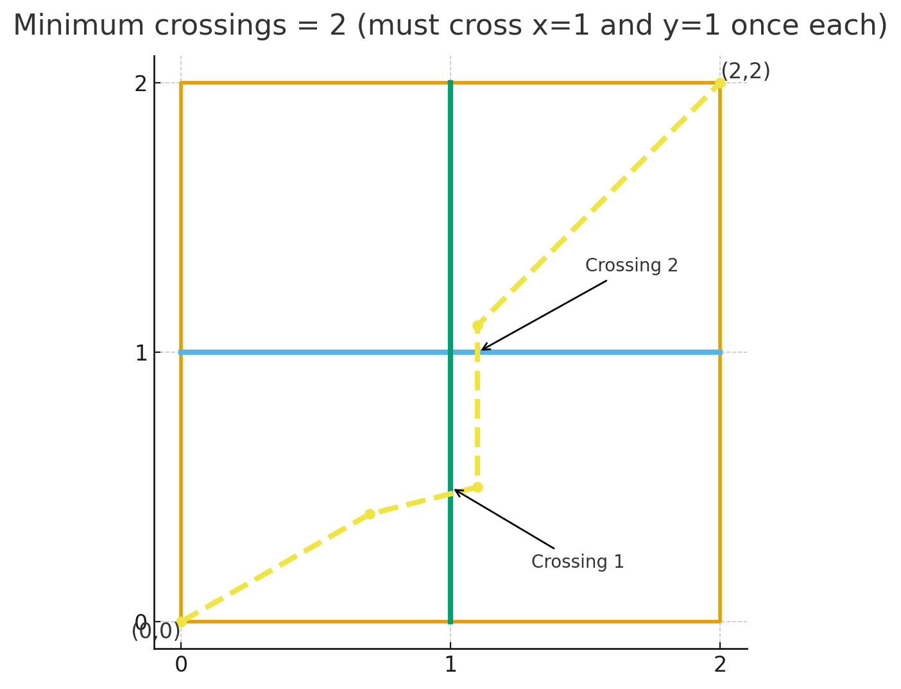

# B. Lasers

**time limit per test:** 2 seconds

**memory limit per test:** 256 megabytes

**input:** standard input

**output:** standard output

There is a 2D-coordinate plane that ranges from $(0,0)$ to $(x, y)$. You are located at $(0,0)$ and want to head to $(x, y)$.

However, there are $n$ horizontal lasers, with the $i$-th laser continuously spanning $(0, a_i)$ to $(x, a_i)$. Additionally, there are also $m$ vertical lasers, with the $i$-th laser continuously spanning $(b_i, 0)$ to $(b_i, y)$.

You may move in any direction to reach $(x, y)$, but your movement must be a continuous curve that lies inside the plane. Every time you cross a vertical or a horizontal laser, it counts as one crossing. Particularly, if you pass through an intersection point between two lasers, it counts as two crossings.

For example, if $x = y = 2$, $n = m = 1$, $a = [1]$, $b = [1]$, the movement can be as follows:





What is the minimum number of crossings necessary to reach $(x, y)$?

#### Input

The first line contains $t$ ($1 \leq t \leq 10^4$)  — the number of test cases.

The first line of each test case contains four integers $n$, $m$, $x$, and $y$ ($1 \leq n, m \leq 2 \cdot 10^5, 2 \leq x ,y \leq 10^9$).

The following line contains $n$ integers $a_1, a_2, \ldots, a_n$ ($0 \lt a_i \lt y$)  — the y-coordinates of the horizontal lasers. It is guaranteed that $a_i \gt a_{i-1}$ for all $i \gt 1$.

The following line contains $m$ integers $b_1, b_2, \ldots, b_m$ ($0 \lt b_i \lt x$)  — the x-coordinates of the vertical lasers. It is guaranteed that $b_i \gt b_{i-1}$ for all $i \gt 1$.

It is guaranteed that the sum of $n$ and $m$ over all test cases does not exceed $2 \cdot 10^5$.

#### Output

For each test case, output the minimum number of crossings necessary to reach $(x, y)$.

#### Example

#### Input
```
2
1 1 2 2
1
1
2 1 100000 100000
42 58
32
```

#### Output
```
2
3
```
