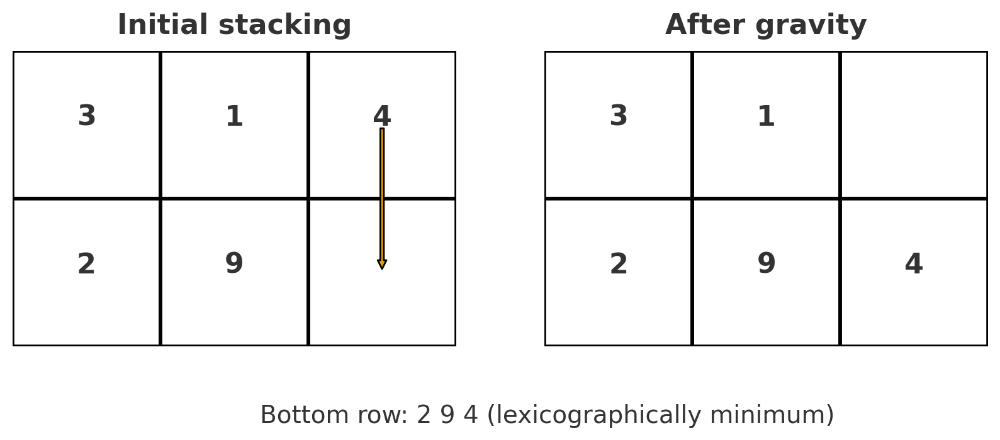
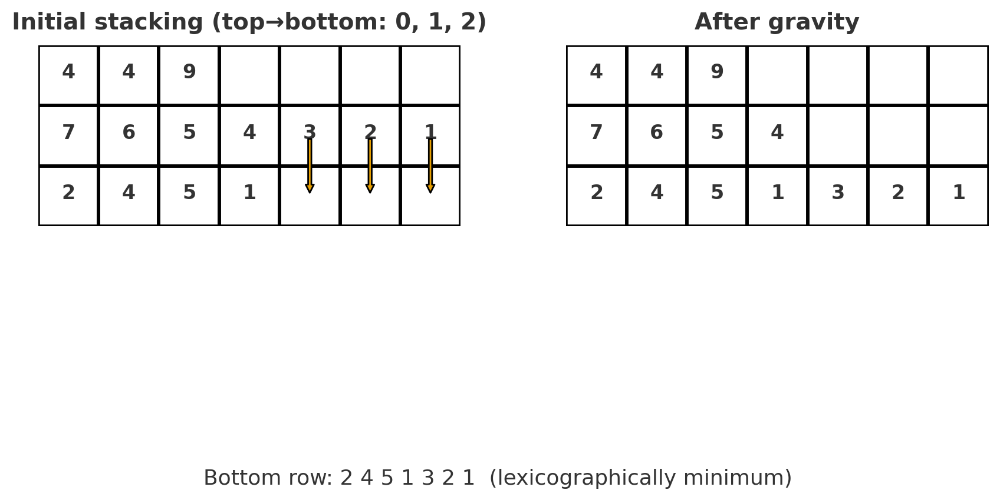

# F. Gravity Falls

**time limit per test:** 2 seconds

**memory limit per test:** 256 megabytes

**input:** standard input

**output:** standard output

Farmer John has $n$ arrays $a_1, a_2, \ldots, a_n$ that may have different lengths. He will stack the arrays on top of each other, resulting in a grid with $n$ rows. The arrays are left-aligned and can be stacked in any order he desires.

Then, gravity will take place. Any cell that is not on the bottom row and does not have an element beneath it will fall down a row. This process will be repeated until there are no cells that satisfy the aforementioned constraint.

Over all possible ways FJ can stack the arrays, output the lexicographically minimum bottom row after gravity takes place.

#### Input

The first line contains $t$ ($1 \leq t \leq 1000$)  — the number of test cases.

The first line of each test case contains $n$ ($1 \leq n \leq 2 \cdot 10^5$).

For the following $n$ lines, the first integer $k_i$ ($1 \leq k \leq 2 \cdot 10^5$) denotes the length of $a_i$.

Then, $k_i$ space-separated integers $a_{i_1}, a_{i_2}, \ldots, a_{i_{k_i}}$ follow ($1 \leq a_{i_j} \leq 2 \cdot 10^5$).

It is guaranteed that the sum of $n$ and the sum of all $k_i$ over all test cases does not exceed $2 \cdot 10^5$.

#### Output

For each test case, output the lexicographically minimum bottom row on a new line.

#### Example

#### Input
```
4
1
3 5 2 7
2
2 2 9
3 3 1 4
3
1 5
2 5 1
2 5 2
3
3 4 4 9
7 7 6 5 4 3 2 1
4 2 4 5 1
```

#### Output
```
5 2 7 
2 9 4 
5 1 
2 4 5 1 3 2 1 
```

#### Note

Demonstration for test case 2:





Demonstration for test case 4:



