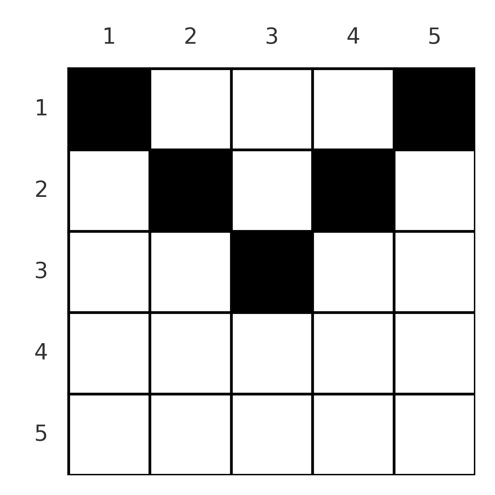

# B. Grid Counting

**time limit per test:** 2 seconds

**memory limit per test:** 256 megabytes

**input:** standard input

**output:** standard output

[ParagonX9 - HyperioxX](<https://soundcloud.com/thorn-557109993/paragonx9-hyperioxx-id-223469>)

⠀

Alice has a grid of size $n \times n$. Initially, all cells are colored white. Alice wants to color some cells black satisfying certain properties.

Let $(x_1, y_1), (x_2, y_2), \ldots, (x_m, y_m)$ be the cells colored black. You are given an array $a$ of size $n$. The following conditions must be satisfied:

- For each row $k$ ($1 \le k \le n$), there exists exactly $a_k$ indices $i$ ($1 \le i \le m$) such that $x_i = k$. Less formally, there should be $a_k$ black cells in row $k$.
- For each $k$ ($1 \le k \le n$), there exists exactly one index $i$ such that $\max(x_i, y_i) = k$.
- For each $k$ ($1 \le k \le n$), there exists exactly one index $i$ such that $\max(x_i, n + 1 - y_i) = k$.

For example, when $a = [2, 2, 1, 0, 0]$, a possible set of black cells is $\{(1, 1), (2, 2), (3, 3), (2, 4), (1, 5)\}$. This corresponds to the following grid:




 5×5 grid with specified black cells.
Count the number of possible grids. $2$ grids are said to be different if there is some cell which is colored black in one of the grids, and white in the other. Since the answer may be large, output it modulo $998\,244\,353$.

#### Input

Each test contains multiple test cases. The first line contains the number of test cases $t$ ($1 \le t \le 10^4$). The description of the test cases follows.

The first line of each test case contains a single integer $n$ ($2 \le n \le 2 \cdot 10^5$).

The second line of each test case contains $n$ integers — $a_1, a_2, \ldots, a_n$ ($0 \le a_i \le n$)

It is guaranteed that the sum of $n$ over all test cases does not exceed $2 \cdot 10^5$.

#### Output

For each test case, output a single line containing an integer: the number of valid grids modulo $998\,244\,353$.

#### Example

#### Input
```
5
5
2 2 1 0 0
2
2 0
2
1 1
4
3 1 0 0
4
0 0 0 0
```

#### Output
```
1
1
0
2
0
```

#### Note

In the first test case, the only valid grid is the one in the statement.

In the second test case, the only valid grid is described by the set of black cells $\{(1, 1), (1, 2)\}$.

In the third test case, there are no valid grids.
