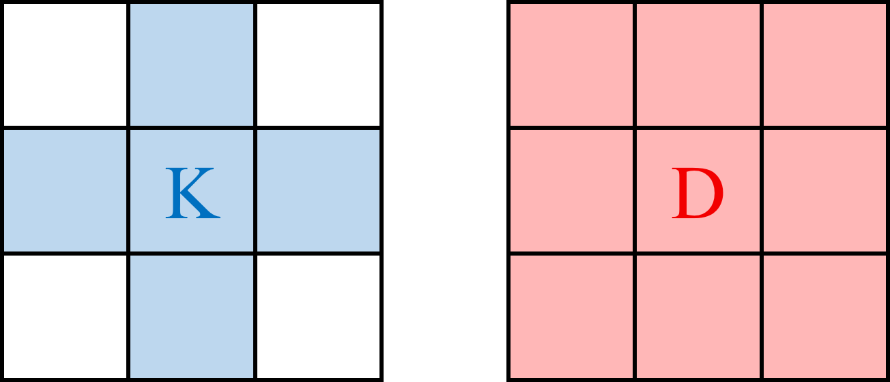
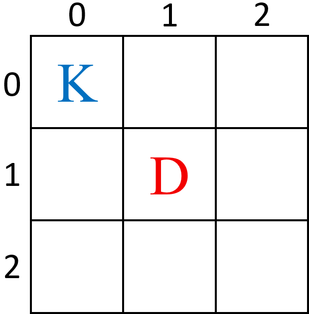
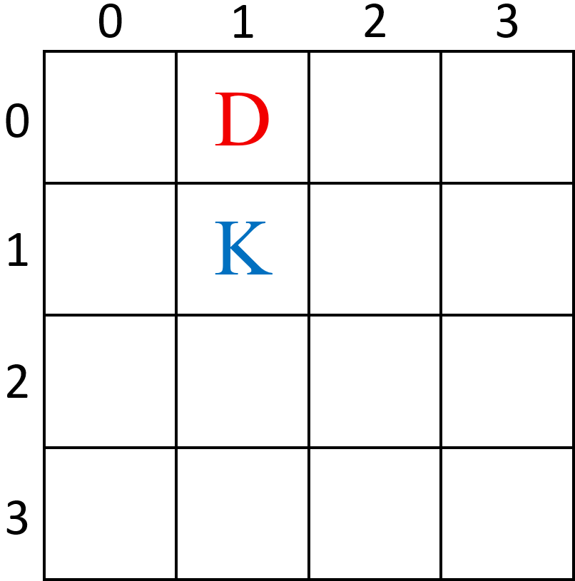

# B. Catching the Krug

**time limit per test:** 1 second

**memory limit per test:** 1024 megabytes

**input:** standard input

**output:** standard output

Doran and the Krug are playing a game on a grid consisting of $(n + 1) \times (n + 1)$ cells whose coordinates are pairs of integers from $0$ to $n$, inclusive. The Krug's goal is not to be caught by Doran for as long as possible, while Doran's goal is to catch the Krug as early as possible. We say Doran caught the Krug if they stand on the same grid cell.

To play the game, the Krug and Doran take turns alternately, starting from the Krug:

- The Krug can either stay in the same cell or move to a cell vertically or horizontally (but not diagonally) adjacent. Formally, if the Krug is currently at the cell $(a, b)$, she can stay at $(a, b)$ or move to either $(a-1, b), (a, b-1), (a, b+1), (a+1, b)$.
- Doran can either stay in the same cell or move to a cell vertically, horizontally, or diagonally adjacent. Formally, if Doran is currently at the cell $(c, d)$, he can stay at $(c, d)$ or move to either $(c-1, d-1), (c-1, d), (c-1, d+1), (c, d-1), (c, d+1), (c+1, d-1), (c+1, d), (c+1, d+1)$.
- Both players cannot go outside of the grid.




 Figures showing possible movements of the Krug and Doran. Letters 'K' and 'D' represent the current position of the Krug and Doran, and the colored cells represent possible positions each player can move to in their respective turn.
The Krug's survival time is defined as the number of Doran's turns until Doran catches the Krug for the given starting cells of the players. Assuming that both players play optimally, find the Krug's survival time or report that the Krug can survive for infinite turns.

#### Input

Each test contains multiple test cases. The first line contains the number of test cases $t$ ($1 \le t \le 10^4$). The description of the test cases follows.

Each test case consists of a single line containing five integers $n$, $r_K$, $c_K$, $r_D$, and $c_D$ ($1 \le n \le 10^9$, $0 \le r_K, c_K, r_D, c_D \le n$, $(r_K, c_K) \ne (r_D, c_D)$) — $n$ is the size of the grid, $(r_K, c_K)$ represents the Krug's starting cell, and $(r_D, c_D)$ represents Doran's starting cell.

#### Output

For each test case, output the Krug's survival time when both players play optimally. If the Krug can survive for infinite turns, print $-1$.

#### Example

#### Input
```
7
2 0 0 1 1
3 1 1 0 1
1 1 0 0 1
6 1 3 3 2
9 4 1 4 2
82 64 2 63 2
1000000000 500000000 500000000 1000000000 0
```

#### Output
```
1
3
1
4
2
19
1000000000
```

#### Note

Explanation of the first test case:

The Krug starts at $(0,0)$ and Doran starts at $(1,1)$. On the Krug's turn, she can only move to $(0,0)$, $(0,1)$, or $(1,0)$.

Doran, starting at $(1,1)$, can reach any cell on the $3 \times 3$ grid in a single move. Therefore, no matter where the Krug moves, Doran can always move to her cell on his first turn. The Krug's survival time is $1$.





Explanation of the second test case:

The Krug starts at $(1,1)$ and Doran at $(0,1)$. To survive Doran's first turn, the Krug must move to a cell that Doran cannot reach. The only such cell is $(2,1)$.

After the Krug moves to $(2,1)$, Doran moves to $(1,1)$ to get closer.

Now, for her second move, the Krug must again move to a cell Doran can't reach, which is $(3,1)$. Doran then moves to $(2,1)$.

At this point, no matter where the Krug moves for her third turn, Doran can always reach her cell. It can be shown that this is an optimal strategy for both, and therefore the Krug's survival time is $3$.



