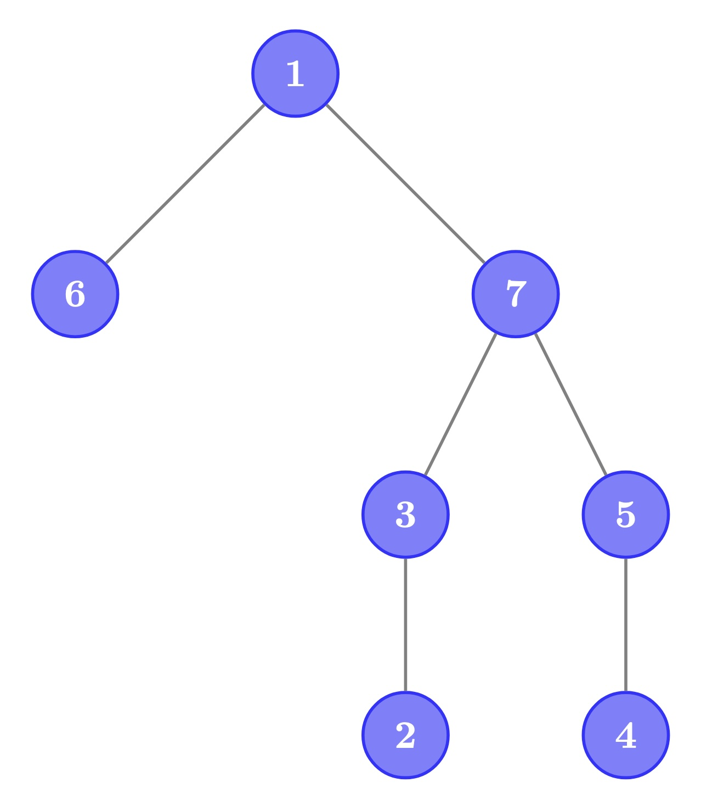

# G. Query Jungle

**time limit per test:** 3 seconds

**memory limit per test:** 1024 megabytes

**input:** standard input

**output:** standard output


Oner is a jungler — a role where you hunt monsters in a jungle. Given the number of trees he sees in a jungle, it's no surprise that he is addicted to tree query problems.

You are given a tree of $n$ vertices, rooted at vertex $1$. Each vertex either contains a monster or does not.

You want to find the minimum integer $k$ such that there exist $k$ paths that satisfy the following conditions:

- Each path must start at the root (vertex $1$).
- Every vertex with a monster must be included in at least one of these paths. A vertex is considered included in a path if it is one of the path's vertices, including its endpoints.

To make this problem more challenging, you must also answer $q$ queries. For each query, you are given a vertex $v$. For each vertex $w$ in the subtree of $v$, its status is inverted — the one containing a monster starts to not contain one, and the one not containing a monster starts to contain one. After each query, you must solve the original problem again with the updated status.

Note that queries are cumulative, so the effects of each query carry on to future queries.

#### Input

Each test contains multiple test cases. The first line contains the number of test cases $t$ ($1 \le t \le 20\,000$). The description of the test cases follows.

The first line contains a single integer $n$ ($2 \le n \le 250\,000$) — the number of vertices in the tree.

The next line contains $n$ integers $a_1, a_2, \ldots, a_n$ ($a_i \in \{0, 1\}$), representing the initial status. If $a_i = 1$, vertex $i$ contains a monster; if $a_i = 0$, it does not.

The next $n-1$ lines each contain two integers $u$ and $v$ ($1 \le u, v \le n, u \ne v$), describing an edge between vertices $u$ and $v$. It is guaranteed that these edges form a tree.

The next line contains a single integer $q$ ($0 \le q \le 250\,000$) — the number of queries.

The next $q$ lines each contain a single integer $v_i$ ($1 \le v_i \le n$) — the vertex given for the $i$-th query.

It is guaranteed that the sum of $n$ over all test cases does not exceed $250\,000$.

It is guaranteed that the sum of $q$ over all test cases does not exceed $250\,000$.

#### Output

Print $q + 1$ lines. The first line should contain the minimum number of paths $k$ for the initial status. Each subsequent line should contain the answer after each query.

#### Example

#### Input
```
2
7
0 1 0 1 1 0 0
1 6
1 7
7 3
3 2
7 5
5 4
4
2
4
6
7
2
0 1
1 2
2
2
1
```

#### Output
```
2
1
1
2
3
1
0
1
```

#### Note

Test Case 1:

Initial State: The monsters are in vertex $\{2, 4, 5\}$. We need two paths: $1 \to 7 \to 3 \to 2$ and $1 \to 7 \to 5 \to 4$. The answer is $2$.

After Query 1 ($v=2$): The monsters are in vertex $\{4, 5\}$. We only need one path, $1 \to 7 \to 5 \to 4$. The answer is $1$.

After Query 2 ($v=4$): The monsters are in vertex $\{5\}$. We only need one path, $1 \to 7 \to 5$. The answer is $1$.

After Query 3 ($v=6$): The monsters are in vertex $\{5, 6\}$. We need two paths, $1 \to 7 \to 5$ and $1 \to 6$. The answer is $2$.

After Query 4 ($v=7$): The monsters are in vertex $\{2, 3, 4, 6, 7\}$. We need three paths, $1 \to 6$, $1 \to 7 \to 5 \to 4$, and $1 \to 7 \to 3 \to 2$. The answer is $3$.

The following figure denotes the tree in the example input.





Test Case 2:

Initial State: The monsters are in vertex $\{2\}$. We need one path: $1 \to 2$. The answer is $1$.

After Query 1 ($v=2$): There are no monsters. We need zero paths. The answer is $0$.

After Query 2 ($v=1$): The monsters are in vertex $\{1,2\}$. We need one path: $1 \to 2$. The answer is $1$.
