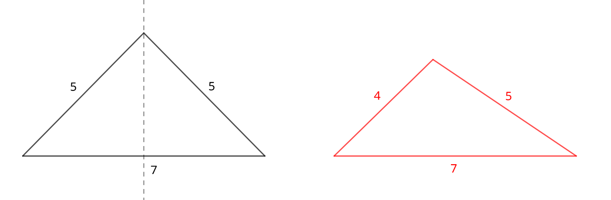
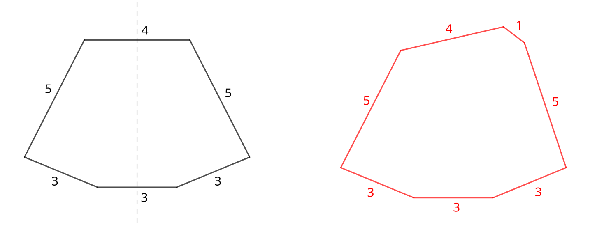

# C. Symmetrical Polygons

**time limit per test:** 2 seconds

**memory limit per test:** 256 megabytes

**input:** standard input

**output:** standard output


You are given $n$ sticks, where the $i$-th stick has a length of $a_i$. You want to choose a non-empty subset of these sticks and use them as the sides of a polygon. Each selected stick must be used entirely as a single side of the polygon. It is not allowed for two or more sticks to be joined end-to-end in parallel to form a longer side.

Your goal is to form a polygon that is symmetrical, strictly convex, and non-degenerate:

- [Symmetrical](<https://en.wikipedia.org/wiki/Reflection_symmetry>): there exists a line of symmetry such that when the polygon is folded along this line, the two halves coincide exactly.
- [Strictly convex](<https://en.wikipedia.org/wiki/Convex_polygon>): all its internal angles are strictly less than $180^\circ$.
- [Non-degenerate](<https://en.wikipedia.org/wiki/Degeneracy_(mathematics)#Convex_polygon>): no two consecutive sides coincide at least partially, no side has zero length, and no angle equals $180^\circ$.

Among all such polygons that you can form with the sticks, find the maximum possible perimeter$^{\text{∗}}$. If no valid polygon exists, output $0$.

$^{\text{∗}}$The [perimeter](<https://en.wikipedia.org/wiki/Perimeter>) of a polygon is equal to the sum of the lengths of its sides.

#### Input

Each test contains multiple test cases. The first line contains the number of test cases $t$ ($1 \le t \le 10^4$). The description of the test cases follows.

The first line of each test case contains a single integer $n$ ($3\le n\le 2\cdot 10^5$) — the number of sticks.

The second line of each test case contains $n$ integers $a_1, a_2, \ldots, a_n$ ($1\le a_i\le 10^9$) — the lengths of the sticks.

It is guaranteed that the sum of $n$ over all test cases does not exceed $2\cdot 10^5$.

#### Output

For each test case, output a single integer representing the maximum possible perimeter of a non-degenerate, symmetrical and strictly convex polygon that you can form from a non-empty subset of the sticks. If it is not possible, output $0$.

#### Example

#### Input
```
5
3
5 5 7
3
4 5 7
3
5 5 10
7
4 3 5 1 5 3 3
4
2 3 5 7
```

#### Output
```
17
0
0
23
0
```

#### Note

In the first test case, you can form an isosceles triangle using all three sticks. It is symmetrical along the vertical dotted line (see left diagram). The perimeter is equal to the sum of the lengths of its sides: $5 + 5 + 7 = 17$.

In the second test case, the triangle formed by all three sticks is not symmetrical (see right diagram). It can be proven that no symmetrical, non-degenerate convex polygon can be formed from any non-empty subset of the sticks.



In the third test case, it is not possible to form a non-degenerate polygon. If all three sides are used, the two sides of length $5$ coincide with the side of length $10$, producing only a straight line with zero area.

In the fourth test case, we can form a symmetrical convex polygon using three sticks of length $3$, two sticks of length $5$, and one stick of length $4$ (see left diagram). The last stick of length $1$ cannot be included, as the resulting polygon would no longer be symmetrical (see right diagram).



In the fifth test case, it is not allowed to join the sticks of length $2$ and $3$ to form a stick of length $5$ (which would yield the first test case). It can be proven that no symmetrical, non-degenerate convex polygon can be formed from any non-empty subset of the sticks.
